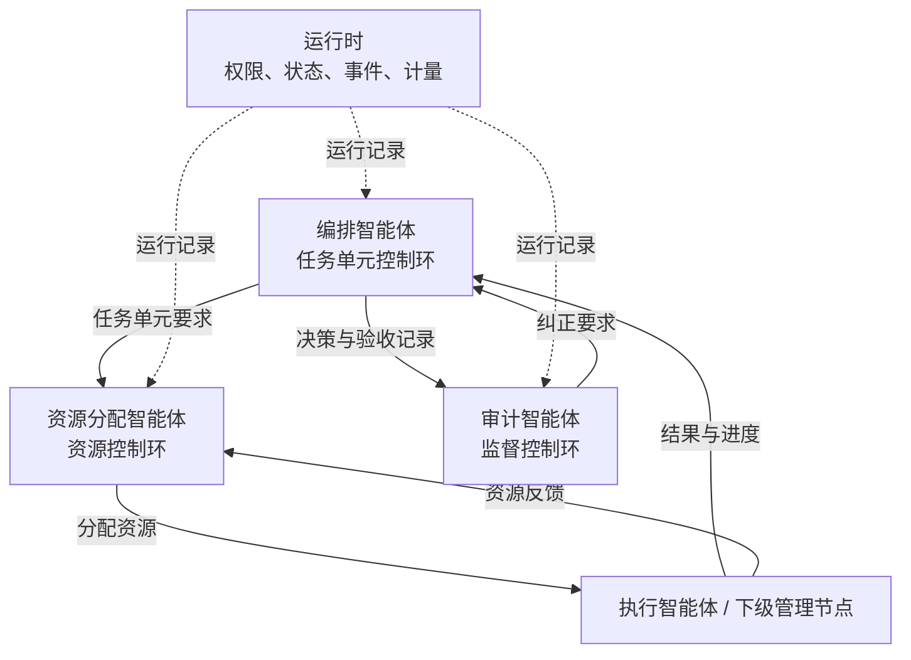
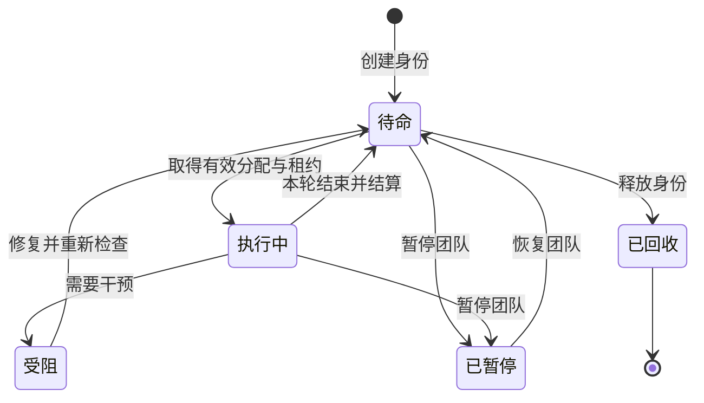
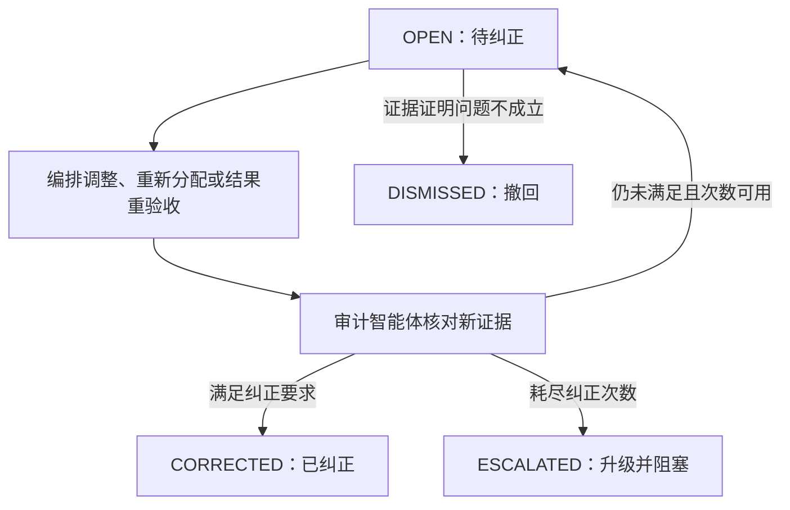

# 智能体分类

智能体集群由四类角色协作完成任务：**编排智能体负责规划与验收，资源分配智能体负责执行资源，审计智能体负责独立监督，执行智能体负责具体执行**。前三类角色共同组成管理节点，执行智能体位于管理树的叶子节点。节点与智能体身份的区别见[层次化智能体结构](/hierarchy)。

本页介绍各类角色的职责、决策权限和生命周期。身份状态、执行结果与界面状态分别说明，避免把一轮执行结束等同于任务验收。初次使用可先阅读[快速上手](/quick-start)，模型、能力和执行参数见[智能体配置参数](/configuration/agents)。

## 四类角色

每个角色分别维护身份、会话和决策记录。智能体与进程不必一一对应，不同角色也可以使用相同模型。

| 中文名称 | 英文名称 |
| --- | --- |
| 编排智能体 | Orchestrator |
| 资源分配智能体 | Allocator |
| 审计智能体 | Auditor |
| 执行智能体 | Worker |

### 编排智能体：任务单元规划与验收

编排智能体对“做什么、如何拆解、结果是否满足目标”负责。它根据上级目标、执行反馈、验收证据和监督意见，定义任务单元及其依赖和执行要求，记录验收结论，并汇总结果。

其主要工作是理解目标，拆解和调整任务单元，跟踪关键反馈，逐项验收结果并向上交付。它可以调整本管理域任务单元，但不得擅自降低上级委派的交付要求或突破预算边界；执行者选择、模型配置和负载调整由资源分配智能体负责。

### 资源分配智能体：执行资源配置

资源分配智能体对“谁来做、投入什么资源、如何调整执行配置”负责。它根据任务要求、可用智能体、预算、模型和运行状态建立执行分配，调整资源，并报告瓶颈。

它负责选择或创建执行智能体，建立下级管理节点，配置模型和预算，设置并发数。需要替换或回收执行者时，必须先等待当前执行达到安全点，并结束旧轮次与租约。目标、验收标准和授权额度不变时，它可以自主调度；不能用更换产物或降低标准解决资源不足。

### 审计智能体：独立监督

审计智能体对规划、调整和验收是否合理、完整、可追溯负责。它检查任务单元版本、决策历史、结果和验收记录，给出审查结论、纠正要求和履职评估，并记录需要上级处理的问题。

它可以要求纠正问题、重新规划或重新验收，并复核修改是否落实。目标调整仍由编排智能体负责，日常资源调度仍由资源分配智能体负责。规划监督可以异步进行，但任务单元被正式接受前，必须完成对应结果版本的独立复核，具体时序见 [任务派发](/dispatch)。

### 执行智能体：具体执行

执行智能体取得任务单元的执行分配、必要上下文、工具授权和预算后，在授权范围内选择执行步骤，提交产物和证据，并报告进度、失败或阻塞原因。需要进一步规划时，它向所属管理节点反馈。

执行智能体无权自行验收、增加预算或创建管理层级。`submit_result` 提交的是候选结果，执行智能体声称完成不代表任务单元已被接受。

## 三条控制环

资源分配智能体负责处理频繁的资源变化，减少这类变化对任务规划的干扰。编排智能体主要处理任务结构、关键反馈和验收，审计智能体检查管理决策及其证据。三者依据同一套持久化状态和执行记录开展工作，分别保留自己的身份、会话和决策记录。角色在会话中的描述不能直接覆盖运行时记录的正式状态。

运行时按确定的规则校验权限、变更状态、投递事件、管理租约并计量资源用量。它执行控制规则，业务判断由各类智能体作出。

## 决策归属

| 场景 | 决策与执行责任 |
| --- | --- |
| 任务单元太复杂，需要独立规划域 | 编排智能体明确分解或委派要求；资源分配智能体决定可行资源配置并创建下级管理节点 |
| 执行智能体速度慢或模型不可用 | 资源分配智能体评估模型切换、替换或扩容；若会突破时限、成本或质量约束，向编排智能体报告，由其决定如何调整任务单元 |
| 验收标准遗漏关键条件 | 审计智能体提出纠正；编排智能体修订标准，并明确旧分配和既有审查结论在新版本中的有效性 |
| 执行智能体声称已完成 | 只表示执行产物已提交；编排智能体验收且审计智能体复核后，运行时才将结果记为正式接受 |
| 其他子树的智能体请求协助 | 可以交换信息；涉及新任务、预算或所有权变化时，由具备相应权限的管理节点作出正式决策 |
| 本管理域无法满足上级要求 | 编排智能体将目标或范围问题提交上级处理；资源分配智能体说明资源缺口；审计智能体提供监督证据 |
| 根节点无法解决冲突 | 请求用户或宿主介入，并记录阻塞原因；根节点没有可继续上报的父节点 |

## 执行身份与显示状态

图中展示常规执行与控制路径。角色身份创建后为 `READY`，每轮执行由有效租约驱动；正常结束并结算后回到 `READY`，回收后为 `TERMINATED`。阻塞、暂停和回收还会协调正在退出的轮次，不能只修改一个显示标记。

团队界面的 `waiting_user`、`waiting_agent`、`completed` 等状态来自任务结果、待处理消息与运行记录的投影。它们与数据库中的身份状态分别建模：等待用户意味着需要用户答复，等待其他智能体意味着依赖执行或审查；已回收意味着不再接受新的输入。工作完成的记录在回收后仍保留。

任务单元 `ACCEPTED` 表示结果经过验收与独立复核；管理节点 `COMPLETED` 表示本管理域已完成交付与收尾。执行轮次正常结束并不自动建立这两种结论。未回收成员的文本续聊仍受团队终态、执行分配、预算和调度规则约束，详见[主会话与团队界面](/development/interface)。

## 审计智能体的纠正闭环

纠正项记录受影响任务、目标版本、严重程度、证据和需要完成的修改。审计智能体通过 `verify_correction` 核对新证据，结果保存在同一纠正项中。

没有新的计划、验收或执行证据时，运行时拒绝把同一内容当作新一轮纠正。若问题源于执行智能体提交的不完整结果，单纯修改计划不足以确认纠正，需要新的分配或结果证据。撤回也必须提供证据，已确认的未完成执行或被拒绝写入不能仅凭解释消除。

`max_corrections` 限制纠正次数；达到上限后，相关管理域或集群受阻，并保留未解决的问题。编排智能体、资源分配智能体和审计智能体分别在自身权限内处理，不以反复声明已修改替代实际检查。

## 编排智能体的履职评价维度

审计智能体根据以下八个维度评估编排智能体的履职质量：

| 维度 | 需要回答的问题 |
| --- | --- |
| 任务覆盖度 | 上层目标是否被任务单元充分覆盖 |
| 分解质量 | 粒度、边界和依赖是否合理 |
| 响应及时性 | 重要反馈是否在适当时间内得到处理 |
| 规划稳定性 | 是否出现没有新证据支持的反复规划 |
| 目标一致性 | 局部任务单元是否持续服务于上层目标 |
| 验收质量 | 验收标准和证据是否足以支持结论 |
| 结果整合质量 | 下级产物是否被正确整合，冲突是否已处理 |
| 问题上报质量 | 超出本管理域能力的问题是否及时提交上级处理 |

履职评价应说明采用的记录、评价时间范围和判定依据，并支持追溯。缺少证据时应标为“未知”，不能用一个总分掩盖尚未解决的关键问题。

## 开发入口

规划监督通过 `inspect_plan` 记录检查与结论，结果通过 `inspect_validation` 完成版本绑定的独立复核。角色动作和责任范围见[动作索引](/development/action-catalog)，实际工具参数见 [API 手册](/development/api)，代码定位见[代码结构](/development/code-structure)。
