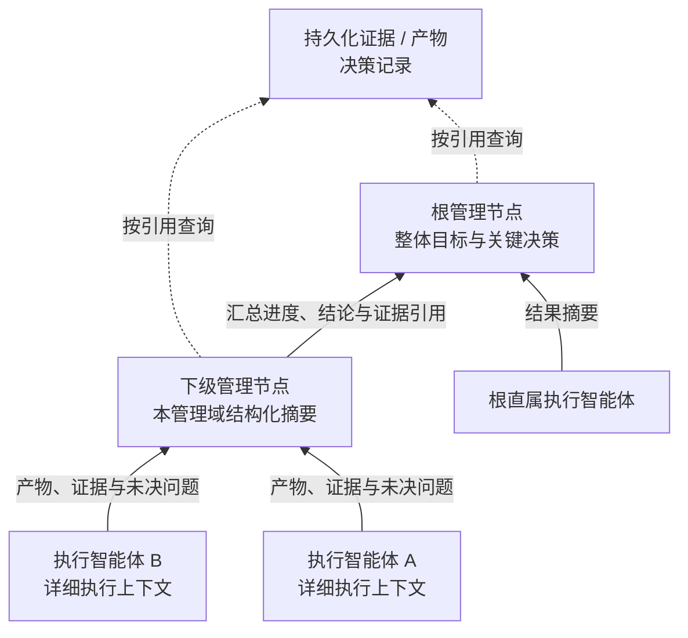

# 智能体通信

通信图描述智能体在执行期间的实际协作关系，与[管理树](/hierarchy)分别建模。不同分支可以直接讨论接口、交换证据或组成临时协作组；结果验收、预算调整和责任交接仍遵循管理关系与[角色权限](/agents)。

本页介绍横向消息、共享黑板，以及上下文如何逐级汇总。通信动作的实际参数见[通信与共享黑板](/development/components/communication)。

## 横向消息与协作组

任意两个智能体都可以直接通信，多个智能体也可以组成临时协作组。能够联系哪些智能体、访问哪些信息，仍受集群边界、授权能力和数据访问规则约束。

| 动作 | 用途 |
| --- | --- |
| `send` | 向一个智能体发送问题、发现或结果引用 |
| `multicast` | 向协作组或指定节点内的多个智能体发送同一信息 |
| `group` | 创建、加入、退出或关闭协作组 |
| `publish` | 向共享黑板发布带版本号的信息 |
| `query` | 按访问范围查询共享信息 |
| `subscribe` | 按黑板键或前缀订阅条目变化 |

消息保存发送者、接收者、消息 ID 与不可变内容，可关联所属任务单元。对会影响协作结论的重要消息，需要能够确认它是否已持久化、是否已被处理。超时后，由发送方决定重试还是提交上级处理；“已发送”不代表“对方已完成”。

直接消息用于交换信息和提出请求。跨管理域修改任务单元、调整预算或改变管理关系时，必须由具备相应权限的角色发出正式命令。共享黑板上的建议也不能覆盖状态库中已经记录的验收结论。

## 共享黑板

共享黑板保存带版本的信息、产物引用和协作记录。它为多个智能体提供可查询、可订阅的信息空间，与直接通信配合使用。

黑板不替代任务单元状态库或预算账本。发布协作过程中发现的信息时，应注明相关任务单元或对象引用及其版本；需要改变目标、执行分配或接受状态时，拥有权限的角色必须通过正式命令提交。发布一条“已完成”的消息或黑板记录，不会使任务单元自动进入 `ACCEPTED`。

系统依据持久化状态、执行账本、产物和决策记录核对实际执行情况，并通过运行追踪展示这些信息。角色不能用会话中的旧摘要覆盖较新的持久化版本。

## 上下文逐级汇总

执行智能体保存详细的执行上下文；管理节点保留本管理域计划、关键事件和决策。向上级发送的摘要应限制长度，必要时再根据引用读取细节，避免每个角色反复接收整棵管理树、全部消息或完整工具输出。

节点摘要由持久化任务、结果、纠正项与用量生成，携带 `as_of_seq` 说明读取位置。主要字段如下：

| 字段 | 内容 |
|---|---|
| `transactions` | 总数、进行中、已接受和失败或受阻数量 |
| `conclusions` | 已接受任务单元的标识与结论 |
| `evidence` | 汇总的结果证据 |
| `unresolved_questions` | 尚未解决的纠正项与所需修改 |
| `resource_state` | 对应管理域的用量汇总 |
| `management_health` | 管理节点及未关闭问题数量 |
| `confidence` | 全部接受为 high，否则为 partial |

摘要帮助管理角色定位细节，不代替原始结果和审查证据。宿主上下文压缩保存会话摘要，控制平面的节点摘要保存业务状态，两者应结合读取。

资源分配智能体配置上下文上限、压缩触发条件和保留策略。压缩请求同样消耗预算，需要事先留出额度；如果压缩后仍超过模型输入上限，应阻塞相关执行并报告原因。

## 传递信息与传递责任

信息可以跨子树传递，但发送消息不会自动转移任务单元的管理责任。例如，执行智能体 A 向另一分支请求接口说明，对方可以回复已有结论；如果需要额外修改代码、投入预算或更改交付范围，应由相应管理节点建立正式任务单元或调整分配。

调整节点的父子关系时，除上下文外，还必须交接尚未完成的任务单元、结果证据、尚未处理完的纠正要求和预算余额。具体过程见[层次化智能体结构](/hierarchy)。

## 通信的可观测性与实现边界

关键消息和证据应能够追溯到所属集群、管理节点、智能体、任务单元、执行尝试和结果版本。投递状态与报告区分已登记、已注入和已确认处理，并提供协作组、跨子树流量及消息积压；原生会话展示对应通信正文。这些信息用于定位“谁在等待谁”，不能替代验收证据。

消息去重不等于外部副作用只发生一次。接收方执行工具后响应丢失时，需要确认工具回执与实际产物，不能仅凭没有收到回复就重复执行。完整恢复规则见 [任务派发](/dispatch)。

上下文上限、压缩触发与保留策略由资源分配智能体配置，相关模型和能力参数见 [智能体配置参数](/configuration/agents)，压缩预算见[集群配置参数](/configuration/cluster)。消息、摘要和工具的当前实现入口见[代码结构](/development/code-structure)，能力边界见[dsh 兼容性](/development/compatibility)。
