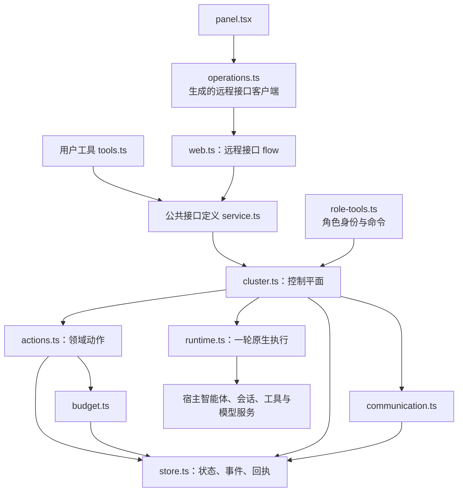

# 代码结构

`dsh-flow` 是 DeepSeek Harness 宿主中的插件，负责管理任务单元、身份、预算和调度。智能体的每轮执行仍由宿主的 `ctx.agents`、`ctx.sessions` 和工具链完成。阅读[智能体分类](/agents)和[任务派发](/dispatch)时，应注意管理树表达的是职责关系，并不对应进程树。

## 目录分工

```text
packages/dsh-flow/
  src/
    index.ts               插件装配、恢复及服务发布
    config.ts              配置解析与启动参数合并
    service.ts             ctx.flow 的七个公共操作
    types.ts               宿主端、远程接口、浏览器端共享的传输类型
    validation.ts          输入校验
    errors.ts              公共错误构造
    tools.ts               用户侧 flow_start/read/control
    web.ts                 标准远程接口服务
    client.ts              浏览器端装配
    client/
      operations.ts        远程调用、分页和结果类型收窄
      panel.tsx            原生面板
    core/
      protocol.ts          角色权限、动作、状态、能力映射
      model.ts             内部对象类型与组件接口
      cluster.ts           控制循环、调度、完成收尾、恢复及查询
      actions.ts           任务单元、分配和审查动作处理
      role-tools.ts        智能体作用域内的模型工具
      runtime.ts           一轮原生智能体执行与请求、工具钩子
      store.ts             SQLite 状态、事件和回执
      budget.ts            预算预留、结算、调拨与汇总
      communication.ts     消息、群组、黑板及订阅
      scope.ts             当前分配的写路径检查
src/host/                  开发宿主、验收 IPC 和日志读取
tests/                     单元与验收场景
packages/typert-protocol/   工作区内的远程接口协议装配
```

`packages/dsh-flow` 是插件的交付边界；仓库根目录下的 `src/host` 用于开发与验收，其中的 IPC 操作不属于生产 API。插件包没有导出 `ClusterRuntime`，外部插件应通过 `FlowService` 调用功能。

## 调用关系



`index.ts` 先解析配置并创建唯一的运行时实例，再执行 `recoverAndReconcile()`。只有恢复检查成功且实例仍有效时，才通过 `ctx.provide('flow', runtime)` 发布服务。必要的宿主服务尚不可用或被移除时，由 Cordis 负责等待或卸载，插件不另行轮询。

## 按问题读源码

| 要解决的问题 | 建议入口 | 组件说明 |
|---|---|---|
| 为什么某个角色被唤醒，为什么任务单元没有启动 | `core/cluster.ts` 的 `tick`、调度候选与租约逻辑 | [控制平面与调度](/development/components/control-plane) |
| 谁能创建、修改或正式接受任务单元 | `core/protocol.ts`、`core/actions.ts` | [任务单元与独立审计](/development/components/transactions) |
| 分配、替换或迁移为什么被拒绝 | `core/actions.ts`、`core/scope.ts` | [执行分配与组织调整](/development/components/allocation) |
| 一次模型或工具调用怎样记账并结束 | `core/runtime.ts`、`core/role-tools.ts` | [智能体运行时](/development/components/runtime) |
| 重启后怎样判断命令、消息和副作用是否发生 | `core/store.ts`、`core/cluster.ts` 的恢复路径 | [持久化与恢复](/development/components/persistence) |
| 预算为什么不足，如何合法调拨 | `core/budget.ts`、`core/runtime.ts` | [预算账本](/development/components/budget) |
| 跨子树通信和黑板更新如何工作 | `core/communication.ts` | [通信与共享黑板](/development/components/communication) |
| 面板看到的状态来自哪里 | `core/cluster.ts` 的 `queryCluster`、`report`；`client/operations.ts` | [查询与可观测性](/development/components/observability) |

## 修改接口时的边界

公共传输数据的结构定义放在 `types.ts`。宿主端和浏览器端分别编译，因此共享类型不能引入 Node.js、数据库或宿主上下文对象。新增公共查询时，需要同步更新查询分支、以 `what` 区分的返回类型、远程接口生成流程，以及浏览器端的类型收窄逻辑。

新增角色动作前，应明确允许调用的角色、管理域范围、版本要求和执行安全点，再修改 `protocol.ts` 与 `actions.ts`。模型提示词和工具描述不能代替运行时检查。完整调用方式见 [API 手册](/development/api)；尚未开放的设计动作见[设计动作索引](/development/action-catalog)。

源码导航：[插件目录](https://github.com/Luohaothu/dsh-flow/tree/main/packages/dsh-flow/src)、[包导出](https://github.com/Luohaothu/dsh-flow/blob/main/packages/dsh-flow/package.json)、[开发宿主](https://github.com/Luohaothu/dsh-flow/tree/main/src/host)。
