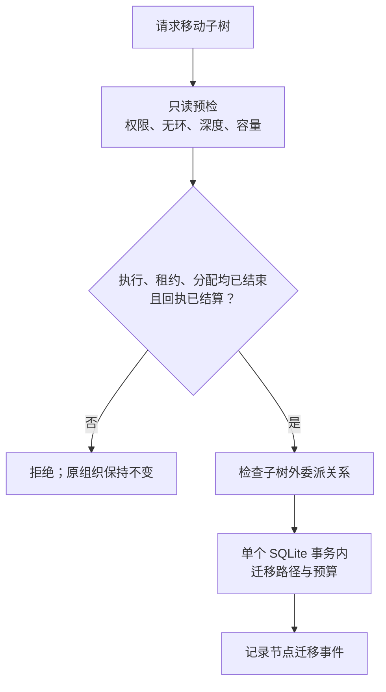

# 执行分配与组织调整

资源分配智能体把已定义的工作交给执行智能体或下级管理节点，并配置能力、模型、预算和执行容量。它不能改变任务单元的目标、交付物或验收标准。

## 主要入口

| 文件 / 符号 | 职责 |
|---|---|
| `core/actions.ts` 的 `allocateAgent`、`createWorkerForTransaction` | 为 `READY` 工作建立执行节点、智能体身份和 `ACTIVE` 执行分配 |
| `spawn_management_node` | 创建下级管理域、三个管理角色的身份及委派约定 |
| `release_agent`、`replace_agent`、`reassign_agent` | 在安全点回收、替换或重新分配身份 |
| `reparent` | 检查并原子调整父子关系及预算归属 |
| `core/scope.ts` 的 `checkWriteAccess` | 根据当前分配，检查受管写工具的路径权限 |
| `core/protocol.ts` | 定义能力与宿主工具的对应关系，以及禁止使用的工具 |

执行分配记录连接智能体 `agent_id`、任务单元 `transaction_id`、负责管理的节点 `node_id`、获授能力和写入范围。执行智能体所在的物理节点与负责它的管理节点使用不同标识；核对产物由哪个管理域产生时，应查看副作用回执的 `owner_management_id`。

## 分配与版本

已有的 `ACTIVE` 执行分配不会自动适用于修改后的任务单元计划。`store.allocationOutdated()` 会检查分配建立后是否发生过计划调整，过期分配不能用于启动执行。替换、重分配或释放身份前，原执行智能体的当前轮次与租约必须结束；回收未使用的额度后才能建立新身份，避免同一任务同时占用两份容量。

`set_concurrency` 可以调整运行上限，但不能突破集群启动时声明的额度。增加执行智能体不会自动增加根预算或模型服务容量。

## 调整父节点的实际边界

如果子树内存在未结算请求、已获准执行但尚未结算的工具调用，或委派工作尚未完成且其父任务单元在子树外，当前实现会拒绝迁移。迁移时，子树内部任务单元所属的管理节点不变；改变的是该管理节点所在的分支，而非将每个任务单元改归新的父节点。

随子树迁移的预算只包括未使用且未预留的额度，新父节点必须有足够容量承接，继承的截止时间不能延后。预检失败时，不会先中止原来的工作。

## 写入范围的限制

当前 `assertWriteScopeFree` 会拒绝同一集群中 `ACTIVE` 执行分配声明的重叠写入路径。`write/edit` 检查实际请求路径；`bash/job_kill` 则要求分配记录声明整个工作区的写入范围。检查时会规范化路径并处理符号链接。

这些检查只覆盖受管调用，不构成文件系统锁，也无法完整隔离外部进程或所有浏览器、MCP 操作的副作用。是否移除插件层的排他写限制仍待评估；宿主沙箱、角色权限、租约和独立结果验收分别承担其他限制与核验职责。

继续阅读：[预算账本](/development/components/budget)、[智能体运行时](/development/components/runtime)。

源码：[actions.ts](https://github.com/Luohaothu/dsh-flow/blob/main/packages/dsh-flow/src/core/actions.ts)、[scope.ts](https://github.com/Luohaothu/dsh-flow/blob/main/packages/dsh-flow/src/core/scope.ts)。
