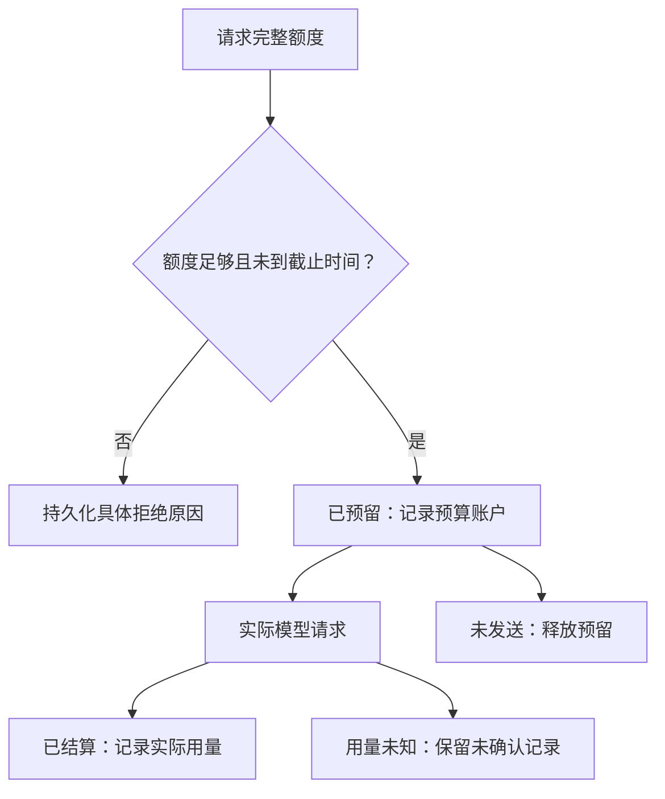

# 预算账本

预算组件管理额度、预留和实际用量。父节点下拨给子节点的额度来自已有预算；汇总集群预算时，不能把父子额度当作彼此独立的预算重复相加。

## 主要入口

| 符号 | 用途 |
|---|---|
| `createBudget`、`budgetView` | 为预算账户建立账本，并生成查询视图 |
| `reserveChain` | 在截止时间和各维度可用额度内预留 |
| `settleChain`、`releaseChain` | 结算实际用量，或释放未使用的预留额度 |
| `transferBudget` | 转移未使用且未预留的额度 |
| `reclaimCapacity` | 归还智能体数量额度和并发执行额度 |
| `effectiveDeadline`、`rollupBudgets` | 计算继承的截止时间，汇总集群用量 |
| `runtime.ts` 的模型请求记账函数 | 记录每次请求由哪个预算账户承担用量，并保存回执 |

上述账本函数位于 `core/budget.ts`。资源调拨由资源分配智能体的动作触发；自动补足额度时，依据的是运行时测得的具体请求缺口。

## 维度及语义

| 维度 | 语义 |
|---|---|
| `tokens`、`model_requests`、`tool_calls` | 用量累计，保存额度 `limit`、预留量 `reserved` 和已用量 `spent` |
| `agents`、`max_active_agents` | 容量：占用时预留，释放时归还，不累计已用量 |
| `wall_time_ms` | 形成绝对截止时间；继承祖先中最早的截止时间 |

请求获准发送前，必须先检查剩余额度。结算必须记录真实用量，即使用量高于预留，也不能截断记录来掩盖超支；用量记录中的 `overshoot` 用于报告这类情况，后续请求仍受额度约束。

## 请求用量归属

一次模型请求的全部 Token 用量和请求次数必须由同一个预算账户承担，不能拼凑多个账户的余额，也不能在没有账户承担用量时发送。持久化回执中的 `usage_receipt.budget_scope_id` 记录实际使用的预算账户，结算与释放均针对该账户，恢复时不能改用重新推导的祖先账户链。

普通请求优先使用本管理域及相关智能体的额度；上下文压缩请求优先使用专门预留的摘要预算。这部分额度从根预算中划拨，不能作为额外预算加到根预算之上。分给闲置智能体的额度可以回收；兄弟管理域之间的预算调拨，需要由资源分配智能体明确发起。

回执状态 `RESERVED` 表示额度已预留，`SETTLED` 表示已按实际用量结算，`NOT_SENT` 表示请求未发送，`UNKNOWN` 表示请求的实际用量尚无法确认。

## 调拨与恢复边界

- 只能转移未使用且未预留的额度；已用量不会因调整父节点、替换执行者或恢复而下降。
- 暂停和重启不重置按实际经过时间计算的截止时间；迁往时间限制更宽松的父管理域，也不能延长原先更早的截止时间。
- 余额很低本身不足以触发模型调度；调拨通知应附确切请求缺口。
- CPU/GPU 和内存尚无可信的按管理域计量方式；本地 `api_cost` 的未计价标记不意味着真实成本为零。

源码：[budget.ts](https://github.com/Luohaothu/dsh-flow/blob/main/packages/dsh-flow/src/core/budget.ts)、[runtime.ts](https://github.com/Luohaothu/dsh-flow/blob/main/packages/dsh-flow/src/core/runtime.ts)。
