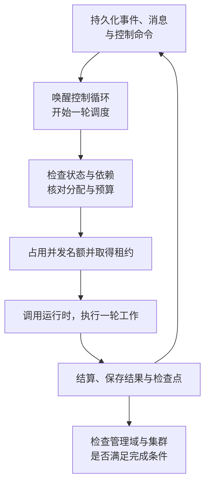

# 控制平面与调度

控制平面从已保存的工作中筛选满足条件的项，交由宿主执行。它需要协调三类状态：集群与节点是否允许运行，任务单元是否具备执行和交付条件，以及智能体的执行轮次与租约是否有效。

## 主要入口

| 文件 / 符号 | 职责 |
|---|---|
| `src/index.ts` 的 `apply` | 创建运行时；恢复完成后发布 `ctx.flow`；注册卸载时的清理操作 |
| `src/core/cluster.ts` 的 `ClusterRuntime` | 协调公共服务、调度、租约、上下文管理、故障恢复和集群收尾 |
| `start`、`control` | 创建集群；暂停、恢复或取消整个集群 |
| `wake`、`tick` | 唤醒控制循环，为满足执行条件的管理角色或执行智能体安排工作 |
| `evaluateCompletion` | 判断任务单元和管理节点是否满足完成条件 |
| `recoverAndReconcile`、`dispose` | 启动时核对恢复状态；卸载时在限定时间内清理运行资源 |

本页 `src/` 均指 `packages/dsh-flow/src/`。角色动作的具体处理见[任务单元组件](/development/components/transactions)和[分配组件](/development/components/allocation)。

## 一次调度的协作

有待处理事件或本管理域内有可执行动作时，调度器会唤醒相应管理角色。执行智能体则必须持有有效的执行分配，且计划未过期、任务单元可启动；进入候选列表不代表已经获准执行。调度器还会分别检查活跃智能体容量和模型请求并发，已创建的身份数不能用来代表正在推理的数量。

## 完成与控制语义

根任务单元全部达到 `ACCEPTED` 后，根节点的编排智能体仍须完成整体目标要求的后续工作，并调用 `finish_cluster`。管理节点要等各角色的当前执行轮次结束，保存摘要，并由审计智能体完成最终编排质量评估，再回收闲置额度与身份，才能进入 `COMPLETED`。

`pause` 保存任务单元可恢复的状态并停止推进；`resume` 重新检查暂停前的状态和版本，不会将所有任务单元直接改为 `READY`。`cancel` 终止整棵子树的执行，使旧租约失效，并处理集群登记的后台任务。编排智能体还可以暂停或取消单个任务单元，这与控制整个集群是两类操作。

## 不变量与恢复边界

- 一轮执行的身份、执行代次和租约必须一致；迟到的旧执行不能借用新租约提交结果。
- 调度及整棵管理树的控制操作应查询各自操作范围内的完整数据，不能把界面上的一页数据当作全部节点。
- 恢复核对完成前不启动新的执行；已暂停的集群在恢复后保持暂停。
- 卸载运行时时，会关闭新的执行入口并取消尚未完成的检查；晚到的恢复结果不能重新发布服务。

排查任务未被调度的原因时，依次检查任务单元状态、依赖是否已正式接受、执行分配是否过期、节点阻塞原因、预算拒绝事件和活动租约。仅凭队列非空，无法判断调度器是否遗漏了工作。

源码：[index.ts](https://github.com/Luohaothu/dsh-flow/blob/main/packages/dsh-flow/src/index.ts)、[cluster.ts](https://github.com/Luohaothu/dsh-flow/blob/main/packages/dsh-flow/src/core/cluster.ts)。
