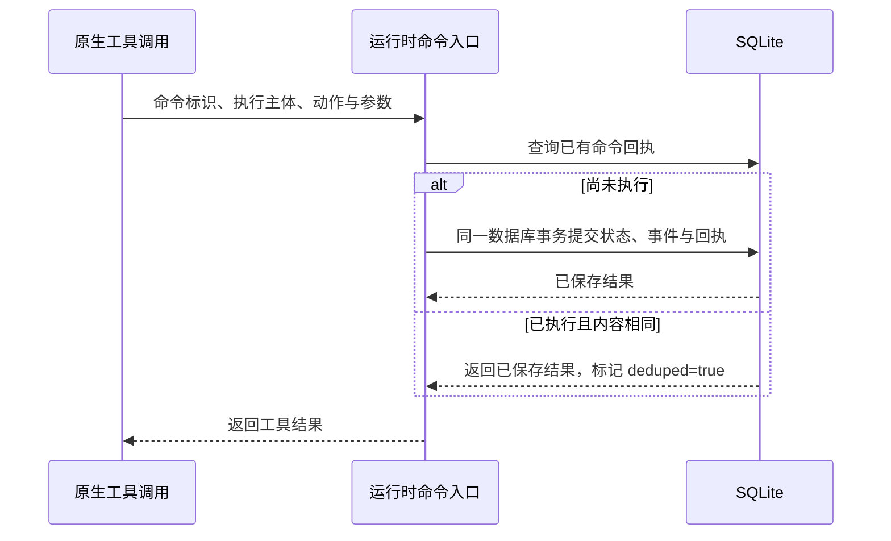

# 持久化与恢复

持久化组件保存运行记录：任务单元与分配、命令结果、事件、预算、租约，以及原生事件投影、工具和消息回执。智能体的原生对话保存在宿主会话中；集群的 SQLite 数据库与宿主会话记录必须相互核对，不能仅凭一侧缺少记录就断定动作未发生。

## 主要入口与记录

| 入口 / 数据 | 用途 |
|---|---|
| `core/store.ts` 的 `ClusterStore`、`tx` | 同步访问 SQLite，外层使用 `BEGIN IMMEDIATE`，嵌套操作使用保存点 |
| `runCommand` | 将状态变更、命令回执与事件放入同一数据库事务 |
| `commands`、`events` | 保存命令结果以处理重复调用，并记录状态变化 |
| `leases`、`checkpoints` | 执行代次、租约与恢复位置 |
| `native_session_events`、`native_usage_cursors` | 原生持久化事件、幂等用量事实与消费游标 |
| `tool_call_receipts`、`effects` | 工具调用和副作用证据 |
| `messages` / `recipients` / `inbox` | 通信、投递与待处理工作 |
| `core/cluster.ts` 的 `recoverAndReconcile` | 结合宿主会话核对恢复状态的一致性，再开放调度 |

`tx` 回调必须同步完成，不能在数据库写事务尚未结束时等待模型或宿主网络操作。数据库采用 schema 4，只接受空新库或当前版本。旧版本及版本 0 但已有业务表的数据库在写入前拒绝，提示使用新 `dataDir`，不迁移、不删除原数据。

`plans` 保存以任务和 `prepared_revision` 标识的不可变计划及正式契约快照；`result_snapshots` 保存实际发布事件和生产轮次；`validation_records` 保存调度校验记录及其计划、结果引用。任务分别持有当前引用，普通状态推进不会让同一业务计划过期。`semantic_receipts` 对模型新调用 ID 的重试去重，`management_assignments` 对父任务、计划引用及委派 key 建立唯一约束。`member_inputs` 保留交接内容、真实作者、绑定对象和原生消息 ID，恢复先核对 Session 证据再决定投递。

## 命令幂等

角色工具根据会话、执行轮次和宿主 `exec.callId` 生成 `command_id`。相同命令重复到达时，`runCommand` 返回已保存结果；同一标识对应的命令内容、集群或执行主体发生变化时，会被拒绝。命令是否成功提交，不取决于调用者是否收到工具响应。

## 三类恢复证据

| 恢复对象 | 要确认什么 | 无法确认时 |
|---|---|---|
| 消息投递 | 对应消息是否存在于持久化会话记录中，不能只看是否已注入内存 | 已投递但无法确认是否持久化时，保留状态并阻塞相关执行者，避免重复注入 |
| 已提交命令 | SQLite 已有结果，但会话中可能仅有工具调用记录 | 使用持久化回执补全原生工具调用的结果记录，不能重做已提交动作 |
| 外部副作用 | 工具是否已实际执行，其结果是否可核对 | 标记不确定并阻止相关重放，等待明确处置 |

检查点的 `flushed_seq` 是原生会话中的持久化位置；`events_seq` 是集群事件位置，宿主用量消费游标记录原生事件位置。它们不能互换。原生事件以 `(nativeSessionId, event.seq)` 幂等，投影与游标原子提交，首次回放、增量和重启共用逻辑。恢复时还要废止旧租约、核对任务单元版本、工具回执和未确认副作用；重启不会重置预算，也不意味着可以安全地重新调用外部工具。

## 保证范围

命令幂等保证数据库控制动作不会因同一命令重送而重复提交，但不能据此保证文件、浏览器或外部服务的操作恰好执行一次。无法确认副作用是否发生时，应保留 `EFFECT_UNCERTAIN`，等待补充证据或完成明确处置后，再决定能否重放。

源码入口：[store.ts](https://github.com/Luohaothu/dsh-flow/blob/main/packages/dsh-flow/src/core/store.ts)、[cluster.ts](https://github.com/Luohaothu/dsh-flow/blob/main/packages/dsh-flow/src/core/cluster.ts)。
