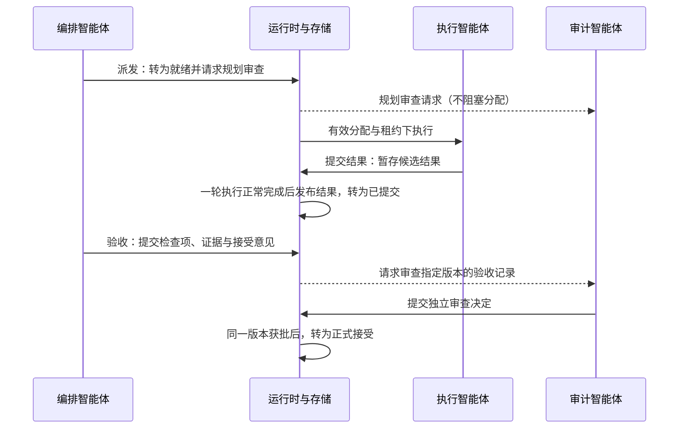

# 任务单元与独立审计

任务单元是可规划、执行和验收的一项工作。编排智能体理解目标、保存执行决定及下游简报，并实际校验交付；执行智能体向其提交产物与执行证据。审计智能体独立审核编排智能体的验收行为及其依据，不以自己补做业务检查来追认缺失的验收。数据库事务保证这些控制状态原子提交。

## 主要入口与对象

| 入口 | 关注内容 |
|---|---|
| `core/protocol.ts` | `TRANSACTION_STATUSES`、`TRANSITIONS` 和角色动作权限 |
| `core/actions.ts` | `dispatch`、`adjust_transaction`、`validate`、`inspect_validation`、`submit_result` |
| `core/cluster.ts` | 执行智能体的轮次结算、候选结果发布、重启后的版本恢复 |
| `core/store.ts` | 保存任务单元、依赖、审查、纠正问题与摘要 |

任务单元持有 `current_plan_ref`、`current_result_ref` 和 `current_validation_ref`。计划引用为 `(transaction_id, prepared_revision)`，包含服务端记录的真实作者、正式契约、理解、执行方式、理由、交接和逐项责任。`criterion_responsibilities` 引用不可变契约中的标准，不用关键词自动分派职责。验收引用为 `(transaction_id, result_revision)`，其中 `result_revision` 是创建验收提案时的任务修订号。审查分别绑定不可变计划或验收引用。

## 当前主路径

新建 `DRAFT` 产生准备方案事项。`dispatch` 仅接受已有有效计划，或同次原子提交计划；裸批量派发不能绕过此门槛。`worker` 允许分配执行者，`management` 允许资源协调按已保存简报建立子管理域，`decompose` 父任务只聚合：父计划、子计划、子任务与依赖原子保存，父任务转 `READY`，子任务保持 `DRAFT` 等待逐项派发。

规划审查继续异步监督。审核按 `plan_ref` 判断适用性，Worker 先提交结果不会使同一计划过期；父计划拒绝影响任务父子关系及委派子域。正式接受统一检查调度验收通过、当前验收记录的独立审核合规、结果与计划仍匹配，以及子任务完成条件。普通 revision 推进不等于计划或验收失效；旧引用的迟到决定只保留历史。

## 修改与返工

调用 `adjust_transaction` 前，需要等待轮次及分配达到安全点。业务修改增加 `revision` 并使旧计划、交接及分配失效；分配保存实际使用的 `plan_ref`。`expected_transaction_revision` 比较任务版本，工具顶层 `expected_revision` 仍比较集群版本。计划写入按真实作者、任务、基准版本与动作形成语义键，相同内容重试返回原回执，异文冲突必须重新读取后明确修订。

验收审核发现校验缺失、证据失配或结论依据不足时，保存不合规决定和责任人为编排智能体的问题，返回 `SUBMITTED` 并保留原结果。编排智能体补充校验，发现产物缺陷时再安排 Worker 返工。即使 Worker 文本不变，新验收记录也有新引用并重新审核；旧批准不能沿用。分别记录 `validated_by`、`audited_by` 和状态提交来源。

委派给下级的任务单元继承上级的交付约定。下级编排智能体可以细化目标、修正执行范围或增加验收检查，但不能通过更换输出文件或删除原验收标准来规避交付失败。正式接受父任务单元的结果前，还要确认委派工作是否全部完成。

## 不变量

- 执行智能体的 `submit_result` 只暂存候选结果，不能自行将任务单元标为 `ACCEPTED`。
- 发布结果需要原生执行轮次正常完成、租约有效且记账可确认；工具返回成功本身不代表工作完成。
- 正向 `validate` 必须完整覆盖正式标准，每项含稳定标准引用、实际方法、观察、判断及证据；独立审核判断方法与依据是否充分。
- 结果处于 `SUBMITTED` 或 `VALIDATING` 时，不能重复调用 `aggregate` 来替换审计智能体正在审查的版本。
- 因结果不完整而提出的纠正要求，不能仅凭计划被编辑就视为已落实。

调用示例见 [API 手册](/development/api#角色工具)。状态与执行路径见[任务派发](/dispatch)。

源码：[actions.ts](https://github.com/Luohaothu/dsh-flow/blob/main/packages/dsh-flow/src/core/actions.ts)、[protocol.ts](https://github.com/Luohaothu/dsh-flow/blob/main/packages/dsh-flow/src/core/protocol.ts)。
