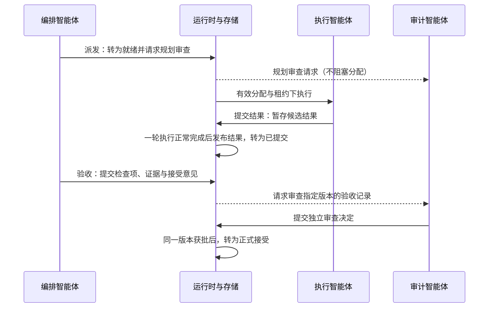

# 任务单元与独立审计

任务单元是可规划、执行和验收的一项工作。编排智能体定义目标并提出验收结论，执行智能体提交候选结果，审计智能体针对具体结果版本作出独立决定。数据库事务则用于保证这些控制状态变化原子提交，两者含义不同。

## 主要入口与对象

| 入口 | 关注内容 |
|---|---|
| `core/protocol.ts` | `TRANSACTION_STATUSES`、`TRANSITIONS` 和角色动作权限 |
| `core/actions.ts` | `dispatch`、`adjust_transaction`、`validate`、`inspect_validation`、`submit_result` |
| `core/cluster.ts` | 执行智能体的轮次结算、候选结果发布、重启后的版本恢复 |
| `core/store.ts` | 保存任务单元、依赖、审查、纠正问题与摘要 |

任务单元记录所属节点 `node_id`、负责管理的节点 `owner_management_id`、父任务单元 `parent_transaction_id`、当前版本 `revision`、结果版本 `result_revision`，以及结果 `result` 和验收记录 `validation`。审查记录通过 `kind` 区分规划审查和验收审查，并用 `target_revision` 指定所审查的版本；纠正问题记录则保存纠正要求及其证据。

## 当前主路径

规划审查采用异步监督方式：`dispatch` 会直接将任务单元转为 `READY`。规划被拒绝后仍会产生纠正要求；如果旧执行智能体还在运行，应先保留其结果与工具证据，再完成回退。结果审查则是正式接受的必要条件：只有满足 `revision = result_revision = audit.target_revision`，审查批准才能使当前结果得到正式接受；过期结论会被标记为 `STALE`。

## 修改与返工

调用 `adjust_transaction` 前，需要等待执行智能体到达安全点；修改生效后，任务单元回到 `DRAFT`，并增加 `revision`。计划调整会使旧执行分配失效，资源分配智能体必须释放旧分配并重新分配。当前实现通过 `transaction-adjusted` 与 `agent-allocated` 事件的先后顺序判断是否过期；分配表没有单独的 `plan_version` 字段。

委派给下级的任务单元继承上级的交付约定。下级编排智能体可以细化目标、修正执行范围或增加验收检查，但不能通过更换输出文件或删除原验收标准来规避交付失败。正式接受父任务单元的结果前，还要确认委派工作是否全部完成。

## 不变量

- 执行智能体的 `submit_result` 只暂存候选结果，不能自行将任务单元标为 `ACCEPTED`。
- 发布结果需要原生执行轮次正常完成、租约有效且记账可确认；工具返回成功本身不代表工作完成。
- `validate` 提出的接受意见必须附有检查项和证据，独立审查仍须判断证据是否满足验收标准。
- 结果处于 `SUBMITTED` 或 `VALIDATING` 时，不能重复调用 `aggregate` 来替换审计智能体正在审查的版本。
- 因结果不完整而提出的纠正要求，不能仅凭计划被编辑就视为已落实。

调用示例见 [API 手册](/development/api#角色工具)。概念状态机与当前实现的差异见[任务派发](/dispatch)。

源码：[actions.ts](https://github.com/Luohaothu/dsh-flow/blob/main/packages/dsh-flow/src/core/actions.ts)、[protocol.ts](https://github.com/Luohaothu/dsh-flow/blob/main/packages/dsh-flow/src/core/protocol.ts)。
