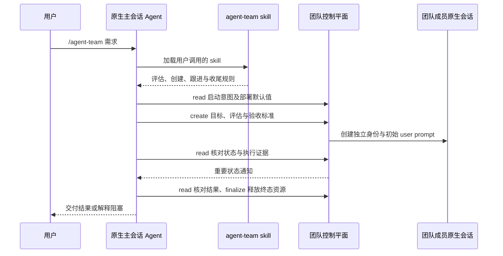

# 主会话与团队界面

主会话 Agent 负责与用户交流、评估需求和管理团队。团队中的总协调、资源协调、质量审核和执行代理分别拥有独立的原生身份与会话。团队图、层级列表和检查器提供观察入口；成员的完整原生会话承载对话、轨迹和符合生命周期条件的文本续聊。

## 需求与执行

`/agent-team` 通过宿主命令注册表接收用户提交，登记 `flow/team-launch`，并把普通 user prompt 交给主 Agent。skill 随模型请求加载。主 Agent 先评估复杂度、整理自包含目标与验收标准，再调用 `agent_team_create`；命令提交成功本身不表示团队已经创建。工具名、参数与幂等规则见 [API 手册](/development/api#主会话命令与执行工具)。

主会话和后台总协调的日志分别保存。主 Agent 通过 `agent_team_read` 查看实际状态与事务证据，通过 `agent_team_message` 传达整理后的补充要求，通过 `agent_team_control` 执行用户明确的暂停、恢复或取消指令。重要状态通过原生持久化 inbox 唤醒主 Agent；Agent 读取证据后输出普通正文。`agent_team_finalize` 释放终态资源，保留会话、审查、通信与结果。

同一主会话可以有多次运行。`run_id` 指定操作对象，`launch_id` 绑定一次启动意图。界面默认展示未结束的团队或最近一次运行。主会话工具可按明确的运行标识读取或操作指定团队，并验证归属。

## 导航与输入

| 入口 | 内容与行为 |
|---|---|
| 主会话 | 官方 Chat 与输入框，保留普通问答；主 Agent 管理团队整体目标和生命周期 |
| 顶栏“智能体团队” | 当前团队摘要与派生树；展开按钮只调整折叠，名称打开成员原生会话 |
| “智能体”视图 | 只读拓扑与层级列表，支持折叠子树、平移缩放和打开成员检查器 |
| 成员完整会话 | 通过宿主 `openSession` 导航，保留原生对话、轨迹、工具细节与阅读状态 |
| 停靠检查器 | 在宿主容器中嵌入完整原生会话内容，供只读观察 |

成员会话通过公开会话驱动把文本提交交给 Flow 调度。未回收、团队未终止的成员允许文本续聊；当前运行中的轮次收到输入后，由调度与原生 inbox 处理。回收后的成员或终态团队保留完整对话和轨迹，并显示禁止输入的原因。服务端再次检查身份、团队状态和输入内容，实际执行继续受能力、预算与租约约束。成员会话中的停止只中断该成员的当前执行轮次；团队控制由主会话工具完成。

原生面包屑和“主会话”按钮返回所属主会话。打开成员、切换标签、展开节点或读取冷会话历史都不会自行启动执行。观察保留使用 `allowUnlisted` 和 `observationOnly`，历史读取仍由宿主校验。

## 团队快照与状态

`teamRead` 在同一数据库事务中投影运行、代理、关系、通信、预算与上下文。实际创建和分配记录确定父代理；未知关系显示待补全，不按角色名称推测父子关系。代理的执行结果与资源是否回收分别展示，`TERMINATED` 不能覆盖已记录的工作结果。

客户端观察器按主会话隔离，以运行标识、版本和请求代次拒绝迟到响应。断连时保留最后完整快照并显示非实时状态；重连后重新读取。列表分页读取到结束，页面上的一页数据不能代表完整团队。

选择、折叠和画布位置按主会话与运行保存。拓扑连线表示派生关系；通信内容通过原生会话内的通信卡呈现，团队快照同时保留通信证据。宿主已记录用量、当前上下文和保留的预算额度分别展示；未知、零和不完整统计有不同标记，共享额度不重复累加。

## 通信呈现

成员初始任务是原生 user prompt。后续协作与事件通信使用 `Agent.send` 的 `next-step` 通道，并设置 `trigger_compaction: false`；调度提示负责唤醒执行。用户从成员输入框提交的真实文本保留其用户消息身份。

通信记录使用官方 `conversation.chat.node` 的结构化节点。卡片默认折叠为一行摘要，展开后显示类别、发送方、接收方、时间、关联任务和完整 Markdown 正文。八类消息、投递与处理语义见[通信与共享黑板](/development/components/communication)。成功或警告样式来自结构化状态，不能从正文猜测审批结果。

## 插件设置

插件管理中的 `dsh-flow` 卡片打开宿主标准设置页。执行设置通过宿主 `configForms` 保存，用于之后创建的团队；显示偏好在当前浏览器保存。

| 设置组 | 可调整内容 |
|---|---|
| 团队默认值 | 深度、直接子节点数、身份上限、时限、串行或并行模式、活跃执行容量与 Agent 模型调度许可 |
| 模型与用量 | 跟随主会话或固定模型、推理等级、工具次数与容量额度；宿主已记录 Token 及统计完整性 |
| 更多执行限制 | 管理轮次、尝试及纠正次数 |
| 显示与阅读 | 默认拓扑或列表、已结束节点、动态效果、用量格式、对话自动跟随 |

编辑草稿后保存才生效。保存失败保留草稿；离开页面时可保存并离开、放弃更改或继续编辑。保存未完成时等待真实结果，不提前导航。实例不允许写入配置时，设置保持只读。

## 宿主边界

插件管理、输入框、会话、轨迹、导航、菜单、停靠、确认和主题由宿主公开接口提供。dsh-flow 在挂载区提供领域内容和 `.flow-*` 样式，不依赖宿主私有 DOM、截图位置或全局样式覆盖。具体接口和依赖补丁见[宿主接口与补丁](/development/provider-interfaces)，验证范围见[验证方法](/development/validation)。
