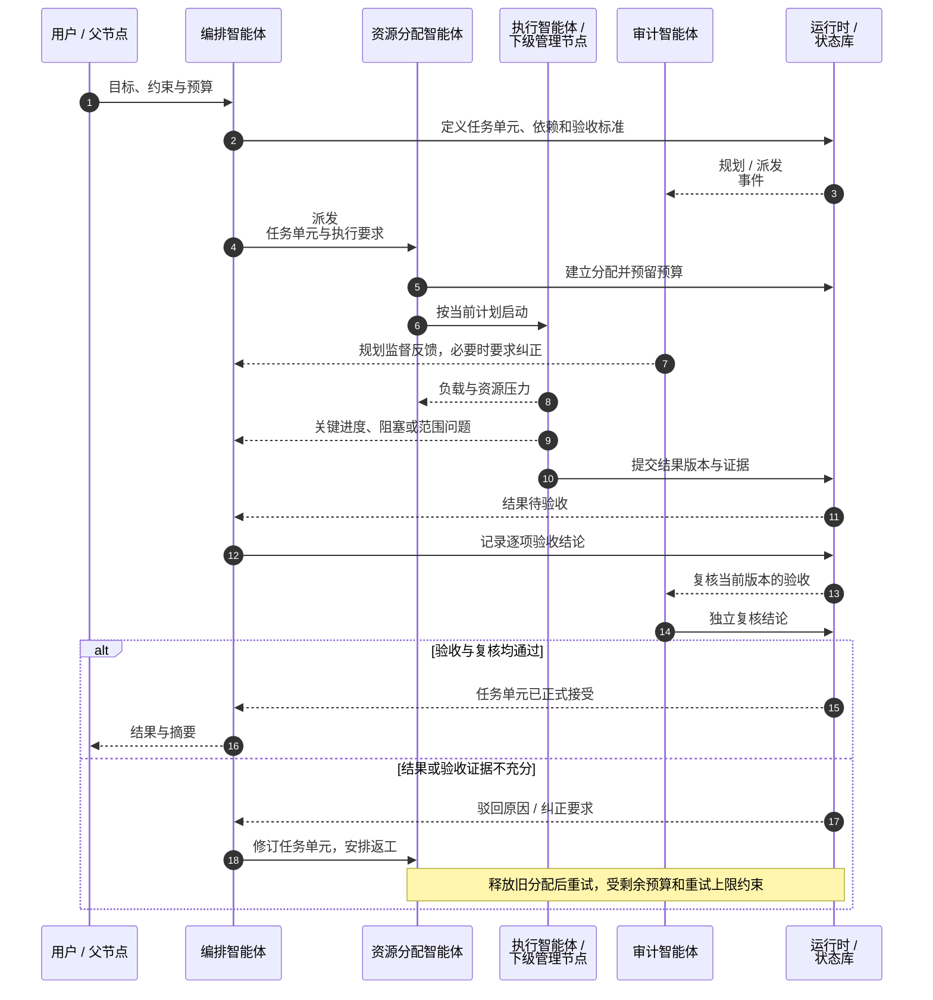
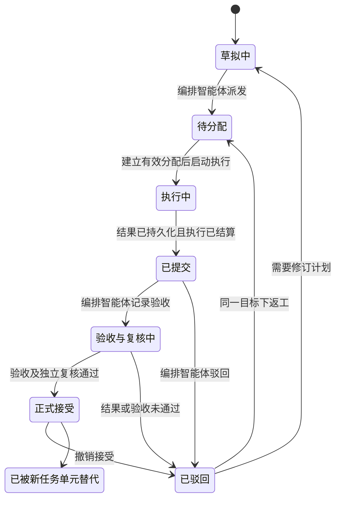

# 任务派发

派发时，编排智能体将**任务单元及其执行要求**交给资源分配智能体。后者选择执行者和模型，授予工具能力，并配置预算和并发数。编排智能体对目标和验收负责，资源分配智能体对执行配置负责，执行智能体或下级管理节点负责产出候选结果，审计智能体独立复核验收过程。

任务单元是可规划、执行和验收的工作单元，与数据库 ACID 事务含义不同。派发后还需要分配资源并满足执行条件，执行完成后还需要业务验收和独立复核。本页先说明完整流程，再介绍任务单元定义、版本绑定、任务单元状态和异常处理。

## 从目标到交付

以“完成某模块改造并提交验证报告”为例，根管理节点的编排智能体将目标拆成接口梳理、实现、验证三个任务单元。实现需要先取得接口结论，验证需要先取得实现产物。接口梳理可以直接交给执行智能体；如果实现需要继续规划多个相互关联的子任务，则为它创建下级管理节点。不同分支可以直接讨论接口问题，但仍由各自负责的管理节点组织验收。

1. **定义工作。** 编排智能体明确任务单元目标、输入、约束、依赖、预期产物和验收标准。
2. **提交执行。** 编排智能体将任务单元及其执行要求提交给资源分配智能体；审计智能体独立检查规划是否遗漏、冲突或偏离目标。
3. **配置资源。** 资源分配智能体匹配执行智能体或建立下级管理节点，配置模型、工具授权、预算和并发额度。
4. **执行并反馈。** 执行智能体在授权范围内运行，报告进度、阻塞与产物；资源问题先交给资源分配智能体，目标或验收问题交给编排智能体。
5. **提交与验收。** 执行智能体提交产物和证据；编排智能体逐项检查验收标准，审计智能体独立复核验收过程及其证据。
6. **汇总或返工。** 通过后汇总结果，未通过则形成明确的修改要求和新执行尝试；超出本管理域的能力时，将问题提交上级处理。
7. **完成交付。** 根节点确认整体目标已完成后，提交结果摘要、归还资源并保存最终管理和审计记录。



规划审查可以异步进行，每次派发不必等待审计智能体完成检查。结果接受则有明确的前置条件：只有该结果版本通过业务验收和独立复核后，才能标记为 `ACCEPTED`。审计智能体检查编排智能体的验收结论是否成立，业务标准及其修订仍由编排智能体负责。

下级管理节点如何分解和向父节点交付，见[递归委派](/hierarchy#递归委派)；各角色权限与纠正闭环见 [智能体分类](/agents)。

## 核心对象

| 对象 | 需要记录的内容 | 主要责任方 |
| --- | --- | --- |
| 任务单元 | 目标、输入、约束、产物、验收标准、依赖、优先级、所有者、版本与状态 | 编排智能体 |
| 执行要求 | 所需能力、质量要求、时延目标、成本上限以及是否需要进一步规划 | 编排智能体定义，资源分配智能体判断能否满足 |
| 执行分配 | 任务单元及计划快照、执行者、模型、能力授权、资源额度和有效执行身份 | 资源分配智能体 |
| 结果与证据 | 结果版本、产物引用、实际完成项、未完成项及可复核证据 | 执行智能体或下级管理节点提交 |
| 验收与审计 | 针对特定结果版本的逐项验收与独立复核，包含理由和证据 | 编排智能体 / 审计智能体分别记录 |
| 纠正要求 | 问题、受影响对象与版本、责任方、所需修改、复核依据和处理状态 | 审计智能体提出，编排智能体修正 |
| 摘要 | 任务单元进展、结论、证据引用、未决问题、资源与治理状态 | 三类管理角色分别提供自己负责的部分 |
| 运行事件 | 发生了什么、涉及哪些对象、对应哪个版本、何时发生 | 运行时持久化并投递 |

一个任务单元在任意时刻只有一个负责它的管理节点。委派给下级后，上级仍需对该委派任务单元向其父节点负责；下级编排智能体对本管理域新建的子任务单元负责。上级根据委派约定验收汇总结果，无需接管每个子任务单元。

## 任务单元定义示例

以下 YAML 展示任务单元在设计上需要保存的信息，不能直接作为工具参数调用；实际字段与校验规则见 [API 文档](/development/api)和[代码结构](/development/code-structure)。

```yaml
transaction:
  id: tx-implementation
  owner_management_id: management-root
  plan_version: 3
  objective: 完成模块改造并保持既有接口行为
  inputs:
    specification_ref: artifact://interface-spec/v2
  dependencies:
    - transaction_id: tx-interface
      condition: ACCEPTED
  constraints:
    - 保留既有公共接口
  expected_output:
    - 代码变更
    - 验证报告
  acceptance_criteria:
    - 约定的接口行为检查全部通过
    - 每项代码变更能够追溯到需求或缺陷
  requirements:
    capabilities: [fs_read, fs_write, shell]
    quality_level: reviewed
  budget_constraint:
    tool_calls: 2048
    wall_time_ms: 600000
  priority: 1
```

验收标准应当在执行前可理解、执行后可检查。`confidence` 可以作为判断的补充，不能代替证据。若标准变更，应保留版本和变更理由；涉及上级委派约定时，必须先向上级申请调整。

## 计划、结果与执行尝试的版本绑定

三个关系必须明确：

1. **执行绑定计划。** 每条执行分配都关联获准执行时的计划快照。目标或验收标准变化后，执行智能体不能沿用旧授权执行新计划。
2. **审查绑定结果。** 验收与审计结论绑定同一个 `result_revision`。新结果不能继承旧版本的通过结论；迟到的结论保留为历史记录。
3. **重试绑定尝试。** 每次新尝试都必须有可区分的执行身份和租约。旧尝试恢复运行后产生的消息，以及迟到或重复的提交，都不能覆盖新尝试。

调整处于运行中的任务单元时，先停止新增执行并等待安全点，保留已发生的产物与工具回执，再撤销或释放旧分配并建立新分配。计划修订、资源重配和结果重验收应形成一条可追溯的记录链。

## 任务单元状态机 {#事务状态机}

以下图示展示任务单元的常规派发和验收路径。任务单元 `ACCEPTED` 表示结果通过业务验收与独立复核；管理节点 `COMPLETED` 表示管理域已完成交付与收尾。这两种结论不能由执行智能体自行声明。

文中的执行结算指当前尝试的实际用量入账；管理节点最终完成交付前，还需归还未用额度、释放身份并保存治理记录。



编排智能体的 `dispatch` 动作将任务单元提交调度。执行需要有效分配、已满足的依赖和预算，常规路径由 `READY` 进入 `RUNNING`。协议也允许 `DISPATCHED` 表示已分配状态；它不是当前分配路径必经的步骤。

| 状态 | 含义与离开条件 | 主要触发方 |
| --- | --- | --- |
| `DRAFT` | 正在定义或修订；定义充分后才可派发 | 编排智能体 |
| `READY` / `DISPATCHED` | 已提交调度 / 已建立分配；依赖已满足，且具备所需能力、预算和可用执行名额后运行 | 资源分配智能体、运行时 |
| `RUNNING` | 执行智能体正在执行，或委派任务单元正在等待下级完成执行并汇总结果 | 运行时 |
| `SUBMITTED` | 有已提交且完成结算的候选结果，尚未完成验收 | 执行智能体、运行时 |
| `VALIDATING` | 已进入验收，等待对该版本的独立复核 | 编排智能体、审计智能体 |
| `ACCEPTED` | 当前结果被正式接受，可满足下游依赖；重验收必须显式撤销接受 | 运行时根据验收与审计结论提交 |
| `REJECTED` | 候选结果未通过，保留原因；可在预算内返工或修订计划 | 编排智能体、审计智能体 |
| `BLOCKED` | 存在不能自动消除的阻碍，如关键输入缺失或预算不足；修复后重新检查调度条件 | 运行时记录，责任角色解决 |
| `PAUSED` | 因控制命令主动暂停；保存暂停前状态，恢复时校验版本和执行资格 | 编排智能体，或用户 / 宿主的集群控制 |
| `FAILED` | 当前执行策略已失败；在重试次数限制内，经明确批准后可重新进入调度 | 运行时、编排智能体 |
| `CANCELLED` | 已取消，不再恢复；再次执行需要新任务单元 | 编排智能体，或用户 / 宿主 |
| `SUPERSEDED` | 被新任务单元或新分解结构替代；保留历史关联，不再调度 | 编排智能体 |

异常分支补充规则：尚未结束的任务单元可因对应原因转为 `BLOCKED`、`PAUSED`、`FAILED` 或 `CANCELLED`，但转换前必须妥善处理仍在运行的执行尝试。恢复不等于无条件回到 `RUNNING`：有待审结果时继续验收，计划已失效时退回 `DRAFT`，需要重跑时重新申请分配。规划审查发现问题时可要求回到 `DRAFT`；如果旧执行智能体仍在运行，先保留其结算结果，再完成回退。

`ACCEPTED` 表示当前结果已被正式接受，这一状态可以撤销。若后续监督发现验收错误，必须记录重新验收的原因，并重新检查依赖该结果的任务单元和已生成的汇总，防止继续使用已经失效的结论。重新规划会暂停直接依赖该结果且尚未终止的任务，并清除其验收记录；该处理不递归撤销所有已接受结果。涉及更广的依赖或汇总时，需要编排智能体逐项核对并按权限处理。

## 事件驱动派发

| 角色 | 主要订阅事件 | 应产生的响应 |
| --- | --- | --- |
| 编排智能体 | 结果提交、失败、阻塞、依赖完成、目标变更、审查反馈 | 验收、调整、汇总、返工，或提交上级处理 |
| 资源分配智能体 | 待分配任务单元、智能体空闲、资源压力、模型异常 | 分配、回收、替换、再平衡或缺口反馈 |
| 审计智能体 | 创建或修改任务单元、派发、验收、重规划、重要反馈长期未处理 | 审查、纠正、履职评估，或提交上级处理 |

状态变更及其对应事件应一致写入持久化存储。角色重启后，可根据保存的处理位置或待处理队列继续工作，并使用命令或事件标识去重。调度器应分批提供新增信息，并合并重复的资源通知，避免每个细小事件都触发一次模型调用。

系统根据持久化状态、执行账本、产物和决策记录判断实际发生了什么，并通过运行追踪展示这些信息。角色不能用会话中的旧摘要覆盖较新的持久化版本。

## 资源不足时如何决策

资源分配智能体先释放闲置分配和无效预留，再在授权范围内回收或再平衡预算、减少并发、选择符合要求的执行配置。仍不可满足时，向编排智能体报告缺口和可行选项，由其决定调整任务单元、申请上级支持或结束任务。

预算不足不能自动扩大根预算、跳过独立复核或降低验收标准。只有确认出现需要调度处理的具体资源缺口时，才唤醒调度角色；余额为零本身不应触发一次新的模型调用。预留、结算与逐级归还的完整规则见[集群配置参数](/configuration/cluster)。

## 失败、恢复与副作用

| 问题 | 处理原则 | 主要责任方 |
| --- | --- | --- |
| 执行智能体 / 模型失败 | 区分可重试错误与不可恢复错误；在预算和尝试次数内重新分配 | 资源分配智能体；需要改计划时交编排智能体 |
| 计划遗漏或目标漂移 | 附证据提出纠正，修改后复核；持续未修正则提交上级处理 | 审计智能体、编排智能体 |
| 结果不完整或证据不足 | 保留候选结果与失败检查项，明确返工范围 | 编排智能体、审计智能体 |
| 角色或宿主重启 | 恢复持久化状态，废止旧租约，核对旧执行轮次的结果，再允许启动新执行 | 运行时 |
| 工具已执行但响应丢失 | 查验工具回执和实际产物；无法确定时标记不确定并阻塞相关重放 | 运行时、资源分配智能体 |
| 依赖结果被撤销 | 识别受影响的下游执行与汇总，明确标记为失效，或重新验收 | 编排智能体 |
| 管理或监督长期无进展 | 按时限告警并提交上级处理，不能靠无进展的模型调用掩盖停滞 | 运行时、审计智能体；根节点交用户 / 宿主 |

执行租约应携带能区分新旧执行的代次，使迟到的旧执行轮次不能继续提交控制状态。恢复时先核对状态与证据，再允许启动新执行；不会因进程重启而自动重新获得预算。

消息去重、命令幂等与外部副作用是不同层面的保证。数据库中命令只提交一次，并不证明文件、浏览器或外部服务的动作只发生一次。自动重放前必须知道副作用是否已发生；工具回执也不能代表完整的文件变化记录。

多个智能体修改同一产物时，应通过任务依赖、责任范围、实际文件差异和验收证据识别冲突。声明了 `write_scope` 不等于持有文件系统锁；需要强隔离的场景，应使用宿主提供的独立工作区或其他真实隔离机制。

## 当前实现与开发入口

- **派发与审查：** 任务单元在派发后可先进入 `READY`，规划监督异步进行；结果被正式接受前，仍需由审计智能体复核同一结果版本。
- **结果提交：** `submit_result` 先暂存当前执行轮次提交的候选结果。只有执行轮次正常结束、租约仍然有效且工具副作用核对通过后，才将其发布为 `SUBMITTED`。如果执行轮次正常结束但没有显式提交结果，当前实现也可以将本轮工具回执作为候选结果；这些结果仍须经过验收。
- **写入范围：** 运行时会拒绝部分写入路径重叠的执行分配，并检查部分工具的操作范围。这些检查不保证文件系统始终只有一个写入者。

实际工具参数见 [API 手册](/development/api)，任务单元与调度代码入口见[代码结构](/development/code-structure)，宿主能力边界见 [dsh 兼容性](/development/compatibility)。
