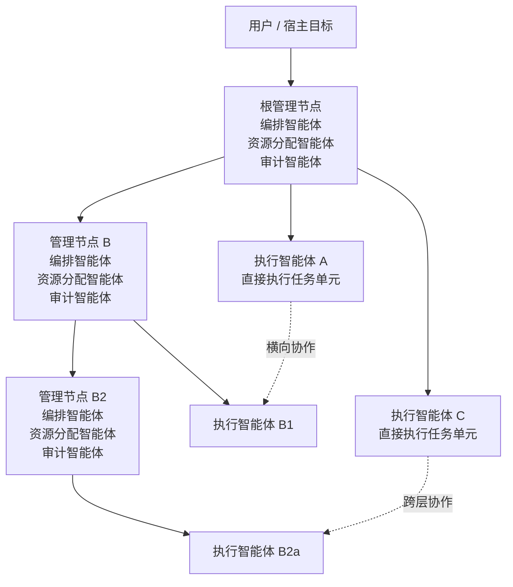
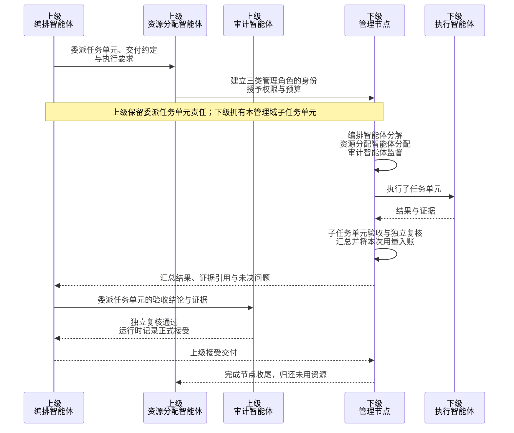
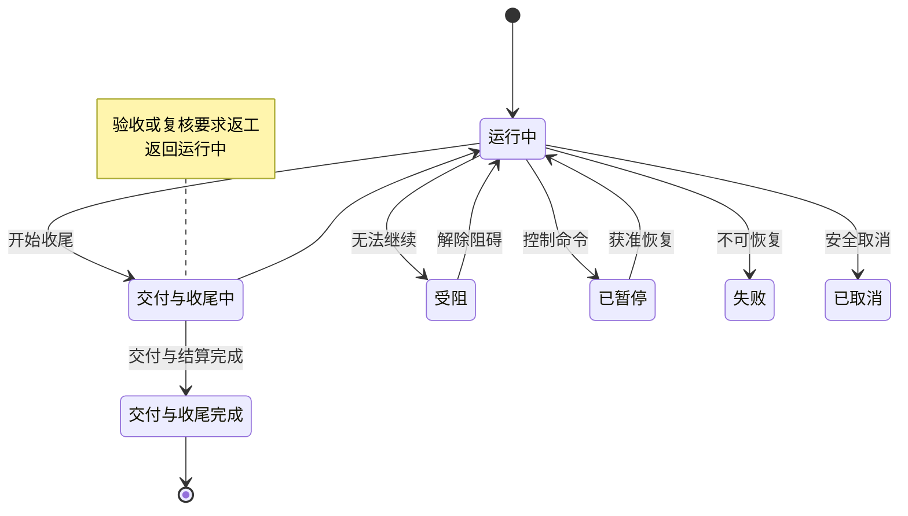

# 层次化智能体结构

智能体集群使用一棵有根的管理树组织工作，各分支可以具有不同的深度和规模。每个管理节点只直接管理有限的子节点；复杂工作可以继续向下分解，简单工作直接交给执行智能体。局部问题优先在所属管理域内解决，结果逐级汇总，未用预算逐级归还，交付责任沿管理关系追溯。

本页说明节点类型、递归委派、完成条件和组织结构调整。角色细节见 [智能体分类](/agents)，任务单元的派发和验收见 [任务派发](/dispatch)。

## 管理节点与执行节点

管理树包含管理节点和执行节点两类逻辑节点。相关概念如下：

| 概念 | 含义与边界 |
| --- | --- |
| 管理节点 | 包含编排智能体、资源分配智能体、审计智能体三个角色的管理单元；拥有自己的管理域，可继续创建子节点 |
| 执行节点 | 负责具体执行的叶子节点，包含执行智能体；需要进一步规划时向所属管理节点反馈 |
| 智能体 | 具有身份、角色、会话和执行状态的行动主体；管理节点中的三个角色也是智能体 |
| 父节点 / 子节点 | 管理树上的直接父子关系；每个非根节点有且只有一个父节点 |
| 管理域 | 一个管理节点直接负责的任务单元、分配和子节点；下级管理节点内部的细节由其自行管理 |
| 根管理节点 | 管理树根节点，接收外部目标并最终向用户或宿主交付结果 |

图中实线表示管理责任，虚线表示协作通信。三类管理角色位于管理节点内部，不计入它的子节点数。因此，3 个子节点不等于 3 个智能体。节点数、智能体身份总数和同时运行的智能体数需要分别统计。

管理节点刚创建时可以暂时没有子节点。进入正常执行后，执行节点位于管理树的叶子，负责具体工作；管理节点负责组织下级执行、汇总结果并完成交付。

## 管理树、任务单元关系与通信图

| 关系 | 回答的问题 | 约束 |
| --- | --- | --- |
| 管理树 | 谁管理谁，谁向谁交付或提交待处理问题 | 具有根节点且不成环，每个非根节点只有一个父节点；允许动态调整 |
| 任务单元分解关系与依赖图 | 工作如何拆解，哪些结果必须先准备好 | 父子任务单元表达目标分解；依赖边构成有向无环图，禁止依赖死锁 |
| 通信图 | 谁正在与谁交换信息 | 可跨管理层级和子树；通信边不改变管理权或验收权 |

**任务单元（Transaction）是可规划、执行和验收的工作单元，与数据库 ACID 事务含义不同。** 一个管理节点可以拥有多个任务单元；某个任务单元也可以委派给下级管理节点，由后者继续拆分。任务单元分解不必逐项创建管理节点。

共享黑板是共享信息载体，用于存放带版本记录的信息、产物引用和协作记录。它与通信图配合，不替代任务单元状态库或预算账本。

## 递归委派

可以直接执行的工作优先交给执行智能体。只有当某项任务单元需要独立的任务分解、多个执行者协调或持续的局部验收时，才引入下级管理节点。单纯增加并行度通常可以通过增加执行智能体解决；每增加一个管理层级，都要承担三类管理角色的规划、审计和上下文成本。

委派约定至少应写明目标、输入、交付位置或形式、必须遵守的上级约束、验收标准、预算上限、深度限制，以及请求上级处理问题的方式。下级可以细化计划并增加检查，不能自行替换上级要求的产物或删除继承的验收条件。下级的汇总结果仍是上级任务单元的候选结果，需要经过上级验收。

一个任务单元在任意时刻只有一个负责它的管理节点。委派后，上级保留该委派任务单元的责任，下级编排智能体对本管理域新建的子任务单元负责。上级验收汇总结果，无需接管每个子任务单元。

候选结果正式发布前，必须将当前执行尝试的实际用量入账。调用 `submit_result` 时可以先暂存候选结果；宿主中的本轮执行正常结束，且租约和记账检查通过后，才正式发布，供后续验收。父节点接受交付后，下级管理节点再完成收尾，归还未用额度并释放身份。执行用量结算与管理节点完成交付是两个不同阶段。

## 管理节点如何完成交付与收尾 {#管理节点如何收敛}

`DRAINING` 表示管理节点正在完成交付与收尾。此时不再接受新的常规执行，只继续必要的验收、最终交付和资源结算。图中展示的是设计生命周期，实际实现可以将部分步骤合并到同一次控制操作中。

管理节点完成需要同时满足：

1. 本管理域必须交付的任务单元均已接受，取消或失败的任务单元已被明确纳入整体失败或范围调整决定。
2. 下级工作已完成，没有仍可能写入数据或提交新结果的活跃执行。
3. 编排智能体已完成结果汇总；委派节点的交付已获父节点接受，根节点已显式确认整体目标完成。
4. 资源分配智能体已结算用量、归还未用额度并释放执行资源。
5. 审计智能体已完成必要复核，阻止交付的纠正项均已解决，或已有具备相应权限的责任方作出明确处置；最终履职评估已保存。

失败或取消也需要停止执行、结算和留存证据，但不得被记为成功完成。空队列、所有执行智能体空闲或单个任务单元已接受，都不足以判断整个集群完成。

## 直接子节点数、层级深度与扩缩容

| 参数 | 含义 | 调整时关注什么 |
| --- | --- | --- |
| 直接子节点数 | 当前管理节点直接拥有的子节点数量 | 任务单元数、通信强度、管理所需的上下文和监督事件量 |
| 层级深度 | 节点在管理树中的深度，根为 0 | 委派收益、逐级汇总造成的信息损失、验收延迟和管理成本 |
| 子树规模 | 当前子树包含的节点数和智能体身份数 | 总资源消耗、恢复范围和治理负担 |
| 活跃智能体数 / 模型请求并发数 | 活跃身份数 / 同时进行的模型请求数 | 两者分别限流，避免把正在等待的智能体也计入模型请求并发数 |

单个管理节点可先按 **4～12 个直接子节点** 进行试验，再根据负载调整。具体上限由部署配置和实验结果决定，这一范围不是已验证的最优值。资源分配智能体根据负载、预算、能力和上下文压力进行扩缩容，并保留足够资源使管理、验收和压缩能够继续运行。

系统面向数百到数千智能体的协作需求，但该规模是设计目标。实际容量需要在固定任务、预算、模型与并发条件下验证，并分别报告身份总数、驻留峰值、模型请求并发数、实际完成数和业务质量。支持某个动作或通过模拟规模测试，都不代表已经通过真实业务场景的规模验收。

组织约束与预算配置见[集群配置参数](/configuration/cluster)。

## 替换、重新分配与父节点变更 {#替换、重新分配与-reparent}

`replace_agent` 改变具体执行者；`reassign_agent` 改变执行分配；`reparent` 改变管理树中的父子归属。三者都不能隐式改变任务单元目标或验收标准。

安全的组织调整需要：

1. 确认具有操作权限、目标管理域有足够容量，并检查调整后的管理树不会成环，也不会超过深度限制。
2. 停止新的分配，等待正在进行的执行轮次和租约结束；必要时保存检查点。
3. 交接尚未完成的任务单元、结果与证据引用、上下文、尚未处理完的纠正要求和预算余额。
4. 通过受控的状态更新，一并提交所有权、预算归属和管理关系的变更，避免同一对象被重复管理，或失去负责它的管理节点。
5. 使旧执行身份失效，在新的管理域重新校验授权后恢复执行；若变更失败，应记录原因，并恢复到原状态或进入 `BLOCKED`。

结构迁移和任务单元所有权转移需要明确绑定，不能只修改一个 `parent_id`。如果实现尚不能安全迁移活跃任务单元，应拒绝该场景，仅允许静止、未承载执行的节点迁移。

## 当前实现与开发入口

当前实现运行在 DSH 宿主内，复用其智能体、会话和工具执行链，使用 SQLite 保存控制状态。管理节点是逻辑边界，不意味着额外启动一套智能体执行循环或独立调度服务。

- **交付与收尾：** 当前实现不会将节点状态设为 `DRAINING`，而是通过持久化记录推进交付和收尾，最后设为 `COMPLETED`。根节点必须通过 `finish_cluster` 明确请求结束集群；仅有根任务单元被接受，并不会自动结束集群。
- **结构迁移：** 如果子树仍有活跃执行轮次、租约、处于 `ACTIVE` 状态的执行分配、未结算请求或工具调用，或者仍承担子树外尚未完成的委派，当前实现会拒绝迁移。因此，不能假定活跃子树能够无缝迁移。
- **后续边界：** 活跃管理子树的可迁移范围、根节点请求宿主介入的交互流程仍需明确并测试，不能靠角色提示词代替运行时机制。

进一步定位见[代码结构](/development/code-structure)和 [dsh 兼容性](/development/compatibility)；组织操作的完整语义见[设计动作索引](/development/action-catalog)，实际工具参数见 [API 手册](/development/api)。
