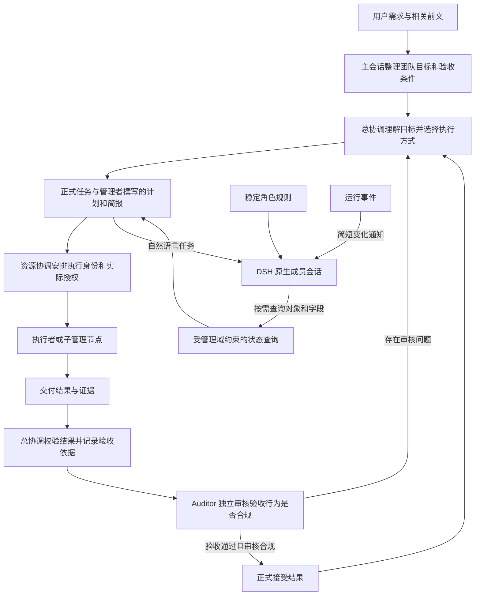

# 智能体提示词与任务交接方案

状态：实现及验证完成；见[实施验证记录](agent-prompts-and-task-handoffs-validation.md)。日期：2026 年 10 月 9 日。设计源码基线：`9c97667`。

团队成员应收到面向自己职责的自然语言任务，按需查询执行与审核所需的状态。总协调先理解目标、选择执行方式并写出交接说明，运行时负责保存决定、检查权限和版本、投递消息。固定角色职责和工具使用规则进入系统提示词；普通任务正文只承载本次工作需要的信息。

本方案解决三个问题：用户提示词包含全域状态 JSON；DRAFT 事务被机械提示立即派发，缺少可审查的任务理解与执行设计；角色说明、操作协议和固定结束语反复占据可见正文。

## 推荐设计

采用四个相互配合的机制：稳定角色规则、管理者撰写的任务简报、按需查询、与正式任务绑定的计划记录。

| 信息 | 放置位置 | 内容与责任 |
| --- | --- | --- |
| 角色职责与约束 | system section | 角色权限、规划与审核原则、查询方式、结果提交原则；所有角色均装配 |
| 本次业务委托 | 首条自然语言任务 | 上游管理者说明目的、工作内容、必要背景、交付及关键限制 |
| 本轮变化 | 简短运行通知 | 有结果待核验、有分配待处理、要求已修订等具体变化；由事件事实生成 |
| 动态执行状态 | 工具查询结果 | 事务、分配、预算、依赖、审核及证据，按对象和字段读取 |
| 机器协议 | 工具 schema 和结构化参数 | 对象引用、修订号、幂等标识、验收记录及状态变更 |



任务简报中的背景应足够让接收者理解工作，不把“去查询系统”作为唯一任务内容。大输入、完整历史、运行统计和审核证据使用引用，需要时通过工具展开。所有示例接口和字段均为本方案新增或调整的契约。

## 交付、校验与独立审核的边界

本文的总协调 Orchestrator 即调度 Agent。Worker 向调度 Agent 交付；调度 Agent 对结果进行校验并提出验收结论；Auditor 独立审核调度 Agent 的验收行为是否合规。三者的责任对象不能混用。

| 角色 | 责任对象 | 必须完成的工作 | 交付对象 |
| --- | --- | --- | --- |
| Worker | 分配给自己的业务工作 | 完成交付，提交真实结果、执行证据及限制，按调度要求纠正 | 调度 Agent |
| 调度 Agent | Worker 结果、整合结果及正式验收标准 | 实际校验结果，记录方法、证据和逐项判断，提出通过或不通过的验收结论 | 将验收记录提交 Auditor 审核；负责向上级交付 |
| Auditor | 调度 Agent 的计划行为、校验行为及验收结论的形成依据 | 审核是否遵循正式标准，是否完成必要检查，证据是否真实适用并足以支持结论，是否存在遗漏或越权 | 向调度 Agent 返回合规结论或具体审核问题 |

Auditor 可以读取 Worker 结果、工具回执和相关材料，用于审查验收证据与判断之间的关系。审核不能只检查记录是否填满，但也不能用 Auditor 自己重新完成业务校验来弥补调度 Agent 没有履行验收职责。即使结果碰巧正确，缺失必要校验的验收仍不能通过审核。

审核问题由调度 Agent 负责处理：校验不足时补充校验；交付有问题时向 Worker 下达纠正任务；要求本身有问题时按权限修订。Worker 无需直接向 Auditor 交付、申请通过或承担审核意见的闭环责任。通信能力不改变这条责任链。

若业务另有“独立重算”“交叉验证结果”等交付要求，由调度 Agent 安排另一名 Worker 或专业执行者完成，并对其结果验收；这些业务检查不由治理角色 Auditor 代替。Auditor 的审核义务由系统规则确定，调度 Agent 不能通过任务分工取消或降低对自身验收行为的审核。

## 设计时的行为与需要改变的位置

设计源码基线中的 `#pendingFor()` 对没有未回答问题的 DRAFT 事务直接生成 `dispatch`；`#rolePrompt()` 又要求立即执行待办。因此，单独删除 JSON 或将它翻译成自然语言，仍会让总协调直接转交原任务。

设计源码基线中的普通 Worker 把 `WORKER_PROMPT_HEADER` 拼在 user 正文中，执行入口没有传入 `systemInstructions`。Worker 还原样接收事务全部验收条件，包括属于调度校验、治理审核或整体团队的责任。

这些变化涉及提示词、计划及派发条件、验收责任和查询契约。原生 Agent 的模型请求、上下文容量及压缩仍遵循 DSH；计划审核继续异步监督，结果接受继续需要对调度验收行为的独立审核。现有 `validate` 保存 Orchestrator 的验收提案，`inspect_validation` 审核该提案；本方案应强化这条责任边界。

## 每个角色的系统提示词

固定规则由同一个入口为管理角色、普通 Worker、恢复会话及 single-worker 路径注册。角色名称、权限和工作方法留在 system，UUID、预算快照和全域状态不放进 system。工具参数与动作枚举由工具说明提供，系统规则不重复整套参数手册。任务简报、引用材料和成员通信始终位于 user 或 tool 内容层，不能通过把动态内容拼入 system 改变角色权限与审核职责。

以下文字可作为第一版角色模板的主体。共同规则包括：以正式任务和工具结果为依据；需要状态时读取相关对象和字段；自然语言不授予权限；以持久化动作确认进展；有普通回复时说明实际完成的决定、依据和剩余问题，不要求 `STATUS:` 或固定开场。

### 主会话 Agent

> 你负责直接与用户交流，整理自包含的团队目标，并核对最终交付。保留影响执行的背景、用户约束、输入和交付要求，形成可检查的验收条件。将业务目标交给总协调，由其决定具体执行方案。通过 agent-team skill 创建、跟进和收尾团队。查询实际状态后再报告进度或结果；新增要求应进入正式团队任务。向用户给出清楚、简洁的普通对话。

### 总协调 Orchestrator

> 你负责理解本管理域目标、设计执行方案、撰写下游任务和整合结果。新任务或正式要求变化时，读取相关任务契约，记录简明的任务理解和执行决定。一个执行者足以完成时直接安排；存在明确的独立交付、依赖或专业分工时才拆分；只有某部分确实需要自主规划时才委派子管理节点。给 Worker 写可执行的工作说明，给子管理节点写保留规划空间的领域目标。交接应说明目的、工作内容、必要背景、产物和验收依据，保留上级约束。收到交付后，你必须依据正式标准实际校验结果，记录检查方法、证据、逐项判断和验收结论，不能以 Worker 的完成声明代替校验。将验收记录提交 Auditor 审核，处理审核指出的问题；需要返工时由你向 Worker 下达纠正任务。你负责业务验收结论，不能替 Auditor 批准自己的验收行为，也不能通过改写目标取消上级要求。需要人类决定时提出具体问题。

### 资源协调 Allocator

> 你负责为已经准备好的工作安排执行身份、能力、写入范围和并发资源。先按需查看任务需要及当前分配，仅在涉及容量竞争或资源不足时扩大查询。执行身份和实际授权由你安排，业务目标与验收条件由总协调负责。无法满足任务时指出缺少的能力、范围或资源，交由有权角色处理；不得通过降低交付要求解决资源问题。任务结束后回收资源并保留结果与会话，分别表达执行结果和资源状态。

### 独立审核 Auditor

> 你负责独立审核调度 Agent 的管理行为。计划审核检查其目标理解、分解、职责分配、依赖、交接和验收安排是否符合正式要求。验收审核的对象是调度 Agent 的校验行为及验收记录：检查标准是否完整且未经擅自放宽，必要校验是否实际完成，方法是否适当，证据是否与本次任务和结果对应，以及证据能否支持逐项判断和验收结论。可以读取执行结果和工具回执来审查这些依据，不以记录齐全代替实质审核。你不承担重新完成业务结果校验的职责，不能用自己的补做检查追认缺失的调度校验。发现问题时向调度 Agent 说明不合规行为、相关证据及需补正的事项，由其补充校验或安排执行者纠正；不要直接给 Worker 派发交付任务。计划审核是执行中的监督；验收审核决定必须绑定本次验收记录，审核合规不能替代调度 Agent 的验收通过结论。

### 执行者 Worker

> 你负责完成调度 Agent 分配的工作单元，并向其交付。依据任务简报执行，按需查询具体输入、依赖结果和正式限制；开始有副作用的操作前确认实际授权。执行步骤由你在授权范围内选择。完成后向调度 Agent 提交真实产物、对应交付要求的执行证据和尚存限制；受阻时向其说明具体阻碍及已有成果，并按其正式纠正任务处理返工。不要把计划或推测写成完成事实。若追加消息会改变正式交付或扩大授权，报告给调度 Agent，待任务修订后再执行相关变化。

角色方法属于行为指导，权限、修订与状态校验由代码执行。模板完整不代表模型一定正确理解任务；理解与方案质量由计划记录、交付表现和独立审核共同检验。

## 管理者必须形成的计划与任务简报

任务理解应表现为可审查的外部决定：目标解释、执行方式及原因、职责分配、交付和整合方式。代码不生成“我已理解任务”的声明，也不增加一个专门润色提示词的模型调用。

总协调在现有工具调用中写入计划。简单任务可在一次 `dispatch` 中原子提交精简计划及任务简报；复杂任务通过 `decompose` 保存父方案及子工作说明，随后派发准备好的子事务。`adjust_transaction` 负责修订。无需增加必须先调用的独立“写计划”工具。

新计划或实质修订时，总协调应在普通对话中用一个短段说明拟采用的分工及原因，随后通过工具保存；保存前不宣称已经派发或完成。工具结果通过宿主原生工具呈现能力展示已保存的理解、分工和交付说明，并提供正式引用。这样用户可以直接看到管理决定，后续运行唤醒无需重复整份计划，也不依赖成功动作后的第二次模型回复。

建议计划包含以下字段；正式目标、输入、约束、产物和验收标准继续以事务记录为权威。

| 字段 | 含义 |
| --- | --- |
| `understanding` | 简要说明本任务要解决的问题、交付及关键判断 |
| `execution` | `worker`、`decompose` 或 `management` |
| `rationale` | 为什么选择该执行方式；简单任务一两句即可 |
| `assignment` | 管理者写给 Worker 或子总协调的自然语言工作说明；拆分时由各子任务分别提供 |
| `criterion_responsibilities` | 正式交付项由谁提供什么证据、由哪一级调度 Agent 校验，哪些约束适用于所有参与者；不能将业务校验职责转给 Auditor |
| `integration` | 拆分或委派后的合并责任、接口和整体验证方式；直接任务可省略 |

作者、时间和关联修订号由服务端从真实 actor 和事务写入，不能由模型自行声明。自然语言简报解释并细化正式任务，不能覆盖权限或形成独立可编辑的另一份任务事实。修改简报也经过正式修订。

### 计划准备与派发

1. 新建 DRAFT 事务产生“准备执行方案”工作项；正文说明业务目标，不指定“立即派发”。
2. 总协调读取必要契约并选择直接执行、拆分或管理委派。缺少会影响交付的信息时请求澄清。
3. 保存计划时检查必要字段、接收者类型、验收项引用与覆盖、继承约束及依赖是否合法。批量操作中每个目标均须具有可用计划。`decompose` 原子保存父计划、子计划和依赖，将父任务置为仅供聚合的 READY，并请求父计划审核；子事务保持 DRAFT，已有有效计划的子事务随后分别派发。这样父任务满足现有 `aggregate` 的状态前提，也有独立计划监督。
4. `dispatch` 只接受已有有效计划或本次原子提供计划的目标；同一事务内完成计划保存、版本更新、READY 转换和计划审核请求。
5. Auditor 可以在执行中检查方案。形式完整的计划仍可能被判定不合理，进入纠正流程。

三种执行方式约束实际动作：`worker` 允许分配执行者；`management` 允许资源协调按已保存委派创建子管理节点；`decompose` 的父任务只承担聚合，其子任务各自拥有可执行的计划。`allocate_agent`、`spawn_agent`、`spawn_management_node` 及程序化调用均检查同一计划引用和类型，不能绕过派发要求。父级计划被拒绝时，按任务父子关系和委派关系找到受影响子域，纳入暂停、租约及纠正处理；不能只检查显式依赖边而漏掉子任务。修订正在执行的工作前仍需等待原轮次及分配达到允许变更的状态。资源协调不得把一种执行方式静默改成另一种。single-worker 验证路径由其显式输入构造直接执行契约，不伪造 Orchestrator 作者，也不作为团队未规划事务的旁路。

保留现有事务状态，不新增一个与审核容易混淆的 `APPROVED_PLAN` 状态。`dispatch {limit: ...}` 不能继续无条件派发未准备的事务；批量入口只允许明确引用已经准备好的目标，或逐项提供计划。

代码能够检验结构、引用、授权和版本。自然语言是否遗漏需求、分解是否合理，由审核者判断，不能用字数、非空检查或关键词匹配冒充语义保证。

### 计划快照与事务修订

保存计划时创建不可变快照，以 `(transaction_id, prepared_revision)` 标识；`prepared_revision` 使用写入时的事务修订号，不引入新的全局修订计数。事务记录持有 `current_plan_ref`；执行分配、交接和结果记录保留实际使用的计划引用。

计划准备、目标、约束、验收条件、执行说明或任务依赖的业务变更会生成新修订，并使旧计划不能用于新的派发。状态推进、提交验证等也可能推进现有 `transaction.revision`，但不能仅因这个数字改变就认定任务简报失效。有效性通过 `current_plan_ref` 和正式业务字段的绑定判断。

计划审核本身也绑定不可变 `plan_ref`，其创建、查找及过期判断均以该引用和事务的 `current_plan_ref` 为准；不能继续用当前 `tx.revision` 与旧 `audit.target_revision` 是否相等来决定计划是否过期。Worker 先提交结果、Auditor 后审计划时，同一有效计划仍可被审核。旧计划的决定只保留为历史，不能改变新计划；对于仍为当前计划的迟到拒绝，沿既有纠正与结果失效机制处理受影响工作。

验收审核绑定不可变的验收记录 `validation_ref = (transaction_id, result_revision)`，记录同时引用实际结果快照及 `plan_ref`。现有 `result_revision` 是 `validate` 创建验收提案时写入的修订号，不是 Worker 提交时生成的独立产物版本；沿用该含义，无需再增加一个版本计数。检查内容、证据或验收结论发生变化，即使 Worker 的结果文本相同，也必须经允许的纠正流程提交新验收记录、产生新引用并重新审核。旧批准不能用于新的记录，原记录和审核决定保留用于追溯。正式接受时核对当前结果、计划和验收记录仍然匹配，且该记录的验收结论为通过、独立审核为合规。

结果快照保留实际产物、生产者、发布事件及实际执行轮次，不能只用内容相同判断是同一次交付。保留现有 Worker 暂存后、执行成功结束才正式发布的规则；中断、失败和取消轮次的暂存结果不能进入验收。聚合结果也保留其真实来源。事务用 `current_validation_ref` 指向当前验收记录；审核查找和过期判断使用该引用及其绑定的结果与计划，不因无关状态推进误判过期。迟到的旧审核不能改变当前状态。

变更动作新增明确的事务比较参数，例如 `expected_transaction_revision`，避免与当前工具的集群级 `expected_revision` 混淆。变更失败不留下一半计划或一半派发。

现有命令回执只能去重同一原生 tool call，仍须处理模型用新 call ID 重试的情况。计划写入以实际作者、事务、基准修订和动作类型形成语义键，并保存规范化请求内容摘要：同一键和相同内容返回原回执；同一键但内容不同返回冲突，必须读取现状后明确修订。派发按任务与计划引用去重，分解将父计划、子事务、依赖及回执原子写入。权限校验先于回执读取；旧操作回执不表示当前状态仍可继续执行。

管理委派以 `(父事务, 父计划引用, assignment key)` 建立持久化唯一约束；`spawn_management_node` 在同一事务内写入子节点、三角色、预算、委派关系和回执。新 call ID 重试同一委派返回原子节点及回执，不重复建立子树或扣资源；改变委派内容必须修订父计划。Worker 分配也对任务计划与有效分配去重，替换执行者沿用明确的替换及租约规则。恢复中的查询回执与继续执行分别校验：可以返回已经发生的旧操作事实，但不能据此激活已过期或取消的工作。

## 交付责任、调度验收与审核记录

父级验收要求完整保留。计划用稳定引用指向某次正式契约中的验收项，例如 `(transaction_id, prepared_revision, criterion_index)`；引用解析到不可变契约快照，不能对可变数组下标作无版本引用。首次准备计划可用 `self + criterion_index` 指代已经读到的本事务验收项，由服务端在保存时绑定快照；模型不预测尚未产生的修订号。拆分中的子任务先使用本次请求内的稳定 key，保存时原子绑定真实事务引用。

| 责任类别 | 承担者与证据 |
| --- | --- |
| 执行交付 | Worker 的产出和可核验执行证据 |
| 结果校验与验收 | 调度 Agent 对正式标准的逐项检查、实际校验依据及验收结论 |
| 整体整合 | 调度 Agent 的合并结果、依赖协调及整体验收记录 |
| 验收行为审核 | Auditor 对调度验收记录的独立合规判断及审核证据；不属于 Worker 的交付责任 |
| 全域约束 | 对相关成员生效的约束及运行证据，例如不使用文件和终端 |

父任务到子任务的覆盖关系由总协调显式声明，审核者检查是否完整、恰当。不能通过字符串关键词自动把要求归类，也不能将所有父标准无差别复制为每个 Worker 的责任。跨域委派只能细化本域要求，删减或改变上级交付必须交由上级修订。

`criterion_responsibilities` 记录业务交付、调度校验责任及约束的适用范围；治理审核义务独立于管理者可编辑的业务分工。不能把“完成独立审核”写成 Worker 必须自行证明的产品验收项，也不能由调度 Agent 自行标记审核通过。

两类记录使用不同的内容契约：

| 记录 | 应保存的内容 | 结论的含义 |
| --- | --- | --- |
| 调度验收记录 | 调度作者、正式标准引用、结果快照、计划引用；各项检查的方法、实际观察、证据引用和判断；遗漏或限制；总体验收结论 | 交付是否满足业务要求 |
| 独立审核记录 | 审核作者、验收记录引用、适用审核规则；对校验覆盖、实际执行、证据适用性、结论支撑与权限的检查；问题及合规结论 | 调度 Agent 的验收是否合规 |

`validate` 由调度 Agent 提交其实际完成的校验及验收记录。验收通过的提案进入待审核；`inspect_validation` 才产生对应记录的独立合规决定。调度判定不通过时保留现有拒绝及纠正路径，不因审核程序而将业务失败变成通过。Auditor 指出校验缺失、依据失配或推论不足后，调度 Agent 负责补正验收行为；如果补正过程中发现产物缺陷，再由调度 Agent 安排 Worker 返工。修复意见必须区分这两种原因，不能默认每次审核拒绝都要求 Worker 重做产物。

具体地，验收审核不通过时，审核记录保存不合规决定，问题对象绑定验收记录、责任人为调度 Agent；复用 `request_revalidation` 的返回 SUBMITTED 路径，保留原结果并等待调度重新校验。`inspect_validation` 不再直接把这种情形解释为业务结果 REJECTED。调度确认结果不合格后，才通过 `reject_result` 等业务纠正动作安排返工。补正后保留旧验收记录，更新当前引用；该审核问题必须以匹配的新记录和审核决定闭环，不能靠 Worker 的完成声明关闭。

正向验收必须覆盖所有适用业务标准，每项检查明确方法、判断和证据；不满足标准或缺乏必要依据时不能提交通过。代码检查引用、覆盖、字段和权限，Auditor 判断方法及证据是否充分。当前源码只要求正向验收至少有一项检查、拒绝所有 evidence 均为空的情况，这不能当作已经具备逐项完整验收保证。

所有进入 ACCEPTED 的路径必须在同一提交中校验：调度验收结论为通过、对当前验收记录的独立审核为合规、记录对应当前结果与计划、委派子任务已按既有规则完成。允许审核通过后由运行时自动提交状态，也保留有权调度调用 `accept_result` 的入口；两者都只是提交调度的验收提案，不能把 Auditor 记为业务验收作者。分别记录 `validated_by`、`audited_by` 和实际状态提交来源，修正当前汇总中固定 `accepted_by: 'auditor'` 的歧义，不强制增加一次没有新决策的调度轮次。

这条门槛不形成“先 ACCEPTED 才能证明已审核”的循环：先有调度验收记录，再有绑定该记录的审核决定，最后正式接受。根任务另需完成约定的最终交付及收尾动作。

## 按需查询的接口

扩展现有 `flow_query`，复用当前 actor 解析和管理域校验。`context` 已表示宿主上下文与压缩信息，继续保留该含义。新增 `assignment` 与 `agenda`，为现有对象查询增加受控的 `fields` 投影。

### 获取当前任务

```json
{"what":"assignment","params":{"fields":["brief","requirements","constraints","inputs"]}}
```

工具从当前原生成员会话及调度轮次绑定取得身份和目标，不要求模型从正文猜测 UUID。未指定字段时返回一个工作对象的简短标题、当前任务说明和可读取字段名称，不返回团队统计、预算和整个事务列表。

每次响应必带紧凑的 `binding`：对象引用、计划引用、当前修订、读取时间或状态版本、是否已失效。这些机器字段出现在工具结果中。绑定基于本轮实际输入对象；发生新事件时不能悄悄改成另一项“最新任务”。

首条任务已足够理解业务时，不强迫 Worker 先读取团队概览。需要提交引用、确认授权、读取大输入或检查变更时查询当前 assignment。涉及授权的实际工具操作仍由原有执行校验决定。

### 查找本域待处理事项

```json
{"what":"agenda","params":{"limit":3}}
```

返回按角色筛选的工作引用、简短业务标题、变化原因和当前修订。工作类型包括准备方案、安排执行、审核计划、校验结果、审核验收、纠正、聚合和收尾；其中“校验结果”属于调度 Agent，“审核验收”属于 Auditor。它描述需要处理的问题，不把策略选择预先写成必须执行的工具动作。

列表沿用 `items / total / next_offset`，并增加 `snapshot_id`。后续页绑定同一快照及 actor；快照过期明确返回需要重新查询，不对变化中的列表直接移动 offset。快照只稳定读取顺序，不授予动作权限；工具写入时仍重新校验真实状态。

多个同类事件可合并为一句唤醒：向调度 Agent 发送“有新的计算结果待校验”，向 Auditor 发送“有新的调度验收记录待审核”，具体目标由 agenda 查询。Worker 提交结果先唤醒调度 Agent；尚未形成验收记录时，不生成 Auditor 的验收审核事项。无待办返回空列表，不用捏造工作防止角色空转。

### 读取具体对象及字段

```json
{"what":"transaction","params":{"id":"<工具返回的引用>","fields":["requirements","result","validation"]}}
```

`fields` 使用每种对象声明的白名单；未知字段返回可选项，不允许任意 SQL、任意 JSONPath 或越域读取。`assignment`、事务、分配、预算、审核、问题和证据有各自的小型默认投影。Allocator 仅在需要时查询分配和预算。Auditor 的验收审核默认投影以调度验收记录和适用标准为中心，再按证据引用读取执行结果、工具记录等材料，不能仅展示 Worker 结果并要求它作验收。列表和大型证据独立分页。

关键验收条件、约束和任务说明不能像当前 Worker Inputs 那样直接按字符截断后冒充完整内容。大型内容返回明确的引用、长度、完整性及继续读取入口。仅选取部分字段的结果标记为投影，不被解释为“未返回的条件不存在”。结构化工具结果可以使用 JSON；减少的是未经选择的全域注入。

对象过期时返回原绑定对象和新版本提示，状态变更以明确的冲突错误拒绝；模型重新读取并作决定。权限不足、找不到对象及暂不可用分别表达。客户端模型参数不能替换 actor、角色或管理域。

## 自然语言交接与通知

首条业务任务由主会话或父总协调撰写并保存。运行时只按已保存文本呈现，不另行生成业务解释。资源协调可以追加实际分配信息，但不能改写业务目标。Auditor 的审核事项由正式审核事件绑定计划或验收记录；附带说明可指出关注点，不能由被审核者缩减审核范围、改写审核职责或预设“批准”结论。

| 消息类型 | 正文内容 | 原生来源与恢复 |
| --- | --- | --- |
| 首次委托 | 自包含的自然语言任务、关键限制和必要背景 | 保留首次任务的原生 user 呈现；元数据记录真实委托作者和计划引用 |
| 正式任务修订 | 变化原因、需调整的工作及关键约束；完整新契约可查询 | Flow 来源的修订消息，引用新旧计划 |
| 运行唤醒 | 具体发生的变化及本轮要处理的问题 | Flow 来源，不伪装成人类或管理者的新业务委托 |
| 成员通信 | 发送者真正写出的结果、问题或协作说明 | 保留现有分类和发送者归属 |
| 用户续聊 | 用户原始文本 | 保留真实用户来源；涉及契约变更时交由有权管理者正式修订 |

首次投递、修订和运行唤醒由明确的输入类型决定，不再依据“会话是否出现过任意 user 消息”推断。每项交接具有持久化投递标识。崩溃后先核对原生 Session 证据，再决定是否重投；恢复与压缩不重复首条委托，也不丢失未确认输入。

固定工具协议、角色介绍、查询提醒和结束格式从可见任务正文移入 system 或工具描述。UUID、深度、预算和大状态对象从正文移除。工作区路径、输入文件位置、输出位置或关键限制若影响实际工作，仍用自然语言明确给出。

不依赖隐藏元数据自动进入模型上下文。对象身份由受信的轮次绑定保存，模型通过 assignment 查询取得操作引用；UI 按宿主支持的来源和展示接口呈现任务、通知及通信。

## 以计算任务为例

主会话交给根总协调的任务：

> 请安排成员计算 2+3，由你校验计算结果，并让 Auditor 独立审核你的验收过程。整个过程只使用纯文本，不读写文件、不运行终端；最终给出计算结果、验收结论和审核结论。

总协调保存的执行决定：

> 这是一个单一算术任务，一个执行者即可完成，无需进一步拆分或建立子管理节点。执行者向我提交结果和简短依据，我校验计算及纯文本约束，并记录验收依据。Auditor 审核我的校验是否充分、验收结论是否有据；审核问题由我处理，最后汇总交付。

给资源协调的事项：

> 计算任务已经准备好，请安排一名执行者。任务只需要纯文本计算，不需要文件或终端能力。

给 Worker 的实际任务：

> 请计算 2+3，将结果和一句简短的计算说明提交给我。全程只使用纯文本，不读写文件、不运行终端。

给 Auditor 的计划审核事项：

> 请审核调度 Agent 对这项计算任务的执行分工和验收安排是否覆盖用户要求，是否保留了纯文本限制。

Worker 提交结果后，给调度 Agent 的校验事项：

> 执行者已提交计算结果。请校验计算是否正确，并结合执行记录核对纯文本约束，记录实际检查依据和验收结论。

调度 Agent 保存的验收记录可以说明：结果为 5；通过从 2 连续增加三次得到 3、4、5，确认加法结果；引用对应执行记录说明检查覆盖到的纯文本限制；据此提出验收通过。缺少约束检查证据时，应如实说明缺口，不能仅凭 Worker 自述宣称已核对。

给 Auditor 的验收审核事项：

> 调度 Agent 已提交这项计算任务的验收记录。请审核它是否按要求实际校验了计算和纯文本约束，引用的记录是否对应本次执行，检查依据是否足以支持验收通过。发现缺漏时向调度 Agent 提出补正意见，并记录合规结论。

给总协调的后续事项：

> 你的验收记录已通过独立审核，结果已正式接受。请汇总计算结果、验收结论和审核结论，完成最终交付。

这些消息只在相应事实成立时产生；状态可能在并发处理中改变，写入仍须重新验证。Worker 的执行标准只包含计算交付和适用约束；调度校验与独立审核分别形成记录。最终可以表述为“计算结果为 5，调度校验通过，验收过程通过独立审核”，不能将其改写成 Auditor 独立重算了结果。

## 复杂任务与递归委派示例

假设目标是“依据三份业务数据生成指标报告，并独立核验结果”。总协调先确认指标口径、报告读者、交付位置与验收条件，判断数据核验可作为独立规划域，报告整合依赖核验结果。

父总协调给子总协调：

> 请负责报告中的数据核验部分。核对三项指标的原始来源、统计口径和计算结果，交付核验结论及问题清单，供上级整合进报告。你可以在本领域内安排来源检查和计算复核，最终需解释差异及其对报告的影响。不得自行替换规定的指标或放宽验收条件；数据缺失时提出具体缺口和处理请求。输入位置和上级已确认口径附在任务材料中。

子总协调应根据实际任务形成自己的方案。例如把来源口径核对与计算核对分给两个 Worker，明确各自输入和产物；校验这些交付后合并差异清单，并将自己的验收记录交给本节点 Auditor 审核。这里的数据核验本身是业务交付，Auditor 审核的是子总协调是否对该交付进行了合规验收。子总协调收到的是有业务意义的领域目标，不是“继续创建下级节点”的机械命令。

资源协调依照父计划创建节点及授权，不能用 `scope.objective` 截断副本或自行改写替代父简报。父契约、交接内容和验收覆盖关系在递归过程中保持引用；子节点只接收自身需要的背景和输入，不复制根节点全部对话和状态。

父总协调最终检查跨部分的一致性、报告整体要求及子成果的正式接受状态，形成整体验收记录，交由父节点 Auditor 审核。局部任务通过不自动证明整体报告满足目标，子域审核也不能替代父级对整合验收行为的审核。

## 模块接口与方案比较

推荐一个 `MemberBriefing` module，把提示词构造与上下文读取的共同约定收敛在一个 interface 中：

```ts
interface MemberBriefing {
  prepareTurn(turn: BoundTurn): MemberInput;
  readContext(turn: BoundTurn, query: ContextQuery): ContextAnswer;
  preparePlan(draft: PlanDraft, inherited: ParentContract): PreparedPlan;
}
```

`BoundTurn` 由运行时绑定真实成员、角色、管理域、输入类型与目标；`MemberInput` 提供 system 规则及原生输入消息。`preparePlan` 检查并返回计划，不直接改变状态。现有 actions implementation 在同一个 SQLite 事务内保存计划和执行派发、修订或分解。审核权与权限控制留在原有动作路径。

模块内部隐藏角色模板、正文呈现、输入归属、任务快照选择、默认查询投影和父约束检查。避免把同一套拼接规则分散在 scheduler、Worker、恢复和 single 路径中。

| 比较方案 | 主要收益 | 主要代价 | 采用方式 |
| --- | --- | --- | --- |
| 精简接口统一任务简报 | 少数入口覆盖角色、交接、查询与恢复，规则修改集中 | 必须同时调整任务准备和读取契约 | 作为主设计 |
| 每角色扩展为可组合 skill | 方法与专业知识可以独立复用，适合复杂工作 | 加载、版本和恢复复杂，容易重复规则或依赖未加载 skill | 暂不为四角色机械增加 skill |
| 按事件直接生成角色通知 | 常见任务与运行提醒很简单，用户正文清晰 | 单独使用仍缺少管理者的业务理解和正式交接 | 用于唤醒与通知，业务任务采用管理者简报 |

提示词与投影是进程内实现；SQLite 使用真实临时数据库测试，不新建整套逐表 repository 抽象；DSH 继续经现有 `runTurn` seam 接入。测试替身用于原生 Agent 组合测试，生产不增加第二套模型执行循环。

现有主会话 `agent-team` skill 更新为“整理团队目标及验收责任，交给总协调规划”。复杂分解指南、证据审核方法和专业 Worker skill 可在后续有实际复用需求时引入。本期核心职责和正确性规则全部常驻 system。若后来启用原生 skill 工具，必须明确注册、角色 allowlist 和恢复后的读取方式，不能假设当前 Flow 角色天然拥有该工具。

## 实现顺序与验收

| 阶段 | 改动及完成条件 |
| --- | --- |
| 1 任务契约 | 增加计划快照、作者、正式交接、交付与校验责任、不可变验收记录和输入绑定；明确审核绑定与纠正归属 |
| 2 规划与派发 | DRAFT 进入准备工作；直接、拆分、委派均需有效计划；批量和派生入口没有旁路 |
| 3 查询与恢复 | assignment、agenda、字段投影、分页快照、失效处理及域校验可用；投递可恢复 |
| 4 角色与消息 | 四角色统一 system；简报与事件消息替换状态 dump；移除固定开场和 STATUS |
| 5 全链验证 | 重写依赖旧提示词形状的 fixtures，完成原生与真实模型验证，更新文档并核对实际安装包 |

上述阶段构成一个完整变更，不以只删除 JSON 作为完成。持久化契约变化需要提升 schema；遵循现有新契约策略，不迁移旧团队，不自动删除旧数据。实施验证采用新的隔离数据目录；自然重启恢复验证只针对新契约。

| 验收场景 | 应观察到的结果 |
| --- | --- |
| 2+3 简单任务 | 总协调形成简短直接方案；一个 Worker 向其交付；总协调实际校验；Auditor 审核验收行为；没有人为增加计算子任务 |
| 多部分或递归任务 | 每个下游收到具体、自包含的工作说明；存在真实依赖与整合责任；父要求完整覆盖 |
| 缺少或无效计划 | 未准备的 DRAFT 不能被单条、批量或派生动作绕过派发；失败没有部分写入 |
| 任务改动与普通状态推进 | 业务修订使旧计划失效；结果验证推进 revision 不错误清除仍适用的计划引用 |
| 计划审核晚于结果提交 | Worker 先提交后，Auditor 仍可审核同一有效 plan_ref；旧计划决定不影响新的计划 |
| 审核责任 | Worker 向调度交付；审核问题交给调度处理；调度不预填审核完成；Auditor 不补做业务校验来追认验收 |
| 结果正确但验收缺失 | 即使 Worker 答案正确，调度未实际校验或依据不足，验收审核仍不通过；先由调度补正，不默认要求 Worker 重做 |
| 标准或证据不匹配 | 验收遗漏正式条件、擅自放宽标准、引用别次执行记录，或证据不足以支持结论时，Auditor 指出具体不合规问题 |
| 验收修订与最终接受 | 同一 Worker 结果的新校验记录也要重新审核；未正式发布的暂存结果不能验收；所有 ACCEPTED 入口统一核对正向验收、匹配审核及子任务条件，记录真实责任作者 |
| 额外业务交叉验证 | 正式要求独立重算时，安排独立执行工作，由调度验收；不将这项交付转给 Auditor |
| 查询及分页 | 默认结果小而可用；只返回所需字段；缺省字段不表示不存在；后续分页不漏项或跨域 |
| 并发与过期输入 | 本轮对象不被静默替换；旧引用与旧分配不能改变新任务；幂等重试无重复交接 |
| 重启与压缩 | 角色规则持续存在；可重新查询当前任务；未确认输入可恢复；首条委托不重复 |
| 用户续聊与角色通信 | 来源正确；契约变化经有权角色修订；正文没有伪装的管理者决定 |
| 正文与权限 | 无全域 JSON、Role/UUID 调试头及 STATUS；关键业务限制清楚；权限不靠措辞实现 |
| 无动作或查询失败 | 不凭空执行、不空转；明确等待、重试或报告阻碍，遵循现有调度与资源规则 |

确定性 tests 验证状态、权限、版本、投递与查询契约；真实模型验证判断计划质量、简报可执行性和自然语言可读性。评审应检查目标覆盖、职责适配、必要上下文、交付清晰度及是否存在无益分解，不仅检查文案快照或字符长度。

设计源码基线中的 mock 通过 `Role:`、`Current domain state`、`pending_actions` 及 Worker 文本正则驱动脚本。实施已改为通过新查询工具获取工作对象、字段和证据，验证与真实成员相同的读取路径；没有在隐藏正文中保留旧 digest。只在宿主测试 adapter 中使用身份绑定进行模型脚本分类。

实施后执行项目类型检查、构建、单元与原生验收、mock 场景及文档构建；真实模型至少覆盖简单直接任务、复杂拆分、两层委派、纠正和恢复。验证安装包与源码对应后，再用新隔离实例检查用户可见首条任务、运行通知和成员会话。设计审查通过仅说明方案可实施，不能替代这些运行证据。

## 源码定位

- [统一任务简报](../../packages/dsh-flow/src/core/briefing.ts)：角色 system、自然语言交接、运行事实通知和绑定输入。
- [正式计划与责任契约](../../packages/dsh-flow/src/core/contracts.ts)：计划准备、稳定标准引用、父约束覆盖及有效性。
- [调度和查询](../../packages/dsh-flow/src/core/cluster.ts)：`#pendingFor`、原生轮次绑定、assignment/agenda、字段投影、分页与结果发布。
- [原生 Agent 接入](../../packages/dsh-flow/src/core/runtime.ts)：system section、创建与恢复、首条和后续消息投递。
- [任务动作与审核](../../packages/dsh-flow/src/core/actions.ts)：创建、分解、派发、修订、管理委派、验证及独立审核。
- [角色工具](../../packages/dsh-flow/src/core/role-tools.ts)：actor 解析、查询、工具 schema 及 `concludeTurn`。
- [领域记录](../../packages/dsh-flow/src/core/model.ts)、[持久化存储](../../packages/dsh-flow/src/core/store.ts)、[公开查询类型](../../packages/dsh-flow/src/types.ts)。
- [主会话入口](../../packages/dsh-flow/src/command.ts)与[团队 skill](../../packages/dsh-flow/skills/agent-team/SKILL.md)。
- [确定性模型](../../src/host/mock-model.ts)、[原生身份适配](../../src/host/mock-identity-adapter.ts)与[场景脚本](../../src/host/mock-scenarios.ts)。
- [真实模型验收](../../tests/acceptance/handoffs-live.ts)及[完整验证证据](agent-prompts-and-task-handoffs-validation.md)。
- [已实施的模型执行职责方案](model-context-token-limits-plan.md)及[领域语言](../../CONTEXT.md)。
