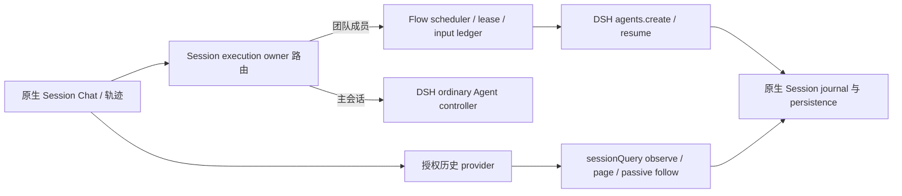

# DSH 0.2.0-rc.2 宿主接口审计

日期：2026-10-11。目标为 DSH 标签 `dsh-v0.2.0-rc.2`，提交 `639ed015397290b3745d163aafe02ffee4aa3f84`；Flow 源码基线为 `7b8f42fb32a4fb07ed6f8ce6843996c4e9a847f9`。本文件是升级方案的接口证据，尚未修改实现、安装依赖或运行构建、测试、真实 Agent Team。DSH 当前 checkout 的后续版本和本地改动未用作目标接口依据。

## 结论

Flow 的原生 Agent 创建、消息投递、作用域工具、system-prompt、模型选择、usage 投影、jobs 和 Typert Remote 在 rc2 基本保留。当前关键阻碍是 Flow 依赖本地 0.1.7 补丁提供的 Session 执行归属及只读历史能力，而这些扩展并未成为 rc2 原生接口。升级需要针对 rc2 明确提供这些能力并验证完整调用路径，不能只更新包版本，也不能把 Flow 成员强制改成 DSH subagent 来绕过恢复归属。[S1][S4][S5][S6]

`dsh-v0.1.7-rc.2` 与目标标签的源码 diff 显示：Agent 公共接口、LLM message/source、tools 公共接口、system-prompt、compaction、jobs、commands 和 Typert generator/protocol 的上述消费接口没有实现差异。rc2 的宿主侧实质变化包括 AgentLoop 在失败 step 内补保守 tool/result、Session 中断尾部恢复，以及 CLI 的安装载体参数。这里的“保留”描述官方接口；Flow 本地 patch 不属于该比较结论。[S1][S2][S3][S7][S8][S9][S10][S11][S12][S13]

## 原生接口映射

| 当前 Flow 调用 | rc2 对应接口与状态 | Flow 处理 |
| --- | --- | --- |
| `ctx.agents.create({sessionId, meta, agentOptions, setup})` | 保留；`sessionId` 是 Agent 与 Session 的同一 branded identity；另有可选 `signal`、`parentAgent`、`seed`、`inheritedEventCount`。[S1] | `core/runtime.ts` 保留创建方式；在 create/resume 请求中传入已有 turn cancellation `signal`，验证取消加载/设置时不发布半配置 Agent。 |
| `ctx.agents.resume({resumeSessionId, agentOptions, setup})` | 保留；`setup` 对未发布的 Agent scope 执行；可返回同步 `commit()`，在全部 await 后、发布前重验可变配置。[S1] | 保留 fresh scope 初始化；只在确有租约/配置 publication race 时使用 commit，不能把 setup 内启动 turn 当合法流程。 |
| `AgentHandle.agent` / `dispose()` | 保留；dispose 等待 loop 退出、注销 Agent/Session 并回收 scope，外部 registry getter 不授予 disposer。[S1] | 保留 try/finally 及 flush-before-checkpoint；验证 dispose、服务卸载与取消期间的 projection drain。 |
| `Agent.followup/steer/send/inject/whenIdle/cancel` | 全部保留；followup 为单独 ordinary turn，send 选择 next-turn/next-step 及 wake，inject 不唤醒，whenIdle 是整个 Agent 活动静止而非特定消息收据。[S2] | 保留通信 next-step 注入 + 单独 followup 唤醒；继续用 exact native message id 和持久 flush 证明 admission。不能仅以 whenIdle 或 flush success 标记特定消息已接收。 |
| `AgentOptions.provider/model/reasoningEffort` | 保留；`maxTokens` 仍是 DSH 提供的可选字段。[S2] | Flow 不重新增加 model output/context 限制，保持已有责任分工。 |
| `createUserMessage({content, source})`、`MessageSourceMap` 合并 | 保留；工厂生成 immutable identified user message，source 是 merge-extensible producer union。[S3] | 保留初始任务 `kind:'user'`、后续 revision/wake `kind:'flow'`、通信 `kind:'flow-message'`；不能从 `user/message` event type 推断人类输入。 |
| `session.append('user/message', message, {surfaceOp:'append'})` | 保留；surface 事件必须携带有效 surface intent。[S4] | 保留通知原始 source/identity；模型可见内容仍须写原生 Session journal。 |
| `SessionId/SessionLogOffset`、`session.seq/snapshotEvents` | 保留；`seq` 是 next event offset；`snapshotEvents(from, toExclusive)` 仍在 rc2，源码标记了以后迁移事项。[S4] | 当前 rc2 可直接使用 journal API；删除仅为“宿主可能没有 snapshotEvents”设计的旧版本分支，保留合法可选 provider 的 unknown 语义。不要将 last seq 和 next offset 混用。 |
| `ctx.on('session/event', (session,event) => …)` / `ctx.sessions.flush(session)` | 保留；flush 返回 durable barrier 的 boolean，observer 通知不是 barrier 本身。[S4] | 保留先同步截取事件 cut，再 await flush，再投影/ack；拒绝或失败 flush 不产生已持久交付结论。 |
| `systemPrompt.section({name, order, text, interpolate:false})` | 保留；section 是 scope 登记，返回 disposer。[S7] | 保留角色 system instructions 注册及 literal interpolation；resume/compaction 后角色要求须继续存在，避免每轮重复人类任务文本。 |
| `tools.get(name, agent)` / `schemas(scope)` / `restrict` / `guard` | 保留；restriction 过滤继承层，自己登记的工具依然需要 executor guard。[S8] | 保留 scope-based capability probe 和完整 allowlist guard；不能仅用 schema visibility 声称权限 enforcement。 |
| `ToolDispatchExecution`、`tools/pre-execute`、`tools/execute` | 保留；拥有 Agent/callId/parent 等执行信息；Flow 实际接入 `tools/execute` waterfall。[S8] | 保留 Flow quota、fencing、dispatch/effect receipt；新增 rc2 failed-step recovery 场景检查。 |
| `BasicCompactionEngine` + `agentCtx.isolate('compaction').plugin(…, {})` | 保留；DSH compaction engine 使用 llm/tokenMeter/sessions 并拥有自动压缩。[S9] | Flow 只组合原生服务、读取事件结果；不自建压缩、不主动探测模型容量、不拦截 model request。 |
| `sessionProjections.snapshot(session, ['contextPressure'])` / state `modelSelection` / `requestHeader` / `agentDefaultModel.currentSelection()` | 保留；context pressure、model selection 来自 host 投影和 request/header。[S10][S11] | 保留 `main-model.ts` 的 durable precedence 与 `native-usage.ts` 的被动投影；缺失 token/model/window 数据保持 unknown/null。 |
| `JobId`、`jobs.kill(id, callerSessionId, reason)` | 保留；job owner 按 SessionId 校验；`job_output/job_kill` tools 仍按 exec.agent.id 读取/操作。[S12] | 保留 caller identity 与 effect job id；成员注销后不得用猜测 PID 杀任务；验收 live job disposal 和跨成员拒绝。 |
| `commands.register({definitionId,name,input,handler})` / invocation `commandId,agent,rawInput,attachments,signal` | 保留；注册/附件 admission 语义未改。[S13] | 保留 command id 去重；`flow/team-launch` 的 ignorable append 另属补丁缺口，见下文。 |
| `@Remote` / `bindTypertRemote` / `WorkspaceTypertGenerator.generate(['dsh-flow'], ['host'])` | 保留；host face 仍产生 Remote descriptors/codecs 和 remote client artifact。[S14] | 保留 read-only `flow` namespace；用 rc2 generator 完整重生成 JS、d.ts、schema，不手改生成产物。 |
| CLI `runCli()` | rc2 为 `runCli(options:RunCliOptions={})`，无参调用仍合法；新增 installation-owned packageManager/Desktop carrier 参数。[S15] | `src/host/dsh-launch.ts` 无须伪造 rename；继续从所选 installed CLI 启动 profile。version/build identity 应确认确为 rc2。 |
| `--profile web/custom --patch …` | 保留；普通 CLI 不允许启动 reserved `desktop` profile。[S15] | 当前 acceptance 的 Web/custom profile 可保留；不把普通 launcher 绕成 Desktop carrier。 |

表中 Flow 文件均位于 `packages/dsh-flow/src/`，除明确写出的 `src/host/`。

## Session 阅读与执行的界限

rc2 真实符号为 `ApiSessionAgentController.resolveAgent/ensureSession`、Client `Session.open()` 和 `SessionManager.resolveTarget/get`；`mustGetSession`、`ensureAgent`、`Session.registerDriver`、`readPersistedWith`、`registerSessionDriver` 并非该目标标签的原生符号。后面提出的注册/读取方法是新增 provider 设计，不能当作已有 rc2 API 调用。[S5][S6]

| rc2 原生路径 | 是否会恢复普通 Agent | 对 Flow 的含义 |
| --- | --- | --- |
| Host `sessionController.inspect(id, signal)` | 不会；attached session 读 snapshot，cold session 用 `sessionQuery.observeSession`，`projectionMode:'none'`。[S5] | 可读 exact persisted handoff/progress history；必须保留 signal、missing session 与 persistence failure 的区别。 |
| Host history `page` | 不会；地址通过 observeSession 校验，读固定 cursor 的 bounded page。[S6] | 可以复用分页读取；传输层仍需授权 address，不能仅以 id 可查证明 UI 有继续执行权限。 |
| Host history `follow({address:{kind:'session',…}})` | cold prepared ordinary session 会在 first snapshot 后 retain observation 并 promote；promote 调 `resolveObservedAgent`。[S5][S6] | 浏览 cold 成员历史可能发布一个默认 preset Agent，抢走 Flow 执行归属。默认 follow 不满足成员“只读查看”。 |
| Client `Session.open()` | 不接受 observation-only options；其 event stream 使用原生 follow。[S5] | 普通引用获取和 open 不能被标注为 guaranteed passive read；断线重连同样要禁止 promotion。 |
| Host `resolveAgent/ensureSession` | 可能创建/恢复 ordinary Agent，并安装默认 model selection/preset。[S5] | prompt、commands、model update、Typert agent/session lookup 等所有入口都要遵从 owner，不能只改 UI composer。 |
| `address.kind:'subagent'` | Host 校验 child `subagent` projection、`origin`、direct-parent lineage 与 mode；Client 依赖显式地址或 parent subagentCatalog 发现 route。[S5][S6] | Flow 的 `parentSession` 记录不足以组成可读 subagent address。 |

作用域登记可原生解决工具、prompt 和事件路由，但不能原生替换 `ApiSessionAgentController` 的普通 Agent 恢复逻辑。该 controller 内部固定调用自身 preset composition；目标没有供 Flow 注册 execution owner 的 seam。Flow 当前 `nativeSessionParent()` 写 lineage，不传 `parentAgent`。单独 `parentSession` 并不会阻止 ordinary resume；DSH `origin:'subagent'` 或真实 runtime parent ownership 才触发普通路由拒绝，这会随之要求真实 subagent delivery/catalog/lifetime。为了隐藏列表而强制设置 `origin:'subagent'` 或包装整个团队成员为 subagent，会改变现有所有权及调度语义，不能作为无证据的兼容替代。[S1][S5][S6][S16]

### 需要 rc2 provider 扩展的能力

当前 `index.ts` 调用的是 0.1.7 本地 patch 的 `sessionController.registerSessionDriver()` 与 `registerSessionOrigin()`；`src/host/ipc-bridge.ts` 读取 fixture 使用 patch 的 `observationOnly:true`。rc2 本身没有这些接口。当前仓库也没有实际调用 `Session.registerDriver()` 或 `readPersistedWith()`；若总方案采用这些名称，应明确写为新设计，并规定职责。[S5][S6]

1. **Client Session 引用取得。** 给 Flow 成员取得原生 Session face 时选择明确的 history route 和执行策略；避免依赖 `allowUnlisted` 隐式放行。继续通过原生 sessions 服务保留和释放引用，由 Host owning driver 执行归属判断；不在 Client 再建立一份执行者注册表。
2. **非激活 persisted read/follow。** 提供同一授权 address 的只读 initial snapshot、分页、live append follow 和 reconnect；全过程不调用 ordinary resume。通过提供方公开的观察选项贯通 Host 与 Client，而非任意 id 的低层绕过。Host `inspect/page` 已经原生非激活，但 cold follow promotion 和 Client open/transport 必须一起解决。
3. **Host execution owner 注册。** 在 SessionController 提供类似 `registerSessionDriver` 的真实注册 seam，让 Flow scheduler 接管 prompt/cancel，并对 queue update、commands、selectModel、Agent/Session Typert lookup、cold follow promotion 统一决定拒绝或转交。当前 patch 只说明已有策略，迁移需枚举旁路入口。主会话继续 ordinary DSH owner；成员 active/recycled/terminal 的执行决定在服务执行点完成，历史读取保持可用。
4. **Origin/目录分类。** 可提供读 summary 的 presentation classification，保留原始持久 header。分类不能授予 execution ownership、构造 subagentCatalog 或改变有效写者；Flow Agent Team 的公开语义与 DSH subagent 生命周期独立。

推荐把上述能力集中为 rc2 的显式 provider 扩展，源文件、declarations、Remote descriptor/schema、Client type 及 behavior test 同步更新。不能仅复制现有 `lib/*.js` patch 后扩大类型使 Flow 通过编译。此建议仍是设计，尚未实现。

图中的 history provider 和 owner 路由是升级提案；`sessionQuery`、ordinary controller、Agent registry 和 Session persistence 是 rc2 已有实现。[S1][S5][S6]

## rc2 失败调用恢复影响

rc2 AgentLoop 在每个 step 开始时登记 `ToolCallRecovery`；step 调度失败或抛错后，先为未提交结局的 assistant tool request 写保守 `tool/result`，再关闭 step。Session 的 open-tail crash/fork recovery 使用同一恢复类。已有 closed step 会清空 pending requests，不被重新写成未执行；原本已记录 result 的调用不再补 result。[S16][S17]

`TOOL_NOT_STARTED` 表示没有已记录 call start，`TOOL_OUTCOME_UNKNOWN` 表示 recorded call 没有 durable result；两者都是 `isError:true`，并非外部效果未发生的保证。fork 文本还明确提醒 parent 可能在 fork cut 后完成效果。Flow 的 `effect/dispatch` ledger 必须保留这一区分，不能因多了一条 `tool/result` 就结算成成功、自动重放 side effect 或关闭 uncertainty。正常 `tools/execute` 返回值与人工/原生恢复事件是不同证据来源。[S16][S17]

Flow 当前 `createToolExecutionHook()` 主要以 execution hook 结算，`native-usage.ts` 只投影 assistant/compaction settlement，这两个设计可保留。需审计 `core/cluster.ts` 的恢复 reconciliation、effect receipts 和 checkpoint 对新增 error tool/result 的处理，并新增 rc2 failure fixtures，而不是再实现一套 Session repair。[S16][S17]

## 其他现有 patch 缺口

`command.ts` 对非 surface `flow/team-launch` 事件调用 `append(type,data,{ignorable:true})`。rc2 的 event envelope 类型有 `ignorable?:true`，但 `Session.append()` 的非 surface rest args 是 `[]`，实现也没有把该选项写入 event；因此这是当前 Flow patch 的能力，不是 rc2 已吸收的接口。[S4][S18]

推荐 rc2 source 扩展提供 typed non-surface append options 并保存 ignorable，同时测试未知可忽略 Flow launch event 的读取。插件卸载后执行读取也要符合 session vocabulary 规则。不能只删除参数令 event 从可忽略变为 required-on-read，也不能依靠 type cast 维持编译。

Flow 的 Remote `web.ts` 自身不需要新的 RPC 设计；其 JSON vocabulary 位于 `types.ts`，递归 `FlowJsonValue` 是自身 generator face 的本地别名。升级仍要让 rc2 generator 对实际 Flow public service 和所有 Remote 参数/结果生成严格 codec，保持 host/client 程序分离。`tests/types/flow-contracts.host.ts` 与 `.client.ts` 应增加 owner/read-only positive 与 negative assertions，修正“seven methods”的陈旧注释；当前 read-only API 已包含 `teamRuns/agentSession/teamRead` 以及 `list/read/events/query/report`，共八项。[S14]

`src/host/session-scan.ts` 是 acceptance 的原始 log 读取器，不是 production Agent owner。它有 legacy marker journal 支持及 fallback sequence；升级后只声称对目标 rc2 的 envelope/identity 有效的验证结果。可以收紧 rc2 fixture 的 seq/source 校验，避免读失败或格式不符被计成消息缺失。是否保留既有 Flow delivery marker 是产品数据决策，与继续支持 DSH 0.1.x 无关。

## 文件修改范围与验收

| 文件 | 计划变化 | 必须验收 |
| --- | --- | --- |
| `packages/dsh-flow/src/core/runtime.ts` | rc2 create/resume signal；移除真实仅为旧宿主提供的 journal fallback；保留 scope 工具、系统指令、原生 compaction、flush-cut admission。 | create/setup/resume 阶段取消；工具 mount failure 无半发布；消息 exact id 仅 admitted 一次；resume/compaction 后 source 和 role instructions 正确；handle 回收无遗留 active input。 |
| `packages/dsh-flow/src/core/cluster.ts` | 与明确 execution owner seam 绑定；审计 rc2 recovery result 与 receipts；jobs owner 及 checkpoint 行为保持。 | 冷历史查看不造 Agent/不获写者；prompt 再进入 Flow lease；recycled/terminal prompt 拒绝；flow receipt UNKNOWN 不自动重放；取消只影响 owned jobs。 |
| `packages/dsh-flow/src/index.ts` | 将旧 patch 注册迁移到 rc2 provider；注册 disposer、多 owner 冲突、依赖卸载处理。 | 主会话普通路由不变；成员所有驱动旁路统一 owner；plugin unload 取消注册；重新 mount 不累积 owner。 |
| `packages/dsh-flow/src/command.ts` | launch event ignorable append 的 rc2 provider 接口；以 command/request id 去重保留用户原任务身份。 | repeated submit/durable inbox/crash resume 无二次人类 delegation；非 surface ignorable event 在日志真实存在。 |
| `packages/dsh-flow/src/main-model.ts`、`core/native-usage.ts`、`types.ts` | 保留 host projection precedence；以真实 rc2 event/schema 校验投影。 | pending selection > durable header > host default；retry/failed attempt/compaction usage 不重算；unknown 不变零；raw model/provider 不拿配置冒充实际。 |
| `packages/dsh-flow/src/web.ts`、`scripts/build.ts`、`tests/types/` | 保留 Remote API；完整 rc2 generator 重生成；新增 owner/nonactivating read 的 type coverage。 | JS、d.ts、Remote schema 同一 source build；read-only observer 无 execution methods；client 无 Host store；Remote cancellation/result narrowing 有效。 |
| `src/host/dsh-launch.ts`、`host.ts` | 保留 CLI profile；确认 selected installation 是 rc2 和 exact build；隔离 acceptance profile/home。 | 版本/build identity 与 listener/IPC ready 分开记录；正常 Web profile 启动；无使用后续 alpha 构建冒充 rc2。 |
| `src/host/ipc-bridge.ts`、`session-scan.ts`、mock fixtures | observation fixture 切换显式非激活 provider；新增 rc2 interrupted tool fixtures。 | cold/live/paging/reconnect 读取的 Agent、Session live/writer 状态；source marker count 区分自发工具结果与 recipient receipt。 |

最低验收集合应同时覆盖类型编译、unit behavior、真实 Loader composition 与 keyless recorded/native acceptance。真实 Agent Team smoke 要另行报告 provider/model、rc2 build、conversation、trace、artifact、active 与 recycled input 行为；它不能被此文静态审计、HTTP ready 或 mock throughput 替代。本次未执行这些验收。

## 实施注意事项：Commands 参数与 owner 旁路

以下是用户授权实施后进行的第二次只读审计；核查对象仍为固定 rc2 source 与当前旧版 Flow patch，尚不代表新版 patch 已通过行为验证。

### 移除 Commands 旧参数兼容必须同步调用者

若新增 `submissionId` 的统一 Host 签名为 `execute(agent,line,attachments,submissionId,signal)`，应删除旧 patch 中把第 4 位非 string 当 signal 的转换、`string | AbortSignal`、4 位 Host overload，以及 Gateway 对 commands endpoint 的旧 arity 重排。保留 `submissionId:string|undefined` 与明确末位 cancellation，不给缺失 Host signal 自动补一个不受请求控制的 signal。[S13][S19]

rc2 Gateway Client `prepareInvocation()` 严格检查参数数量：expected 来自 descriptor business parameter 数，Agent scoped projection 少一个 bound identity；optional codec 允许值为 undefined，但并不使该参数位可省略。因此新增 business 参数后，即使 TypeScript 声明显示 `submissionId?`，3 位旧 Remote 调用也会被 Gateway 拒绝。应更新所有生产调用者，而不是另保留 endpoint 特殊兼容 shim。[S19]

| rc2 生产调用者 | rc2 旧形式 | 统一新形式 |
| --- | --- | --- |
| `@deepseek-ai/dsh-api-session-controller` Client `Session.command()`，`src/client/sessions/session.ts:388` | `remote.commands.execute(id,line,[])` | `remote.commands.execute(id,line,[],undefined)`；Client bundle 必须一起更新。[S5] |
| `@deepseek-ai/dsh-client-ui-commands`，`src/client/service.ts:406` | `remote.commands.execute(id,line,attachments)` | 显式 `submissionId`；`/agent-team` 使用持久稳定 intent，普通命令传 undefined。[S20] |
| `@deepseek-ai/dsh-client-ui-plan`，`src/client/index.ts:122` | `remote.commands.execute(id,'/plan off',[])` | `remote.commands.execute(id,'/plan off',[],undefined)`；这是当前 15 个旧 patch 清单以外的新增 consumer patch。[S21] |

固定 rc2 的 production `src` 中没有使用 `agent:commands/execute` scoped alias 的实际调用者，但生成接口与 Gateway projection 必须同步：direct Remote 为 `(id,line,attachments,submissionId,signal?)`，agent-scoped 为 `(line,attachments,submissionId,signal?)`。`@deepseek-ai/dsh-commands` 的 Host declaration、`typert.host.js`、`typert.remote-client.js/.d.ts` 和 `@deepseek-ai/dsh-api-remotes` 的聚合 descriptor 要保持同一参数顺序。[S14][S19]

Host 直接调用旧 `execute(agent,line,attachments,signal)` 要统一改成 `execute(agent,line,attachments,undefined,signal)`。Flow 的 `tests/acceptance/native/host-observer.ts` 是本仓库已发现的直接调用者；官方 rc2 测试调用者分布于 `commands`、`api/session-controller`、`command-compact`、`command-feedback`、`command-goal`、`permission-presets`、`plan-mode` 和 `session-log-export` 包。后续若把 provider 扩展发布回 DSH source，必须更新这些类型/测试消费者；本次 Flow patch 环境不需要假装已运行官方完整 suite。[S13]

最小行为验收：主会话 `/agent-team` 重试保持 command/request identity；普通 command 和 `/plan off` 可调用；direct 与 agent-scoped 形式显式 undefined 正确省略 JSON field；每种形式末位 signal 能取消 handler；旧 3 business args 或旧位 signal 被拒绝且 handler 未执行。可以复用 rc2 `packages/api/gateway/tests/gateway.client.spec.ts` 中“declared undefined encoding”和“Agent scoped alias”测试的真实 Remote carrier，以及 `packages/interaction/commands/tests/commands.spec.ts` 的 abort/admission behavior。[S19]

### 现有 SessionDriver patch 覆盖与实际漏项

现有 0.1.7 patch 不只是 prompt/cancel 包装：它在 `ApiSessionAgentController.resolve()` 入口阻止 Flow owner，因此 `selectModel`、`rename`、commands Remote 的 Agent/Session/context lookup、file-upload Agent resolver 已经受这一检查；它还显式拒绝 SessionController `updateQueue()`，并通过 follow `observationOnly` 和 `promote()` 中的 owner 检查阻止 cold ordinary promotion。迁移时要保留这些已有检查，不能把它们误记为全部缺失。[S5][S6]

实际漏项是 `session.create({sessionId:FlowMember,…})` 的 explicit-id adoption：`ensureSession()`/`createOrAdopt()` 不经过 `resolve()`，所以当前 patch 可能采用 live Flow Agent，也可能以普通 preset 恢复 cold member。最小修正是在 `ApiSessionAgentController.ensureSession()` 及异步 create/adopt 发布前重验 owner，拒绝将 plugin-owned identity 交给 ordinary creation。SessionController create 入口可以更早拒绝，但不能仅停留在 facade；测试应覆盖 live/cold explicit-id create，以及 owner 在异步 observation/setup 中登记的 race。[S5]

`SessionCommandController.updateQueue()` 与 `cancel()` 自身存在直接 `ctx.agents.get()` 路径；公开 Remote facade 的 driver guard 已保护当前调用路径，但若发布 provider controller 供其他 Host 消费者直接调用，应将普通 owner 检查放在实际执行方法入口，确保 live 路径不绕过 policy。正常 Flow prompt/cancel 继续显式转交 scheduler，不用普通 Inbox mutation 代替。[S22]

`session.fork()` 直接读取历史并创建新的普通 child，不经 resolveAgent。它不会抢占源 member identity，但会把 Flow 历史、私有 Flow events 和指令引入默认 Agent；此操作不是只读查看。当前方案未授权成员原生 fork 时，应在 fork 执行入口拒绝 plugin-owned source；否则必须单独定义允许导出、event vocabulary、workspace 与 child preset 的规则。不要由 context-menu 是否显示决定执行权限。[S22]

`registerSessionOrigin()` 仅调整 summary 展示/列表分类，不阻止执行，也不建立真正 subagent ownership。`registerSessionDriver()` 撤销后原始普通 header 仍存在；若产品要求卸载 Flow 后成员历史只能阅读，须保存可识别的 durable execution owner 或独立 owner catalog，并在“owner 无 provider”时拒绝 ordinary activation。单纯卸载 registry callback 不提供此保证。该停用语义必须作为明确产品决定，不能在验收中夸大现有 patch 的保护范围。[S5]

行为测试来源：`agent.host.spec.ts` 的并发 ensureSession/ownership races；`commands-create-fork.host.spec.ts` 的 explicit creation、fork 与 retained history；`commands-queue-attachment.host.spec.ts` 的 live queue/cancel；`session-history-journal.host.spec.ts` 的 cold/live follow 和 snapshot cut；`transport.client.spec.ts` 的 reconnect。新增测试应证明 owner route 的拒绝或转交同时保留 history，并检查没有普通 Agent/Session writer、model request 或 Inbox mutation 被意外发布。[S23]

## 主来源

全部 DSH 链接固定在目标提交，避免后续版本漂移。Flow 调用与 patch 事实来自本仓库所述基线的文件读取。

- [S1] [Agent factory / registry / ownership / setup](https://github.com/deepseek-ai/deepseek-harness/blob/639ed015397290b3745d163aafe02ffee4aa3f84/packages/core/agent/src/index.ts)
- [S2] [Agent live runtime / inbox / options](https://github.com/deepseek-ai/deepseek-harness/blob/639ed015397290b3745d163aafe02ffee4aa3f84/packages/core/agent/src/runtime-types.ts)
- [S3] [LLM identified messages / sources](https://github.com/deepseek-ai/deepseek-harness/blob/639ed015397290b3745d163aafe02ffee4aa3f84/packages/llm/llm/src/message.ts)
- [S4] [Session runtime / append / flush / journal](https://github.com/deepseek-ai/deepseek-harness/blob/639ed015397290b3745d163aafe02ffee4aa3f84/packages/core/session/src/index.ts)
- [S5] [API Session Agent activation](https://github.com/deepseek-ai/deepseek-harness/blob/639ed015397290b3745d163aafe02ffee4aa3f84/packages/api/session-controller/src/agent.ts), [controller inspect / promote](https://github.com/deepseek-ai/deepseek-harness/blob/639ed015397290b3745d163aafe02ffee4aa3f84/packages/api/session-controller/src/index.ts), [Client Session.open](https://github.com/deepseek-ai/deepseek-harness/blob/639ed015397290b3745d163aafe02ffee4aa3f84/packages/api/session-controller/src/client/sessions/session.ts), [Client acquisition](https://github.com/deepseek-ai/deepseek-harness/blob/639ed015397290b3745d163aafe02ffee4aa3f84/packages/api/session-controller/src/client/sessions/manager.ts)
- [S6] [History page / follow / promotion / address](https://github.com/deepseek-ai/deepseek-harness/blob/639ed015397290b3745d163aafe02ffee4aa3f84/packages/api/session-controller/src/history.ts)
- [S7] [System-prompt sections](https://github.com/deepseek-ai/deepseek-harness/blob/639ed015397290b3745d163aafe02ffee4aa3f84/packages/core/system-prompt/src/index.ts)
- [S8] [Tools scoped registry / guard / execution](https://github.com/deepseek-ai/deepseek-harness/blob/639ed015397290b3745d163aafe02ffee4aa3f84/packages/core/tools/src/index.ts)
- [S9] [Basic compaction engine](https://github.com/deepseek-ai/deepseek-harness/blob/639ed015397290b3745d163aafe02ffee4aa3f84/packages/compaction/compaction-basic/src/index.ts)
- [S10] [Token/context pressure projections](https://github.com/deepseek-ai/deepseek-harness/blob/639ed015397290b3745d163aafe02ffee4aa3f84/packages/llm/token-meter/src/usage-projection.ts)
- [S11] [Agent default model](https://github.com/deepseek-ai/deepseek-harness/blob/639ed015397290b3745d163aafe02ffee4aa3f84/packages/core/agent-default-model/src/index.ts)
- [S12] [Jobs registry ownership](https://github.com/deepseek-ai/deepseek-harness/blob/639ed015397290b3745d163aafe02ffee4aa3f84/packages/jobs/jobs/src/index.ts), [job tools](https://github.com/deepseek-ai/deepseek-harness/blob/639ed015397290b3745d163aafe02ffee4aa3f84/packages/jobs/tool-jobs/src/index.ts)
- [S13] [Commands registration / invocation](https://github.com/deepseek-ai/deepseek-harness/blob/639ed015397290b3745d163aafe02ffee4aa3f84/packages/interaction/commands/src/index.ts)
- [S14] [Typert Remote protocol](https://github.com/deepseek-ai/deepseek-harness/blob/639ed015397290b3745d163aafe02ffee4aa3f84/packages/typert/protocol/src/index.ts), [generator public artifact API](https://github.com/deepseek-ai/deepseek-harness/blob/639ed015397290b3745d163aafe02ffee4aa3f84/packages/typert/generator/src/workspace.ts)
- [S15] [CLI runCli options](https://github.com/deepseek-ai/deepseek-harness/blob/639ed015397290b3745d163aafe02ffee4aa3f84/apps/cli/src/bin.ts), [profile and Desktop restrictions](https://github.com/deepseek-ai/deepseek-harness/blob/639ed015397290b3745d163aafe02ffee4aa3f84/apps/cli/src/args.ts)
- [S16] [ToolCallRecovery and interrupted/fork closers](https://github.com/deepseek-ai/deepseek-harness/blob/639ed015397290b3745d163aafe02ffee4aa3f84/packages/core/session/src/repair.ts)
- [S17] [Failed live-step tool recovery](https://github.com/deepseek-ai/deepseek-harness/blob/639ed015397290b3745d163aafe02ffee4aa3f84/packages/core/agent-loop/src/agent.ts)
- [S18] [Session event envelope / ignorable field](https://github.com/deepseek-ai/deepseek-harness/blob/639ed015397290b3745d163aafe02ffee4aa3f84/packages/core/session/src/types.ts)
- [S19] [Gateway Client arity / cancellation / scoped projection](https://github.com/deepseek-ai/deepseek-harness/blob/639ed015397290b3745d163aafe02ffee4aa3f84/packages/api/gateway/src/client/index.ts#L486), [Gateway behavior tests](https://github.com/deepseek-ai/deepseek-harness/blob/639ed015397290b3745d163aafe02ffee4aa3f84/packages/api/gateway/tests/gateway.client.spec.ts)
- [S20] [UI Commands production consumer](https://github.com/deepseek-ai/deepseek-harness/blob/639ed015397290b3745d163aafe02ffee4aa3f84/packages/client/ui-commands/src/client/service.ts#L406)
- [S21] [UI Plan production consumer](https://github.com/deepseek-ai/deepseek-harness/blob/639ed015397290b3745d163aafe02ffee4aa3f84/packages/client/ui-plan/src/client/index.ts#L122)
- [S22] [Session command execution / create / fork / queue / cancel](https://github.com/deepseek-ai/deepseek-harness/blob/639ed015397290b3745d163aafe02ffee4aa3f84/packages/api/session-controller/src/commands.ts)
- [S23] [Agent ownership and create races](https://github.com/deepseek-ai/deepseek-harness/blob/639ed015397290b3745d163aafe02ffee4aa3f84/packages/api/session-controller/tests/agent.host.spec.ts), [create/fork tests](https://github.com/deepseek-ai/deepseek-harness/blob/639ed015397290b3745d163aafe02ffee4aa3f84/packages/api/session-controller/tests/commands-create-fork.host.spec.ts), [queue/attachment tests](https://github.com/deepseek-ai/deepseek-harness/blob/639ed015397290b3745d163aafe02ffee4aa3f84/packages/api/session-controller/tests/commands-queue-attachment.host.spec.ts), [history journal tests](https://github.com/deepseek-ai/deepseek-harness/blob/639ed015397290b3745d163aafe02ffee4aa3f84/packages/api/session-controller/tests/session-history-journal.host.spec.ts), [Client transport tests](https://github.com/deepseek-ai/deepseek-harness/blob/639ed015397290b3745d163aafe02ffee4aa3f84/packages/api/session-controller/tests/transport.client.spec.ts)
