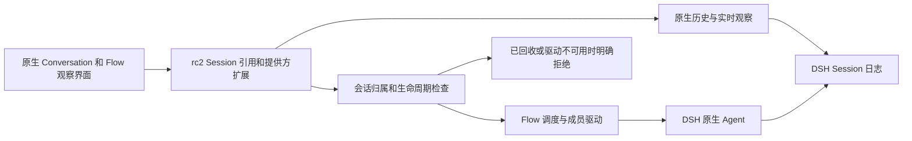

# dsh-flow 升级到 DSH 0.2.0-rc.2 的实施方案

状态：完成。依赖、接口和提供方扩展已迁移到 DSH `0.2.0-rc.2`；构建、确定性验收及本地 oMLX 实际案例验证已完成，模型失败尝试与解析器修正的复核证据见[验收记录](dsh-0.2.0-rc2-upgrade-validation.md)。目标是把 dsh-flow 的依赖、宿主接口、浏览器接口、生成协议和验收环境统一到该版本，直接取消对 `0.1.x` 的运行与构建兼容。升级保持现有团队协作、原生成员会话和资源回收行为；模型执行与上下文压缩仍由 DSH 负责。

此次升级采用 **rc2 单一版本基线，并重新实现仍然必要的提供方扩展**。基础 Agent、LLM、工具和 Typert 接口大多可以继续使用；当前完整功能依赖的扩展并未全部进入 rc2。完成依赖改版不能等同于完成接口迁移，也不能据此宣称插件可直接安装到未经扩展的官方 npm 宿主。

## 版本与交付范围

| 对象 | 基线或要求 |
| --- | --- |
| Flow 源码核查基线 | `7b8f42fb32a4fb07ed6f8ce6843996c4e9a847f9` |
| 升级前宿主组合 | `0.1.7-rc.2`，外加 `patchedDependencies` 中的 15 个提供方补丁 |
| 已实施宿主组合 | `0.2.0-rc.2`，外加 14 个基于 rc2 发行包重新制作的提供方扩展 |
| 目标 npm 版本 | `0.2.0-rc.2`；用户所称的 `0.2.0-rc2` 对应此实际版本号 |
| 目标上游源码 | `dsh-v0.2.0-rc.2`，提交 `639ed015397290b3745d163aafe02ffee4aa3f84` |
| Cordis 与 Schemastery | 依目标发行版分别使用 `4.0.4` 与 `3.18.4`，不改成 DSH 的版本号 |
| 升级完成条件 | rc2 冻结依赖、必要扩展的运行代码与类型一致、原生功能验收通过、发布归档可复现 |
| 数据 | 不为版本升级主动删除数据库、会话或配置；不提供降级到旧宿主的路径 |

版本依据：[官方 rc2 发布页][release]、[rc2 CLI 包声明][cli-manifest]。宿主审计及逐项源码出处见[接口审计](dsh-0.2.0-rc2-interface-audit.md)。本地 DSH 仓库当前检出的是更高版本，实施时必须使用该固定标签或对应 npm 发行包，不以当前工作区源码代替 rc2。

迁移涵盖根工作区、`packages/dsh-flow`、生成期的 `packages/typert-protocol`、`src/host` 启动和验收装配、`patches`、锁文件及开发文档。Flow 的团队工具名称、事务协议、调度校验和独立审核职责保持当前领域契约，不借此次升级重写团队产品。

## 接口变化与处理方式

当前运行对象是带扩展的宿主，判断变化时要同时比较官方 `0.1.7-rc.2`、当前补丁和官方 rc2。不能把 Flow 自己增加的接口误写成上游在 rc2 中删除的接口。

| 接入面 | rc2 核查结论 | 实施动作 |
| --- | --- | --- |
| Agent 创建、恢复、输入与生命周期 | 主要公开契约延续，仍使用 `ctx.agents.create/resume`、`AgentHandle` 和原生 Agent | 保留执行架构，核对取消信号、恢复和插件卸载；不增加另一套 Agent 循环 |
| LLM 消息和来源 | 现有 message/source 契约可以继续使用 | 保持首次任务、修订、唤醒、通信的来源及持久化身份；不能将内部通知统一伪装为用户输入 |
| 工具中断恢复 | rc2 会为未完成的工具调用补写保守结果，Session repair 也发生变化 | 以实际 dispatch 和 effect receipt 判断副作用；`tool/result` 的存在不能代表执行成功 |
| 模型选择、用量与压缩 | 继续由宿主提供模型选择、用量事件和官方压缩 | 保留未知用量；不恢复 Token 预算、容量预检、模型请求拦截或 Flow 自行压缩 |
| Typert | 生成器与协议主体延续，Host 与 Client 仍需分开编译 | 更新生成期声明包并从 rc2 重新生成全部 Host、Remote 描述与 codec |
| 主会话命令 | rc2 的 `commands.execute` 没有当前补丁增加的 `submissionId` | 重新定义单一提交意图契约，保持去重；删除旧参数位置及 `string \| AbortSignal` 兼容处理 |
| Client Session 引用 | rc2 原生 `retain(target, {source, signal?})` 不包含 `allowUnlisted`、`observationOnly` | 重新提供受约束的独立会话观察扩展；保留原生引用、分页和释放机制 |
| 原生成员输入 | `registerSessionDriver`、`registerSessionOrigin` 是当前提供方补丁能力 | 移植并完善 rc2 的会话驱动扩展，禁止 Flow 会话意外走普通 Agent 恢复 |
| 团队视图与嵌入阅读 | `conversation.view` 等插槽仍在；`registerViewPresentation`、观察参数等扩展不在 rc2 | 继续通过官方插槽装配，重新实现会话级可见性、contained 布局、只读阅读和跟随行为 |
| 通信卡片 | rc2 默认按 `source.kind` 和唤醒事实分类，没有当前 `communication` 节点扩展 | 保留结构化通信展示，并验证每条消息只出现一次 |
| 侧栏 | Resources、SidebarRightTabs、`openResource` 仍可使用；rc2 改变了侧栏目标会话的确定时机 | 按 rc2 目标会话和资源生命周期接入；验收切换会话前后的迟到回调归属 |
| 设置导航 | 当前 `addNavigationGuard/requestNavigation` 为补丁接口 | 在 rc2 的 Layout、插件管理和 Workspace 导航链路重新接入离开守卫 |
| CLI | rc2 的 `runCli(options = {})` 仍接受无参调用；Web profile 可继续使用 | 保留支持的 profile 启动，核查插件加载、鉴权与关闭；不把版本升级写成 CLI 接口强制重构 |

Client 结论依据：[Sessions 引用契约][sessions]、[Workspace 导航][workspace]、[Conversation 插槽][conversation-slots]、[消息分类][chat-message]、[侧栏控制器][sidebar]。原生未扩展的 `conversation.blocks` 仍可用于展示成员无法输入的原因，但它是界面策略，服务端也必须检查成员生命周期。

## rc2 提供方扩展设计

### 原生会话观察和执行归属

rc2 的 `session.page` 是冷历史读取；`session.follow` 在普通会话的 prepared snapshot 之后可能触发 Agent 激活。它不能直接替代当前观察模式。只移除 Client 的两个参数而继续调用原生打开流程，会让读取历史具有恢复普通 Agent 的副作用。[历史读取与激活来源][history]

以下为要在 rc2 提供方实现的契约，名称可沿用现有扩展；这些不是 rc2 当前已经提供的能力。

1. `registerSessionDriver` 按明确的会话身份选择 Flow 驱动。驱动的 prompt、cancel 转发给 Flow 当前拥有的原生 Agent，由 Flow 检查归属、请求身份、可继续状态和资源生命周期。
2. `registerSessionOrigin` 的分类与驱动选择共同核查；新成员另以不可变的 `agentPreset: dsh-flow/member` 标记独立执行归属，保留原生 `origin`。审计命令、队列、模型选择及冷会话激活的全部入口：支持的操作走 owning driver；不支持的操作明确拒绝，不能旁路为普通 Agent 恢复。该标记使 Flow 未装载时的新成员也受到保护；旧版本无标记日志不承诺同样的卸载后保护。
3. 观察模式读取真实原生 Session，保留事件流和历史分页，但不创建、恢复、发送或驱动普通 Agent。不在默认 `follow` 行为之外偷偷修改所有宿主会话的执行规则。
4. 独立会话读取必须验证身份与存在性。预分配 ID 尚未形成 Session 时可等待正式创建后重试；不可利用“允许未列入目录”创建占位 Agent，亦不可读入任意缺少归属证明的会话。
5. 成员回收后保留历史，拒绝 prompt、queue、command 和其他执行入口。回收期间已进入服务端的请求也要重新核查有效状态，不能只依赖浏览器按钮禁用。
6. 每次观察引用独立释放；取消、重连、分页失败和同 ID 新 generation 的迟到结果不得写入另一代视图。历史失败与会话不存在分别表达。

Flow 的成员是独立原生会话，当前并不属于 DSH subagent catalog。不能仅设置 subagent 标志或拼造 `SubagentAddress` 来获得只读导航；那会引入不同的父子关系、交付和生命周期语义。保持现有 Flow 会话归属，扩展提供方的明确接口。[当前 Flow 装配](../../packages/dsh-flow/src/index.ts)



### 命令提交和生成协议

提交意图要在一次用户提交的重试中保持稳定，使 `/agent-team` 不因确认丢失而启动两个团队。团队启动身份由稳定的提交意图派生；每次实际命令执行仍获得唯一的 `commandId`，保证 V4 日志中 `command/run` 与 `command/done` 的唯一配对。

推荐保留当前新增的 `submissionId` 能力，定义 rc2 唯一签名：Host 调用显式提供 `submissionId: string | undefined` 和独立的 `signal`；Remote 的 JSON 参数仅承载提交身份，取消信号由 Typert 的 cancellation 契约处理。更新全部仍在使用的 Host、root Remote、Agent scoped Remote 与 UI 调用者，取消旧四参重载、参数个数判断和 `string | AbortSignal` 联合参数。

Host 描述、`dsh-commands/remote` 和 `dsh-api-remotes` 浏览器装配中实际内联的 codec 必须一致。从真实 rc2 类型生成后检查最终 bundle；不能只改 `.d.ts` 或只改一个包里的生成文件。[rc2 命令提供方][commands]、[Remote 装配][remotes]

### 视图和资源装配

团队页继续贡献 `conversation.view`，顶栏继续贡献 `conversation.session.header.actions`，插件设置继续使用 `plugins.bundle.config` 和 `configForms`，侧栏继续通过 `resources`、`sidebarRightTabs` 与 `sidebarRight.openResource` 创建。所有贡献随 Cordis 生命周期释放，不引入私有 DOM 接入或覆盖宿主全局样式。

需要重新提供当前依赖的会话级视图呈现、顶栏选择回调、lineage 协同、只读内容工厂和 Chat 操作限制。只读应同时禁止发送、取消、分支、命令执行和其他修改所观察会话的动作。完整成员会话的活跃输入策略仍由 Flow 生命周期决定。

跨会话嵌入的 Factory 递归检查应区分工厂和实际 Session generation，允许主会话嵌入成员，拒绝回到同一 generation 的递归。rc2 的 renderer 使用工厂名做祖先检查，旧补丁需要按新实现重做，不能仅修改接口类型。[rc2 Factory 渲染][renderer]

设置离开守卫要覆盖 Layout 面板、插件管理页内切换、工作区会话切换和清除选择。保存完成后再执行待提交导航；继续编辑、放弃和保存失败分别具有确定结果。对话观察区的固定 Dockkit 布局保持禁用标签拖动，同时允许原生焦点和分隔条调整。

### 工具恢复和证据

rc2 的中断补偿结果是恢复事实，不是外部操作成功凭据。升级后的 `core/runtime.ts`、`core/native-evidence.ts` 和 `core/cluster.ts` 必须继续按实际派发、真实成功结果和副作用回执归因；保守结果不能自动满足成功校验、把 UNKNOWN 改成成功、重复计费或触发重复效果。

新测试要覆盖请求工具但未派发、已派发但效果未知、效果成功而结果尚未记录，以及恢复结果重复出现。调度 Agent 仍负责实际校验并记录结论，Auditor 仍独立审核该验收及证据。[宿主恢复差异](dsh-0.2.0-rc2-interface-audit.md)

## 现有 15 个补丁的处理

删除所有 `@0.1.7-rc.2` 补丁文件和清单项，以 rc2 原始包为起点重新生成必要补丁。允许保留同名业务能力，但不保留旧版本分支。补丁数量由实际需要决定，不以重新凑齐 15 个为验收条件。

2026 年 10 月 11 日核对 npm registry，当前直接声明及 Client 注入涉及的 48 个 DSH 包、补丁另涉及的 3 个传递包均存在 rc2 发行版。对 15 个 rc2 原始发行包执行旧补丁的 `git apply --check`，11 项可试套，4 项发生冲突：`ui-commands`、`ui-plugin-manager`、`ui-renderer`、`ui-workspace`。该检查未应用补丁，也未证明运行兼容；冲突项必须重新制作，其余仍须逐项核查语义。

| 当前提供方包 | rc2 处理 |
| --- | --- |
| `dsh-api-gateway` | 删除旧参数位自动补齐的兼容补丁；采用统一调用签名及重新生成的描述 |
| `dsh-api-remotes` | 随命令签名重建实际内联的 Remote 描述，检查与 owner 包一致；不手写长期漂移的第二份协议 |
| `dsh-commands` | 保留提交意图能力，移除旧重载和参数位兜底，统一 Host 与 Remote |
| `dsh-client-ui-commands` | 保留提交失败不丢输入、未知确认复用提交身份、插件不可用时的明确引导 |
| `dsh-client-ui-plan` | 新增 rc2 调用适配：显式提供提交意图参数，保持独立取消信号位置 |
| `dsh-api-session-controller` | 重建观察、独立会话读取、历史错误、分页 generation 和 owning driver 接口 |
| `dsh-session` | 保留 Flow 所需的可忽略事件元数据能力，重新核对 rc2 append 和 repair；不改变 Session 格式版本来掩盖 codec 差异 |
| `dsh-session-format-v3-to-v4` | 已删除旧校验放宽补丁；使用原生 Agent inbox 投递通知及唯一命令执行 ID，保留 rc2 正式关系校验 |
| `dsh-client-ui-conversation` | 重建会话级视图呈现、lineage、顶栏导航与观察内容工厂参数 |
| `dsh-client-ui-chat` | 重建通信节点、原生任务正文、只读操作和初始跟随，验证正文与来源不重复渲染 |
| `dsh-client-ui-renderer` | 适配 rc2 的 Factory 实现，按 generation 验证跨会话嵌入及递归拒绝 |
| `dsh-client-ui-workspace` | 接入新的独立会话打开和导航守卫，保留 rc2 自身新增的导航语义 |
| `dsh-client-ui-subagent` | 处理 lineage 的注册冲突，保留 DSH 原生 subagent 功能与 Flow 独立会话的区分 |
| `dsh-client-ui-dockkit` | 保留禁用标签拖动、允许聚焦与分隔条调整的能力 |
| `dsh-client-ui-layout` | 重新实现导航守卫及延迟提交，不保留旧宿主能力检测 |
| `dsh-client-ui-plugin-manager` | 按 rc2 页面装配接入守卫，不沿用旧 bundle 的函数位置和内部变量 |

上游已提供等价能力时删除对应扩展，以公开接口调用替代；否则交付具备运行代码、类型、生成物和测试的 rc2 补丁。最终发布支持条件必须列出确切版本和扩展基线。将扩展提交给上游可以后续进行，不能以尚未合入的实现作为 rc2 官方能力。

## 实施顺序与阶段产物

| 阶段 | 工作与主要文件 | 退出条件 |
| --- | --- | --- |
| 1 固定接口 | 依据本方案与审计明确提供方契约；先做观察、驱动、命令和 Factory 最小样例 | 活跃会话与冷历史分开验证，已回收会话无普通 Agent 恢复旁路 |
| 2 更新依赖 | 根 `package.json`、`packages/dsh-flow/package.json`、`packages/typert-protocol/package.json`、`pnpm-workspace.yaml`、`pnpm-lock.yaml` | DSH 直接依赖、peer、开发及生成包统一精确 `0.2.0-rc.2`；运行闭包无旧版混装 |
| 3 重建扩展 | 从 rc2 npm 原包重新制作补丁；删除旧补丁与兼容分支 | 补丁可冻结安装，所有运行接口和声明一致，生成描述匹配 |
| 4 迁移宿主 | `index.ts`、`command.ts`、`web.ts`、`core/runtime.ts`、消息与证据模块、`src/host` | 创建、恢复、输入去重、取消、回收及恢复证据符合契约 |
| 5 迁移 Client | `client.ts`、`client/reader-source.ts`、`reader.tsx`、通信、侧栏、设置和导航模块 | 团队、原生对话和轨迹、输入策略、设置守卫及重连正常 |
| 6 重建生成物 | `scripts/build.ts`、Host/Client tsconfig、生成期协议声明包、包 exports 与 client inject/external | 干净产物可完成 Host 编译、Typert 生成、Client 编译及打包，无重复服务实例 |
| 7 验收与归档 | 现有单元、原生和确定性验收，真实模型最小任务；按归档安装 | 同一源码和产物指纹的 rc2 组合通过目标行为验证 |
| 8 更新文档 | `patches/README.md`、开发搭建、兼容性、提供方接口、验证方法及 `provider-baseline.json` | 只描述 rc2 支持条件、安装方法和实际验收，不保留旧支持矩阵 |

阶段 1 的关键契约先成立，随后可以交错推进依赖、宿主和 Client。不能以 `skipLibCheck`、类型断言、手改 `node_modules` 或降回 `0.1.x` 消除迁移错误。

生成期的协议声明包要与 rc2 对齐，保留 `linkWorkspacePackages: false` 和 Host/Client 类型隔离。`scripts/build.ts` 的 Host → Typert → Client 顺序继续成立；同名服务保持由宿主提供，不能在浏览器 bundle 或 Host 包中再装一份 Cordis 服务。

不因宿主改版强制提升 Flow 数据库 schema。只有 Flow 自身持久化契约实际变化时才按当前规则变更 schema，并在新目录验证。删除 `0.1.x` 运行兼容不等于删除 DSH 自己提供的会话格式读取组件，更不等于删除已有用户数据。

## 验收要求

### 依赖与构建

使用更新后的锁文件执行冻结安装，检查所有解析到的 `@deepseek-ai/dsh*` 包及补丁版本，核对 npm tarball integrity 与实际安装入口摘要。官方标签用于接口审计，npm 发行字节用于运行基线；不能由相同版本号推断两者构建字节相同。

```sh
pnpm install --frozen-lockfile
pnpm typecheck
pnpm build
pnpm test
pnpm test:mock
pnpm docs:build
git diff --check
```

这些是实施阶段的验收命令。类型检查和构建通过后再运行相应行为检查；遇到新变更或失败再扩大复核。另以 `pnpm --dir packages/dsh-flow pack` 生成发布归档，在隔离的 rc2 宿主组合中安装，避免只验证源目录路径或残留 `lib`。

### 必须观察到的行为

| 场景 | 验收事实 |
| --- | --- |
| 团队启动与重试 | `/agent-team` 和主会话工具各能启动；同一提交意图在未知确认和重连重试后只绑定同一次运行 |
| 首条任务与唤醒 | 首条业务正文真实进入原生 Session 一次；状态通知、通信和后续唤醒的 source 与渲染一致 |
| 成员完整会话 | 打开成员的原生对话与轨迹；返回所属主会话和团队视图正确 |
| 活跃成员输入 | 文本请求只路由到当前 Flow 成员，按请求身份去重；取消作用于该成员 |
| 历史观察 | 对运行、冷历史和已回收会话分别打开观察区；不创建第二个普通 Agent，不意外执行任务 |
| 回收与卸载 | 历史仍可读；输入、命令、队列及模型操作无执行旁路；驱动缺失有明确结果 |
| 分页和重连 | 分页失败可重试，同 ID 新 generation 不接收旧结果；引用、订阅及计时器最终释放 |
| 视图与 Factory | 团队标签只在对应主会话显示；多个成员嵌入可用，同 generation 的递归被拒绝 |
| 侧栏归属 | 切换前后的资源打开、迟到回调和关闭仍针对正确会话，保持 rc2 原生焦点行为 |
| 设置离开 | 保存、放弃、继续编辑、保存失败和进行中的保存覆盖所有导航入口，不误丢草稿 |
| 工具恢复 | 补偿 `tool/result` 不伪造成功，不重复效果或计费；实际验收证据仍绑定正确工具调用和产物 |
| 原生恢复 | 宿主重启后重用既有成员 Session 和首条输入证据；最终校验、独立审核及纠正回执匹配 |
| 官方组件共存 | Flow 之外的普通会话、命令和 DSH 原生 subagent 可正常使用，无全局行为回归 |

现有的 `provider-observation`、`provider-session-restore`、`provider-message`、`provider-factory-scope`、`reader-source`、`agent-session` 和原生 runtime 用例应按 rc2 实际装配更新。保留行为测试，减少依赖 bundle 私有函数位置的探针；不能只把期望版本号替换后视为验收完成。

真实模型验收至少覆盖创建团队、向活跃成员追加输入、完成并回收、冷历史读取和宿主重启。先确认运行的是最终 rc2 产物、通过鉴权可访问，再核对原生 trace、会话日志、Flow 验收与审核记录及真实交付文件。静态类型、HTTP 成功和截图分别不能单独证明此链路成立。

## 交付与回退

实施交付包含 rc2 锁文件、必要提供方扩展、迁移后的源码、重建协议、发布归档、基线清单和验收记录。`provider-baseline.json` 记录最终实际安装字节的 SHA-256，移除旧基线条目；构建与验收指纹应能关联到同一归档。

不提供混装宿主、运行时版本探测或旧签名适配。若实施中需要回退，回退整组 Git 变更、锁文件和提供方补丁，使用独立验证目录；这属于开发回退，不成为发布包内的双版本支持。

在上述验收完成前，状态保持“待实施”或“实施中”。最终兼容性说明区分“rc2 加指定扩展已验证”与“未经扩展的官方 rc2 可直接安装”；只有后者真实通过独立安装验收，才可作相应声明。

[release]: https://github.com/deepseek-ai/deepseek-harness/releases/tag/dsh-v0.2.0-rc.2
[cli-manifest]: https://github.com/deepseek-ai/deepseek-harness/blob/639ed015397290b3745d163aafe02ffee4aa3f84/apps/cli/package.json
[sessions]: https://github.com/deepseek-ai/deepseek-harness/blob/639ed015397290b3745d163aafe02ffee4aa3f84/packages/api/session-controller/src/client/contract/sessions.ts
[workspace]: https://github.com/deepseek-ai/deepseek-harness/blob/639ed015397290b3745d163aafe02ffee4aa3f84/packages/client/ui-workspace/src/client/navigation.ts
[conversation-slots]: https://github.com/deepseek-ai/deepseek-harness/blob/639ed015397290b3745d163aafe02ffee4aa3f84/packages/client/ui-conversation/src/client/contract/slots.ts
[chat-message]: https://github.com/deepseek-ai/deepseek-harness/blob/639ed015397290b3745d163aafe02ffee4aa3f84/packages/client/ui-chat/src/client/conversation-nodes/message.ts
[sidebar]: https://github.com/deepseek-ai/deepseek-harness/blob/639ed015397290b3745d163aafe02ffee4aa3f84/packages/client/ui-sidebar-right/src/client/service.ts
[history]: https://github.com/deepseek-ai/deepseek-harness/blob/639ed015397290b3745d163aafe02ffee4aa3f84/packages/api/session-controller/src/history.ts
[commands]: https://github.com/deepseek-ai/deepseek-harness/blob/639ed015397290b3745d163aafe02ffee4aa3f84/packages/interaction/commands/src/index.ts
[remotes]: https://github.com/deepseek-ai/deepseek-harness/blob/639ed015397290b3745d163aafe02ffee4aa3f84/packages/api/remotes/src/client/index.ts
[renderer]: https://github.com/deepseek-ai/deepseek-harness/blob/639ed015397290b3745d163aafe02ffee4aa3f84/packages/client/ui-renderer/src/client/scoped-slots.tsx
