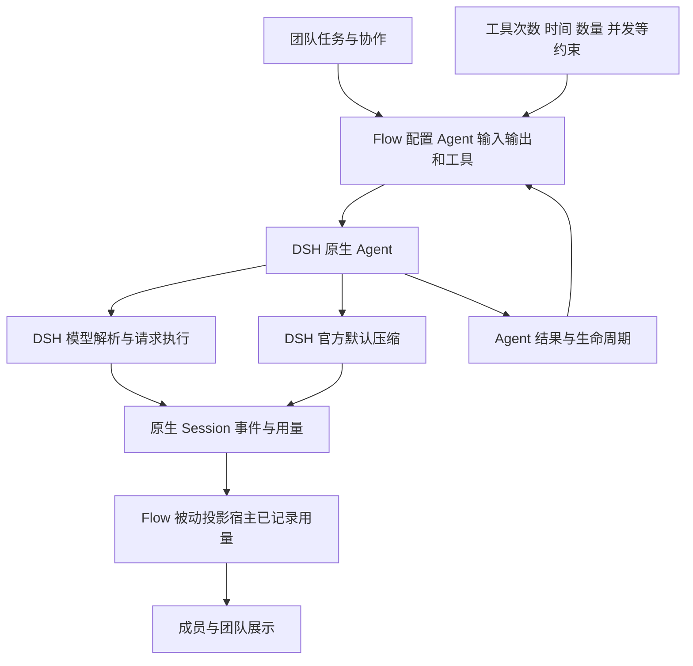

# Agent 上下文与模型执行限制移除方案

状态：已于 2026 年 10 月 8 日完整实施并通过验收，结果见[实施与验收记录](model-context-token-limits-validation.md)。方案源码核查基线为 `d2295af2098f8e64a59cec02827c03b3c0b90c34`，实际依赖为仓库锁定的 Harness `0.1.7-rc.2` 及补丁。

Flow 以 DSH Agent 为最小操作单元，配置任务输入、结果交付和工具能力，并管理团队协作。模型解析、容量、输出和压缩全部由 DSH 实现。本次彻底删除 Flow 的上下文限制、输出截顶、累计 Token 预算和模型请求次数限制；统计改为消费宿主已经记录的用量。项目尚未稳定发布，直接采用新契约，不做历史兼容。

## 最终范围

| 项目 | 目标行为 |
| --- | --- |
| Agent 执行 | 由 DSH 实现；Flow 使用原生创建、恢复、输入、结果和生命周期接口 |
| 上下文窗口 | 由 DSH 根据所选模型配置处理，Flow 不另设角色窗口或固定窗口 |
| 模型元信息 | Flow 不查询、检查、缓存或兜底，不添加模型发送守卫 |
| 输出与压缩 | 遵循模型适配器和 DSH 官方默认行为，Flow 不定制 |
| Token 预算 | 从集群、管理节点、智能体、任务和压缩池全链删除 |
| 模型请求次数 | 删除团队和 Worker 请求次数上限及相应账本维度 |
| Token 统计 | 展示宿主已记录的用量，保留未知及不完整状态 |
| 保留约束 | 工具调用次数、运行时限、身份数量、并发、管理轮次、尝试与纠正次数、权限和审计 |
| 历史兼容 | 废弃字段直接拒绝，不迁移旧配置、旧数据库或旧团队 |

“使用最大上下文”表示 Flow 不再施加额外窗口限制，由 DSH 使用实际模型配置。DSH 可以按官方默认策略提前压缩；这不属于 Flow 需要覆盖的行为。模型容量缺失及服务错误同样由 DSH 处理。

架构决策：[移除模型执行额度](../adr/0001-remove-flow-token-limits.md)、[采用新契约](../adr/0002-use-clean-resource-contract.md)、[Agent 职责归属](../adr/0003-use-host-model-capacity-and-compaction.md)。

## 职责与执行关系

Flow 不建立模型容量模块，不调用 `resolveModelInfo` 做准入预检，不使用 `request/context` 阻断请求，也不为这些操作改造启动接口的异步签名。固定团队模型、跟随主会话和成员模型选择仍通过现有 Agent 配置完成；团队域权限与可选路由配置检查保留，不扩展成模型能力检查。

## 删除配置和执行入口

| 删除项 | 需要同步清理的入口 |
| --- | --- |
| `maxTokens` | Flow 配置、运行时选项、团队设置、模型选择合并、UI 控件 |
| `context` 全部字段 | role、worker、model、server_input、compaction_threshold，以及 `FlowContextLimits` |
| `defaultBudget.tokens`、`budget.tokens` | 类型、校验、默认值、动作参数、预算投影和存储 |
| `defaultBudget.model_requests`、`budget.model_requests` | 团队请求次数额度及相应类型、动作参数、存储 |
| `worker_max_tokens`、`worker_model_requests` | Worker 输出与请求次数限制、快照字段及设置 |
| `select_model.max_tokens` 及嵌套输出设置 | 身份模型覆盖的输出写入能力 |
| `set_context_budget` | 动作协议、执行器、工具说明、提示和文档 |

废弃字段在实际入口明确报错，不静默忽略。当前验证器有只遍历白名单的路径，删除白名单项并不能达到拒绝效果，需同步修正部署配置、启动请求、预算动作和模型选择的字段检查。

预算动作中将 `requests` 映射为 `model_requests` 的别名也一并删除并拒绝，避免保留隐藏入口。

`index.ts` 当前依赖 `maxTokens.get` 判别已解析配置，必须换成仍有效的稳定判别，保留 Cordis 原生设置的 Volatile 行为。宿主模型适配器自己的 `contextWindow`、`maxTokens` 和 DSH 压缩内部参数不属于删除范围。

## DSH Agent 接入与官方压缩

Flow 继续通过 `ctx.agents.create/resume` 和原生 Agent 输入、结果、取消及会话接口工作。传递任务、模型选择、推理设置和工具能力，不传 Flow 自设的上下文及输出上限。

当前 Web 组合全局关闭 `compaction-basic`，标准 Agent preset 在自己的隔离作用域启用它，而 Flow Agent 没有挂载该 preset。删除 Flow 自有压缩代码时，必须按官方隔离组方式为 Flow Agent 装配一份默认 `compaction-basic`，共用宿主服务，不加载另一套 Agent 实现。

默认压缩的装配与卸载跟随 Agent 作用域生命周期；不传策略覆盖，不同时启用全局和私有两份监听器。直接导入官方包时声明直接依赖并更新锁文件。

完整删除以下旧链路：

- `contextBudget`、`measureAndCompact`、`installContextPressure`、`TurnContextState`。
- 轮前、轮中、轮后强制压缩，`#forceCompact` 和额外的溢出强压缩重试。
- 角色上下文额度、固定模型窗口、输出预留估算及相应发送拒绝。
- 上下文预算不足通知、Allocator 扩容建议和关联的自定义状态分类。
- `llm/stream` 模型请求中间件，包括准入、统计包装和对摘要请求的改写。
- 示例和下载配置中的摘要 `maxTokens: 4096` 覆盖，以及旧路径所需的全局压缩启用配置。

模型请求参数、摘要内容和工具声明不再由 Flow 改写。宿主已产生的停止原因与错误作为 Agent 执行结果处理，Flow 不另算窗口或通过强制压缩重试接管执行。

## 资源账本清理

从 `FlowBudget`、`FlowBudgetInput`、`BudgetDimension`、内部记录、投影视图及 SQL 中删除 Token 与模型请求次数维度，包括 limit、reserved、spent 及其计算。不能用零、无限值或极大整数模拟无限额度。

成组删除根预算扣减、子节点最低模型额度、Worker 初始模型额度、管理角色按上下文乘轮数的分配、模型请求付款方选择、补额、调拨、回收、耗尽停止和相关恢复判断。团队和 single 两条启动路径均覆盖。

压缩池目前只管理 Token 与模型请求份额，两者删除后整个压缩预算账户及 `compactionBudgetId`、补额和付款路径一起删除。模型请求的 `reserveLlmRequest`、`settleLlmRequest`、`releaseLlmRequest`、`estimateRequestTokens` 及对应回执状态机不再保留。

同时删除依赖模型回执的消息恢复门槛、等待条件、管理角色阻断、Worker 结果扣留和 reparent 拒绝。`ACCOUNTING_UNCERTAIN` 等共享错误分类仍可能用于工具配额，按来源清理，不能全局删除。

保留的账本处理工具次数、身份容量、执行容量和截止时间。`allocate_budget`、`rebalance_budget` 只面向这些维度。工具调用回执、工具次数准入与结算、权限、租约隔离和未确认副作用处理仍然有效，不能因函数或错误码名称相近被误删。

管理轮次、执行尝试次数与模型请求次数是不同限制。保留原有团队协作限制，不把已删除的模型请求上限换成步骤上限或新的 Token 相关门槛。

现有 `max_llm_concurrency` 通过 Agent 执行轮外围的许可控制调度，继续保留该行为；文档与验收应说明这是 Agent 调度许可，不能仅凭它声称已精确计量所有宿主辅助模型请求的并发。

## 宿主用量的被动投影

使用原生 Session 的持久化事件建立用量投影，替代 Flow 自建的模型调用回执。不再为每次模型请求生成付款范围、Token 预留、请求次数结算或 `overshoot`。

| 宿主事件 | 计量来源与规则 |
| --- | --- |
| `assistant/message` | 取 `data.usage`，不重复累计其 stream 中的 usage；包含宿主记录的中断消息 |
| `assistant/attempt` | 通过公开 helper 取 stream 中最后一条 usage；可能没有用量 |
| `compaction/summary` | 取 `data.usage`，不重复累计后续替换历史的用户消息 |
| `compaction/start/end` | 只记录完整性与错误；不补造 Token 或摘要请求次数 |

同一次原生 attempt 落为 message 或 attempt 事件，不双计；一个步骤可能含多个独立 attempt，不能按 turn/step 去重。stream 中 usage 是覆盖式结果，取最后一条，不逐条求和。实时 stream 帧不另计，避免与持久化事件重复。

以 `(nativeSessionId, event.seq)` 作为投影幂等键。首次回放、实时增量与重启重放使用同一逻辑；投影记录和消费游标原子提交。成员、节点与团队汇总使用同一批事件事实，避免父子层级重复累加。

检查点中原来的 `usageWatermark` 改为宿主事件消费游标，不再使用旧回执时间。查询、read、report、最终 summary、实际模型及推理设置展示均切换到相同投影；清除摘要解码中将未知 Token 用 `?? 0` 转成零的路径。

原样保留输入、输出、缓存、推理及总 Token 字段。缺失值保持未知，已有 total 不再额外加 reasoning；total 缺失时不伪造精确总量。失败或中断中宿主记录为零的用量与完整性状态分别保存，不能据此证明物理调用没有消耗。

统计口径为“宿主已记录用量”。失败摘要可能没有 `compaction/summary.usage`，失败或未结束的压缩应标记统计可能不完整，不能把一个压缩错误换算成未知请求次数。Flow 不为填补缺口新增模型中间件或扩展宿主接口。

模型信息同样读取事件事实：message 的模型 source、attempt 发生时的 request header，以及 summary 自身的模型字段。上下文和压缩展示读取宿主已有数据，不额外查询模型能力；无数据时显示未知。

## 新数据契约

数据库采用新 schema；本基线为 2，实现时递增至 3。新的资源表不含 Token 和模型请求次数字段，模型用量使用原生事件投影记录，删除旧模型调用回执及压缩预算账户结构。

只接受空新库或当前新契约版本。旧版本以及版本为 0 但已有业务表的数据库，在建表或写入前拒绝并提示使用新 `dataDir`，不自动删除原数据。不提供旧团队迁移、旧模型预算阻塞恢复或兼容读取。

新的建表定义应自足。现有 `#migrateColumns` 也给新库补有效列，清理时需将仍用于事务、分配、检查点、工具回执等功能的列纳入新 `SCHEMA`；仅服务于已删除模型回执的列随表退役。

正常重启恢复继续覆盖原生会话、用量投影游标、工具回执、租约、暂停、检查点和未确认副作用。模型请求的 RESERVED、NOT_SENT、payer 和付款不确定状态不再由 Flow 重建；不能把它们与仍有效的工具回执状态混淆。

## 界面 文档与测试清理

设置页删除团队 Token 预算、团队模型请求次数、单次输出上限、Worker 输出上限及 Worker 请求次数。成员和团队展示宿主已记录的 Token 用量及完整性状态，其他资源额度继续显示。

`core/team.ts` 的模型用量查询改用事件投影；窗口和压缩时间不再依赖将被删除的 Flow `context-step`。当前配置模型与最近实际请求应区分，不混用模型名称和上下文信息。

同步更新团队创建工具、Allocator 提示、启动 skill、配置页、预算说明、动作目录、接口文档、README 和所有示例。删除旧概念对应的代码、注释、测试与 fixtures，而非仅隐藏表单字段。

仓库 `src/host/ledger.ts` 及验收脚本直接查询旧 `usage_receipts`，需改为新的宿主证据来源；Worker 激活和并发证明也要按真实 Agent 生命周期与观测能力调整，不能用新投影伪造原有请求级证明。

## 实现顺序

| 阶段 | 工作与完成条件 | 主要文件 |
| --- | --- | --- |
| 1 原生 Agent 接入 | 官方默认压缩在 Flow 作用域正确装配一次；原生事件可供被动观测 | `core/runtime.ts`、包内 `cordis.patch.yml`、原生组合测试 |
| 2 移除执行干预 | 删除上下文和输出控制、强制压缩、模型请求中间件及配置入口 | `config.ts`、`index.ts`、`core/model-selection.ts`、`core/runtime.ts`、`core/cluster.ts`、`core/actions.ts` |
| 3 账本与存储 | 删除两个预算维度、压缩池及模型回执；保留工具和其他资源控制 | `types.ts`、`validation.ts`、`core/model.ts`、`core/protocol.ts`、`core/budget.ts`、`core/store.ts`、`core/cluster.ts` |
| 4 用量与界面 | 事件投影可重放且不重复；UI、查询和报告使用新数据源 | `core/runtime.ts`、`core/store.ts`、`core/team.ts`、客户端设置与团队视图、服务和生成类型 |
| 5 文档与验收 | 工具、skill、示例、文档与当前行为一致；完成独立审查 | `team-tools.ts`、`core/role-tools.ts`、`tests/`、`examples/`、`docs/design/`、依赖锁文件 |

源码路径未写前缀时相对于 `packages/dsh-flow/src/`；包配置与启动 skill 位于 `packages/dsh-flow/`，示例、测试、文档位于仓库根目录。这些阶段构成同一次行为变更，全部完成后交付，避免运行时、存储和工具采用不同契约。

## 验收矩阵

| 场景 | 验收结果 |
| --- | --- |
| 各角色使用不同模型 | 上下文与输出行为跟随 DSH，无 Flow 角色窗口和输出截顶 |
| 模型能力缺失或变化 | 完全按 DSH 原生行为处理，Flow 不额外查询、拒绝或兜底 |
| 官方默认压缩 | 原生步骤间压缩与恢复有效，只装配一次；Flow 未主动压缩或改写摘要 |
| 模型请求执行 | 无 Flow `llm/stream` 拦截，无模型次数准入、预留或结算 |
| 超过原 Token 或请求次数额度 | 成员执行、摘要和深层委派不因这两个已删除维度停止 |
| 工具、时间、身份、并发、轮次及审计 | 原有有效约束继续执行，无新增模型步骤限制 |
| 成功、中断、失败及多次 attempt | 用量按原生事件计量，同一步多次 attempt 不被合并或双计 |
| stream 多条 usage | 只取最终记录，不把累计报告重复相加 |
| 摘要成功与失败 | 成功用量计入一次；失败或缺失只标不完整，不伪造用量与调用数 |
| 回放、实时事件、重复投递、重启 | 同一原生 seq 只投影一次，游标与用量一致 |
| 缺失用量字段 | 保留未知，已知部分与完整性分别展示 |
| 新库创建及连续重启 | 不依赖旧迁移，可运行团队、恢复工具额度并重放用量 |
| 废弃配置、参数和旧库 | 明确拒绝，不静默忽略、不迁移、不删除原数据 |
| 原生设置热更新 | 保留配置字段仍可更新，删除 maxTokens 后不破坏 ResolvedConfig 判别 |
| UI 与模型可见工具 | 无已删除预算入口，展示宿主已记录用量与保留资源额度 |

重写 `context-trigger.test.ts` 中的人为窗口和强制低阈值测试；删除 Token 与请求次数分配、付款、耗尽和恢复的旧断言。保留其他资源守卫测试；新增被动用量投影的重放、去重及缺失数据测试。真实 Loader 与原生 Agent 组合测试证明默认压缩和输入输出工作正常。

实施验收执行 `pnpm install --frozen-lockfile`、`pnpm run typecheck`、`pnpm run build`、`pnpm test`、`pnpm run test:mock`、`pnpm run docs:build` 和 `git diff --check`，并验证真实宿主的成员执行、压缩与界面。以上门禁已全部通过，测试范围、宿主证据和模型服务限制见[实施与验收记录](model-context-token-limits-validation.md)。

## 源码依据

- 配置与隐藏入口：`config.ts:140`、`:159`、`:205`，`index.ts:42`，`core/model-selection.ts:4`，`core/actions.ts:1303`、`:2178`。
- 上下文与请求控制：`core/runtime.ts:372`、`:490`、`:533`、`:688`、`:824`、`:1300`。
- 分配与恢复：`core/cluster.ts:872`、`:2223`、`:2366`、`:4470`、`:4665`、`:4854`；账本维度：`core/budget.ts:24`。
- 存储与展示：`core/store.ts:872`、`:884`、`:999`，`core/team.ts:176`、`:196`，`client/execution-settings.ts:31`。
- 宿主用量：安装的 `dsh-session/lib/types/types.d.ts` 中 message、attempt 和 seq；`dsh-llm/lib/types/assistant-stream.d.ts` 中 `lastAssistantStreamChunk`；`dsh-compaction/lib/types/types.d.ts` 中压缩事件。
- 官方压缩接入：安装的 Web standard preset、`dsh-compaction-basic` 自动监听器及 `dsh-scope` 的事件作用域契约。

邻接宿主源码 `5badb15009ae1756c3afe0ae0cef1faafc290ccc` 仅用于对照已核实的行为；实际实施以当前锁定依赖和组合测试为准。
