# dsh-flow UI/UX 开发规格

> 2026-10-07 最新使用反馈修订（覆盖下文旧图稿和相冲突的交互）：主对话使用官方主会话，由总调度代理直接回应用户、汇报结果及接收追问；后台各角色的调度上下文只在代理详情中阅读，不替换主对话。新团队继承主会话模型，后续模型选择仅同步给该主会话未结束的团队。
>
> 子会话导航修订：顶栏点击代理或检查器点击“打开完整会话”，通过宿主导航进入该代理的完整原生 Session，保留对话、轨迹及宿主提供的其他标签。未回收且团队未结束的代理保留原生输入框，消息由 Flow 调度和计费；已回收或团队已结束的代理显示历史记录说明。检查器和右侧预览仍只读。此要求覆盖旧图稿中的 S07 只读页面。
>
> 智能体标签铺满画布，上方仅保留“拓扑图 / 列表”切换；删除重复任务摘要、搜索、状态筛选、通信范围和通信记录入口。节点按真实类型使用不同底色，派生连线加强对比；缩放工具和详情悬浮，图区接收两方向滚轮及触控板缩放。顶栏团队下拉沿用官方灰色菜单，参考宽 360px，每代理两行，13px 名称、12px 状态与用量、耗时；不重复任务长文。设置移除无对应展示的通信范围和摘要选项，保留五项显示及阅读偏好。删除机械只读提示；异常与等待信息按需出现。旧图稿仅作结构参考。

> 设计版本：1.4 · 2026-10-07 · 当前 UI/UX 唯一设计依据，宿主与官方 UI 优先
>
> 本规格将原始界面设想展开为可开发、可验收的产品设计。产品需求按本次设计确定；UI/UX 落地优先参考官方实现，通过 dsh 或实际负责该区域的 UI 插件所提供的接口创建。全文及图稿中的尺寸、比例、断点、色值、字体和动效参数均为参考，不是要求自行绘制或逐像素复刻的实现合同。本文不表示相关接口或能力已经实现；图中的名称、时间、Token、预算和上下文数字均为设计样例，不是真实遥测。

> **权威与废止声明：dsh-flow 的 UI/UX 设计以当前文档为唯一依据。原有界面元素及其交互逻辑全部作废，包括 Cluster panel、集群模式 profile 及相关入口、切换和操作流程。旧文档、旧截图和现有实现均不能作为保留或恢复这些设计的依据。** 官方实现用于组件、接口及通用交互复用，须服从本文确定的产品结构和交互语义。

[打开交互设计预览](ux-design/index.html) · [设计源：app.js](ux-design/app.js) · [设计源：styles.css](ux-design/styles.css)

## 目录

1. [范围、原则与页面库存](#1-范围原则与页面库存)
2. [主流程与导航](#2-主流程与导航)
3. [全局布局与视觉规范](#3-全局布局与视觉规范)
4. [S01 插件管理与 S02 设置](#4-s01-插件管理与-s02-设置)
5. [S03 启动与 S04 主会话及团队树](#5-s03-启动与-s04-主会话及团队树)
6. [S05 智能体拓扑](#6-s05-智能体拓扑)
7. [S06 联动检查器与 S07 子会话](#7-s06-联动检查器与-s07-子会话)
8. [S08 通信详情](#8-s08-通信详情)
9. [S09 等待与 S10 结束](#9-s09-等待与-s10-结束)
10. [S11 异常、空态与恢复](#10-s11-异常空态与恢复)
11. [S12 紧凑桌面与 S13 手机布局](#11-s12-紧凑桌面与-s13-手机布局)
12. [S14 设置状态与保存契约](#12-s14-设置状态与保存契约)
13. [状态、计量与数据语义](#13-状态计量与数据语义)
14. [实时一致性与稳定布局](#14-实时一致性与稳定布局)
15. [通用交互、无障碍与文案](#15-通用交互无障碍与文案)
16. [验收用例](#16-验收用例)
17. [开发拆分与交付边界](#17-开发拆分与交付边界)

## 1. 范围、原则与页面库存

### 1.1 已确认的产品边界

- dsh-flow 是标准插件，安装后显示在宿主插件管理页面，并具有独立的插件设置页。
- 用户通过主会话输入 `/agent-team` 加自然语言需求来启动团队；样例统一为“为知识库增加全文检索”。
- 主界面保持宿主原有结构，仅增加一个“智能体团队”顶栏按钮和与“对话”“轨迹”并列的“智能体”标签页。
- 不增加“X 个子智能体”独立下拉入口，不替换主输入框，不增加另一个团队指令系统。
- 智能体视图和检查器只读：允许查看、搜索、筛选、导航、复制和调整显示；团队生命周期指令在主会话下达，完整子会话允许给未回收的代理发送补充消息。
- 节点、通信详情和检查器不提供执行操作。完整原生子会话允许给未回收的代理发送消息、停止当前轮次；团队生命周期操作仍由主会话处理。
- 预算本次只展示服务提供的额度信息；不提供额度设置、追加、调整或预算阈值策略。
- 回收表示运行资源已释放，不删除代理的历史节点、会话、通信和计量记录。
- 插件设置只影响显示，不改变任务的执行、调度、预算或权限。
- 原有 dsh-flow 界面元素及交互逻辑均已废止；本次按当前文档重新确定页面与流程，不并行保留旧界面或兼容入口。具体废止规则见 1.5。

### 1.2 P0 体验目标

用户应当能够回答四个问题：团队正在做什么、谁正在处理、谁在等待什么、结果在哪里。P0 优先保证这些信息的一致、可读和可追溯；动态效果不得阻碍阅读。

P0 包含全部页面的基本展示、正常与异常状态、只读联动、实时同步、键盘访问和响应式布局。动画采用简单过渡即可，不以复杂物理布局或持续装饰性动画作为交付条件。

### 1.3 页面库存

| 屏幕 ID | 页面 / 状态 | 用户目标 | 主要入口 |
|---|---|---|---|
| S01 | 插件管理 | 找到并启用 dsh-flow | 宿主插件管理 |
| S02 | 插件设置 | 调整查看团队的方式 | 插件卡片 / 插件详情 |
| S03 | 主会话启动 | 提交团队任务 | 主会话输入框 |
| S04 | 主会话与顶栏团队树 | 不离开对话快速了解团队 | 唯一“智能体团队”按钮 |
| S05 | 智能体拓扑 | 查看层次、状态与通信 | “智能体”标签页 |
| S06 | 节点联动检查器 | 阅读某代理的对话与信息 | 选择图 / 列表节点 |
| S07 | 子代理完整会话 | 连续阅读代理工作记录 | 顶栏树标题 / 对话面板入口 |
| S08 | 通信详情 | 理解代理之间交换了什么 | 通信箭头 / 通信列表 |
| S09 | 等待用户 / 等待代理 | 找到等待原因与答复位置 | 状态节点 / 待办提示 |
| S10 | 团队结束 | 复查结果、拓扑与历史 | 已结束主会话 |
| S11 | 加载、空态、异常 | 了解不可用原因并恢复查看 | 各页面内联状态 |
| S12 | 紧凑桌面 | 在较窄窗口检查代理 | 参考 768–1279 px；由宿主容器可用空间决定 |
| S13 | 手机布局 | 顺序查看团队与详情 | 参考小于 768 px；由宿主响应式规则决定 |
| S14 | 设置状态板 | 明确保存、取消及失败行为 | 修改设置后的页面状态 |

### 1.4 实现优先级与官方参考

- **产品语义保持一致**：唯一团队入口、只读观察、主会话管理团队、原生子会话续聊、预算仅展示等已确认要求必须保留；参考官方实现不意味着增加平行的子智能体下拉。
- **官方 UI/UX 优先**：有对应官方实现时，优先参考其组件组合、信息层级、导航、键盘操作、状态反馈和交互惯例；可复用的公开组件或扩展能力优先直接复用。
- **按界面归属创建**：区域由 dsh 管理时，使用 dsh 的对应接口；由其他 UI 插件管理时，使用该插件的对应接口。注册入口、传入数据或提交内容，由提供方创建和管理相应界面，不在 dsh-flow 中另画一个相同的外壳。
- **样式由实际提供方控制**：容器大小、停靠方式、主题、字体、间距、断点、层级、焦点与动效优先沿用对应组件的规则和配置。不得为贴合示意图而覆盖宿主或其他 UI 插件的全局样式。
- **自定义仅补充业务差异**：确无可复用内容组件时，可在获准的扩展区域内实现团队拓扑、状态标记等专属内容；外围页面、标签、面板和会话仍使用对应接口。不能将“内容需自定义”扩大为重绘整个宿主界面。
- **接口缺口明确记录**：开发时核对官方来源、适用版本、界面提供方与公开接口。若缺少所需接口，记录缺口并设计适配或接口扩展；不得把原型 DOM、截图坐标、私有结构或 CSS 覆盖当成生产接入方式。

上述规则适用于全部页面和补图。第 3 节的数值用于沟通信息密度与相对布局；验收关注业务语义、可用性和与宿主的一致性，不要求与设计图逐像素相同。本次修订规定参考与复用原则，不声称已经核实具体官方接口名称或版本。

### 1.5 当前文档权威与旧 UI/UX 废止

当前文档是 dsh-flow 页面形态、入口、信息架构、状态呈现和交互逻辑的唯一设计依据。旧方案和现有实现中未按本文重新定义的 UI/UX 不再生效，不因为已经存在代码、文档或用户入口而自动成为新设计的兼容要求。

| 已废止对象 | 废止范围 | 本次设计依据 |
|---|---|---|
| Cluster panel | 原面板、打开入口、面板内界面元素及其交互逻辑 | 本文 S04 团队树、S05 智能体标签及 S06 只读联动详情；不保留平行的旧面板 |
| 集群模式 profile | 原模式配置入口、模式选择 / 切换逻辑及其作为团队启动前提的流程 | 本文 S03 的 `/agent-team` 加自然语言启动；用户无需选择旧集群模式 profile |
| 其他旧 dsh-flow 界面元素与交互 | 旧页面、菜单、按钮、标签、配置界面、快捷入口及其操作路径 | 仅按本文重新定义的界面与行为实施，不从旧实现自行补回 |

- 新设计只复用经核实适用的组件和接口；不继承这些组件此前承载的旧产品流程。
- 若旧实现、旧规划或官方示例的产品行为与本文冲突，以本文为准。官方参考不能引入旧 Cluster panel、集群模式 profile、额外子智能体下拉或直接控制智能体的操作。
- 生产接入时应清理旧 UI 的注册入口和交互绑定，不通过隐藏开关、别名入口或旧模式切换继续暴露已废止流程；对旧入口引用给出失效说明或指向本文对应的新入口，不重新激活旧 UI。
- 宿主及其他 UI 插件负责的通用界面仍按 1.4 与 3.3 通过其接口创建；“复用提供方组件”不等于“保留旧 dsh-flow 界面”。
- 本节废止的是界面设计及交互契约；底层执行能力、历史数据和存储的处理应在相应实现方案中另行界定，不能仅因 UI 废止而推导删除历史记录。

## 2. 主流程与导航

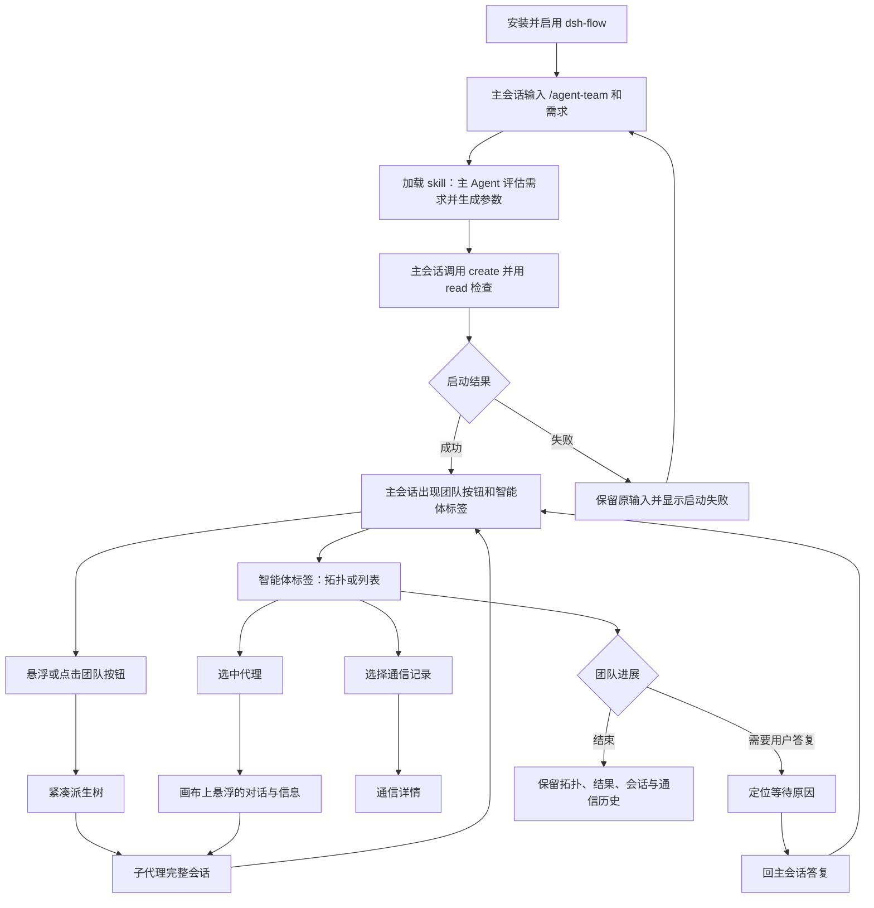
```mermaid
flowchart TD
    A[安装并启用 dsh-flow] --> B[主会话输入 /agent-team 和需求]
    B --> S[加载 skill：主 Agent 评估需求并生成参数]
    S --> T[主会话调用 create 并用 read 检查]
    T --> C{启动结果}
    C -->|成功| D[主会话出现团队按钮和智能体标签]
    C -->|失败| E[保留原输入并显示启动失败]
    E --> B
    D --> F[悬浮或点击团队按钮]
    F --> G[紧凑派生树]
    G --> H[子代理完整会话]
    H --> D
    D --> I[智能体标签：拓扑或列表]
    I --> J[选中代理]
    J --> K[画布上悬浮的对话与信息]
    K --> H
    I --> L[选择通信记录]
    L --> M[通信详情]
    I --> N{团队进展}
    N -->|需要用户答复| O[定位等待原因]
    O --> P[回主会话答复]
    P --> D
    N -->|结束| Q[保留拓扑、结果、会话与通信历史]
```

### 2.1 导航约束

- 每个团队归属于一个主会话；查看期间始终能识别当前主会话与团队。
- 同一主会话如存在多次团队运行，页面标题区通过“运行记录”选择已发生的运行；顶栏仍只有一个团队按钮。
- 默认展示当前运行；没有当前运行时展示最近一次。切换运行属于查看操作，不启动或恢复任务。
- 运行记录仅在确有多次运行时出现；不为单次运行增加空入口。
- 从顶栏树点击代理标题，进入 S07；从拓扑或列表选择节点，进入 S06，不跳离当前主会话。
- S07 提供所属“主会话”入口和团队下拉；返回主会话保留原标签、画布视角、所选代理和阅读位置。
- S06 的“打开完整会话”导航到 S07；详情中的父代理 / 子代理链接只改变当前选择。
- S08 的发送方 / 接收方链接定位并选中对应代理；关闭通信详情恢复此前的节点选择。
- 切换“对话 / 轨迹 / 智能体”不重启任务，不清空智能体页的本地查看状态。
- 浏览器或宿主返回动作遵循原导航语义；插件不截获与本功能无关的快捷键。

### 2.2 统一设计样例

| 代理 | 标识 | 父代理 | 状态 | 累计 Token（自身） | 样例职责 |
|---|---|---|---|---|---|
| 总协调 | `lead` | 无 | 运行中 | 12,840 | 分解需求、协调实现与汇总 |
| 需求分析 | `research` | `lead` | 已完成 | 8,620 | 明确全文检索的使用场景 |
| 检索实现 | `search` | `lead` | 运行中 | 17,300 | 实现索引与查询逻辑 |
| 界面实现 | `ui` | `lead` | 等待用户 | 4,200 | 等待确认结果摘要形式 |
| 质量验证 | `qa` | `search` | 等待其他智能体 | 5,300 | 等待检索实现可验证 |

样例团队共 5 个智能体，计数包含总协调根代理；不引入额外角色分类。样例任务已运行 `08:42`（8 分 42 秒），累计 Token 为 `48,260`，等于上表各代理自身用量之和。预算样例只在检索实现详情展示 `120,000 Token · 当前代理独立额度`，不表示团队共享额度或任何实际分配算法。

“等待用户”的代理不会单独获得输入框。样例问题为“结果摘要需要包含上下文吗？”，由用户回到主会话答复。

## 3. 全局布局与视觉规范

### 3.1 尺寸与区域

**本节和后文出现的全部布局数值仅供参考。** 图注中的画板尺寸仅是设计图片的导出规格。实际实现根据 dsh 或相应 UI 插件提供的容器尺寸、布局接口、主题与响应式规则适配，不硬编码宿主栏位的宽高，也不以整个应用窗口宽度代替插件实际可用宽度。

| 项目 | 图稿参考值 / 预期行为 |
|---|---|
| 主设计画板 | 1440 × 900 px；仅为截图规格，不要求页面固定宽高 |
| 宿主左侧栏 | 参考 224 px；由宿主管理，插件不创建或锁定其尺寸 |
| 主会话顶栏 | 参考 64 px；通过顶栏扩展入口加入团队按钮，由提供方排列 |
| 页面标签栏 | 参考 48 px；通过标签扩展入口加入“智能体”，与“对话”“轨迹”同层 |
| 主内容边距 | 参考桌面 24 px、紧凑视口 16 px、手机 12 px；实际使用提供方的间距规范 |
| 节点 | 参考 220 × 100 px，水平间距 40 px、层级间距 64 px；随内容、字体和图布局调整，保持可读与不重叠 |
| 右侧信息面板 | 参考 320 px；使用提供方的面板容器及滚动行为 |
| 悬浮详情容器 | 初始高度约为内容区的 45%，可读下限 220 px；采用提供方的分隔与尺寸约束，可关闭或调整尺寸 |
| 宽桌面 | 参考 ≥1280 px；可用空间充足时在悬浮容器中并列展示对话与信息 |
| 紧凑桌面 | 参考 768–1279 px；空间不足时使用单个详情容器，以“对话 / 信息”切换 |
| 手机 | 参考 <768 px；默认列表、单页详情，保留返回入口；使用提供方的响应式能力 |

画布填满智能体标签的实际内容区。摘要、工具条和筛选悬浮在画布上方，缩放工具悬浮在左下角；选中代理后，对话和信息在可调整尺寸的悬浮详情容器中联动显示。打开详情不改变画布尺寸或视角。宽屏并列对话与信息，空间不足时切换为同一容器的标签页。容器使用提供方的面板与停靠接口，保留关闭及键盘访问。

### 3.2 色彩与字体

以下是图稿的语义色别名及参考值，不是已核实的宿主 Token 名称。生产实现先映射到 dsh 或相应 UI 插件的主题接口，不直接复制这些色值作为全局样式。

| 图稿 Token | 参考值 | 用途 |
|---|---|---|
| `surface.canvas` | `#151515` | 页面 / 画布底色 |
| `surface.sidebar` | `#202020` | 宿主侧栏 |
| `surface.panel` | `#262626` | 节点、浮层、抽屉 |
| `border.default` | `#363636` | 分割线和中性边框 |
| `text.primary` | `#f0f0f0` | 标题、正文 |
| `text.secondary` | `#b2b2b2` | 辅助说明、时间、单位 |
| `accent.primary` | `#8ab4ff` | 选中、链接、焦点 |
| `status.running` | `#66c590` | 运行中 |
| `status.waiting` | `#e3b85d` | 等待、暂停 |
| `status.error` | `#ed8c8c` | 失败及需注意的异常 |

- 优先继承提供方字体；图稿参考字体为 `system-ui, -apple-system, BlinkMacSystemFont, "PingFang SC", "Microsoft YaHei", sans-serif`。
- 参考排版：页面标题 20–24 px / 600；区域标题 16 px / 600；正文 14 px / 1.5；辅助文本 12–13 px / 1.5；紧凑计量、ID、图例 11 px。实际字号随提供方排版与用户字体设置变化，缩放后的节点须支持放大或等价列表阅读。
- ID、时间及计量值可使用系统等宽字体，但中文标签保持正文字体。
- 参考圆角：面板和节点 12 px、输入与按钮 8 px；参考边框 1 px。实际圆角、阴影、边框使用提供方组件样式。
- 参考间距以 4 px 为基数，常用 8 / 12 / 16 / 24 px；小图标参考 16 px，状态点参考 8 px。实际使用提供方的密度与图标规范。
- 控件高度参考 36 px、手机触控区域参考 44 × 44 px；具体尺寸采用提供方的可访问控件规范，保证能辨认、能聚焦、易于点击。
- 以原始示意图的暗色为主设计；浅色使用独立语义色映射（补图 S05-L），由宿主主题选择。不得直接反转图片颜色。深浅色均需满足相同信息层级与对比度目标。

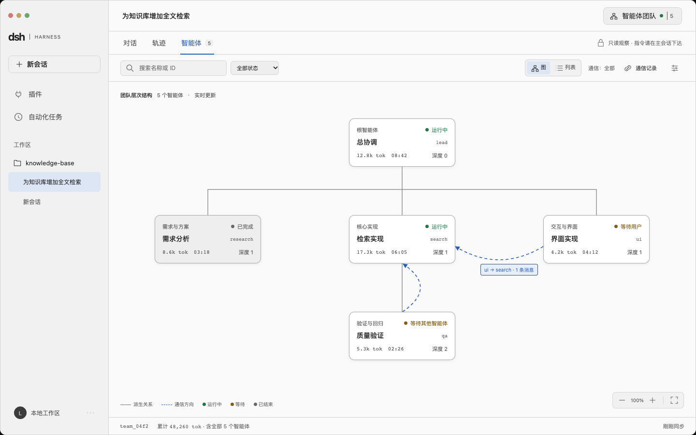

*补图 S05-L · 1440 × 900 px。独立浅色语义色：底色 `#fafafa`、面板 `#eeeeee`、正文 `#202020`、次文字 `#595959`、强调 `#285fba`、运行 `#247846`、等待 `#845f13`、错误 `#b83939`。*

### 3.3 界面归属与接口创建

下表描述接入职责，接口能力名称仅是开发时的核查项，不代表已经存在同名 API。由其他 UI 插件承载某区域时，该插件就是该区域的实际提供方。

| 区域 | 优先参考 | 生产创建方式与 dsh-flow 职责 |
|---|---|---|
| S01 插件列表、安装和启用状态 | 官方插件管理 UI/UX | 提交插件元数据与设置入口，由插件管理接口生成条目；不重画列表、启停开关或安装流程 |
| S02 / S14 设置页、字段与反馈 | 官方插件设置与表单模式 | 通过提供方的设置声明、字段或页面扩展接口提交配置；优先使用其校验、保存和提示组件 |
| S03 输入框、命令补全 | 官方会话输入与命令 UX | 注册命令和处理逻辑，保留提供方创建的输入框、模型和权限控件 |
| S04 顶栏按钮、浮层及团队摘要 | 官方智能体团队与子代理展示 | 通过顶栏扩展入口创建唯一团队按钮，复用可用的浮层和代理条目；仅补充所需派生层次与业务信息 |
| S05 标签页、图容器和查看工具 | 官方会话标签及可用图 / 列表组件 | 注册“智能体”标签及内容；在扩展区域内提供拓扑数据和专属绘制，不重画标签栏或宿主侧栏 |
| S06 / S12 / S13 面板与详情导航 | 官方分栏、停靠、抽屉及响应式 UX | 通过提供方的面板接口创建详情容器并联动选择；由提供方处理尺寸、层级、拖动和焦点 |
| S06 / S07 对话、工具结果和完整会话 | 官方会话渲染与导航 | 检查器提供只读预览；完整子会话复用原生 Session、消息、轨迹和生命周期对应的输入策略 |
| S08 通信及 S09–S11 状态反馈 | 官方详情列表、状态、空态和错误组件 | 提交只读消息与状态数据，复用对应组件；仅补充通信方向、原因和定位关系 |
| 菜单、确认、通知及未保存提示 | 官方通用交互组件 | 使用提供方的菜单、确认和通知接口，复用其焦点、层级与关闭行为；只提交本功能的选项与文案 |
| 所有页面的主题、图标、间距、动效 | 官方设计规范与实际 UI 提供方 | 通过主题与组件参数适配；跟随运行时变化，不覆盖提供方全局 CSS |

若官方实现缺少本规格要求的派生树、只读展示或外部 Session 执行所有者能力，应在允许的扩展内容内补齐，或先补充相应接口。不能直接复制官方私有 DOM / CSS。只读检查器不提供执行操作；原生子会话的输入由 Flow 执行所有者处理。

## 4. S01 插件管理与 S02 设置

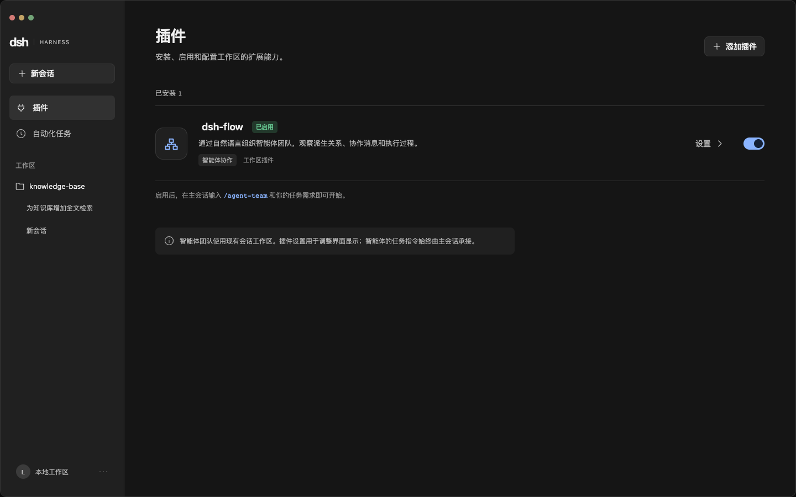

*图 S01 · 插件管理 · 1440 × 900 px。展示插件卡片、安装 / 启用状态与设置入口；宿主导航仅作环境示意。*

### 4.1 S01 插件管理

- 卡片包含图标、`dsh-flow`、一句话描述“在主会话中协调智能体团队”、宿主支持的安装 / 启用状态；版本在真实安装元数据存在时显示，设计图不虚构版本号。
- 未安装时遵循宿主安装流程；已安装时可进入详情和设置。安装及启停控件沿用宿主已有模式。
- 点击 dsh-flow 图标、名称或“设置”进入 S02；不自动创建会话或启动团队。
- 安装中显示进度状态，阻止重复提交；失败显示宿主返回的可读原因与重试入口。
- 插件被停用后，不接受新的团队启动；已有运行的执行结果由宿主决定，本规格不规定停用会终止任务。
- 停用期间已有历史仍可查看时保持入口；无法查看时说明原因，不能把历史显示为空团队。
- 插件列表无搜索结果时给出“未找到匹配的插件”和清除搜索入口。

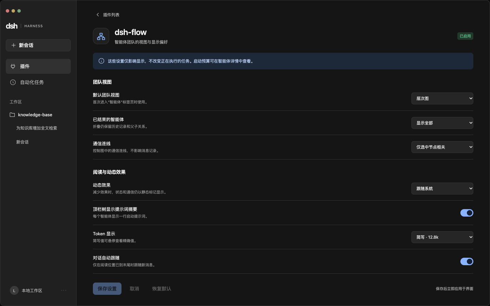

*图 S02 · 插件设置 · 1440 × 900 px。旧版显示偏好示意。2026-10-07 用户反馈增加团队执行默认值，以后续字段说明为准。*

### 4.2 S02 设置字段

以下默认值为本次新设计提案，不能据此描述现有产品行为。设置作用于当前用户的 dsh-flow 显示偏好；保存后立即用于已打开及后续打开的相关视图。

| 字段 | 可选值 | 建议默认值 | 影响 |
|---|---|---|---|
| 默认团队视图 | 拓扑图 / 列表 | 拓扑图 | 桌面首次进入“智能体”的形式；手机优先列表 |
| 已结束节点 | 显示 / 折叠 | 显示 | 折叠后保留计数、状态和展开入口，不删除历史 |
| 动态效果 | 跟随系统 / 减少 | 跟随系统 | 控制位移动画、脉冲和通信流动效果 |
| Token 显示 | 简写 / 精确 | 简写 | 简写如 `12.8k`；详情可查看精确值 |
| 对话自动跟随 | 开 / 关 | 开 | 控制首次打开对话面板时是否跟随新消息 |

- “显示方式”和“阅读偏好”分组；每字段具有中文名称、当前值和一行帮助文字。
- 团队默认值通过官方 ConfigForm 保存：最大深度、每节点子代理数、总代理数、运行分钟数、并行 / 串行派发、模型与推理等级、Token / 请求 / 工具预算及输出上限。新团队启动时保存配置快照，已有团队保持原预算与输出限制。
- 模型目录取自官方 Session API；默认跟随主会话，显式指定团队模型时保持该选择。
- 字段修改先形成草稿；“保存”成功后立即应用。“取消”、恢复默认与失败详见 S14。
- 显示字段采用有限选项；执行数值采用官方 SettingsValueField，校验整数、范围及原生步长。

## 5. S03 启动与 S04 主会话及团队树

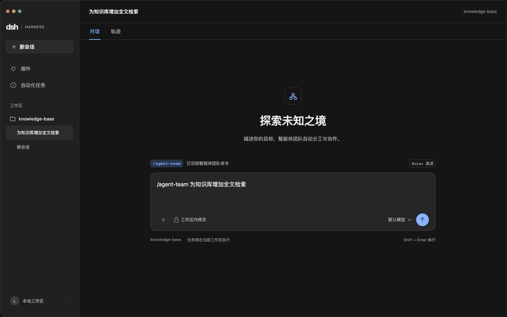

*图 S03 · 启动团队 · 1440 × 900 px。保留宿主输入区，通过命令和自然语言启动任务。*

### 5.1 S03 启动

- 输入示例：`/agent-team 为知识库增加全文检索`。
- 命令建议展示“智能体团队”和简短说明；使用宿主已有命令补全，不新增大面积启动表单。
- 仅输入 `/agent-team` 而无需求时，提示“请描述希望团队完成的任务”，保留输入内容。
- 提交先出现普通 user prompt，并加载 agent-team skill。主会话 Agent 评估复杂度、生成启动参数，再调用 create；read 核实实际启动状态。团队创建记录位于用户需求之后。同一启动意图按相同参数重试时复用已有运行。
- 启动成功后出现 S04 顶栏入口与“智能体”标签；主会话停留在“对话”，展示用户与主 Agent 的原生对话。后台总协调保留独立会话。普通后续执行要求由主 Agent 整理后调用 message，进度提问通过 read 回答。
- 主 Agent 通过有等待上限的 read 轮询，收到关键状态通知时重新 read 并报告。终态结果核对后调用 finalize 释放资源，再 read 确认；历史和证据保留。
- 启动失败给出原因和“重试”；原始需求可恢复到输入区。重试对应同一提交意图，结果未知时先核实状态。
- 插件不可用时说明“dsh-flow 尚未启用”，提供回插件管理的入口，不悄悄当作普通提示词执行。
- 主会话后续指令沿用普通输入方式，不要求再次添加 `/agent-team` 才能答复当前团队的问题。

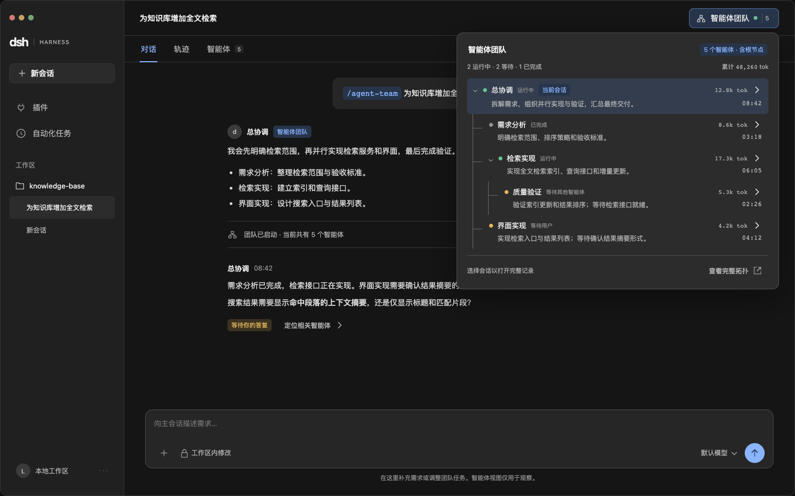

*图 S04 · 主会话与紧凑派生树 · 1440 × 900 px。顶栏只有一个“智能体团队”按钮，无额外子智能体下拉。*

### 5.2 S04 顶栏按钮

- 按钮显示“智能体团队”及团队状态；数量可作为按钮内辅助信息，不增加相邻独立入口。
- 优先沿用官方浮层交互；图稿参考停留 200 ms 打开、移出触发区与浮层 250 ms 后关闭。移入浮层后必须保持可操作，不要求为参考时长重写提供方的悬浮逻辑。
- 单击按钮固定展开；再次单击、点击外部或按 Esc 关闭。触屏以点击打开。
- 键盘聚焦后按 Enter / Space 打开，焦点进入浮层；关闭后返回按钮。
- 浮层参考宽 360 px、高度上限 420 px 或可用视口的 65%；实际通过提供方的浮层接口创建，沿用其尺寸、边缘避让和滚动策略，保证内容可达。
- 团队未加载完成时使用结构骨架；没有子代理时显示总协调节点和“尚未派生子代理”。

### 5.3 S04 紧凑派生树

- 采用 `tree` 式缩进和连续层级连接线，根代理在首行；显示父子关系，不按状态排序打乱层次。
- 每行主信息为状态点 / 图标、代理会话标题；辅信息为状态文字、累计 Token 与运行时长。
- 名称与用量各占首行一端，状态与耗时各占次行一端；实际沿用提供方的截断与展开规则。完整文本必须可查看，不因截断丢失访问信息的入口。
- 悬浮在一行代理上时，状态右侧显示该代理的模型；移出即隐藏，不增加常驻信息密度。使用最近一次实际模型请求的记录，未请求时显示已确定的模型路由，未知时留空。列表和拓扑节点采用相同行为。
- 状态颜色遵循第 13 节；必须有状态文字，不能仅凭绿色、黄色、灰色判断。
- 名称、状态、用量与耗时作为一个按钮打开完整代理对话。右侧箭头独立，点击通过官方 sidebarRight.openResource 在侧边栏显示代理；左侧展开按钮仅展开 / 折叠后代。全部箭头复用官方 SVG，随展开状态翻转，遵守减少动效偏好。
- 拓扑采用居中树布局，圆形 emoji 头像与稳定的随机两字中文名字；卡片右上角以小字展示节点类型和状态。
- 悬浮时在状态右侧显示间隔符、厂商 Logo、模型与推理等级；厂商从模型名称推测，无法识别时使用通用图标。模型与推理等级优先来自实际请求回执。
- 选中和键盘焦点具有不同表现；当前查看代理可显示“正在查看”。
- 完成节点遵循显示偏好；折叠代理分支显示“已结束 3 个”，可临时展开。
- 底部“查看智能体”切换到 S05，并定位当前选中的代理（若有）。

## 6. S05 智能体拓扑

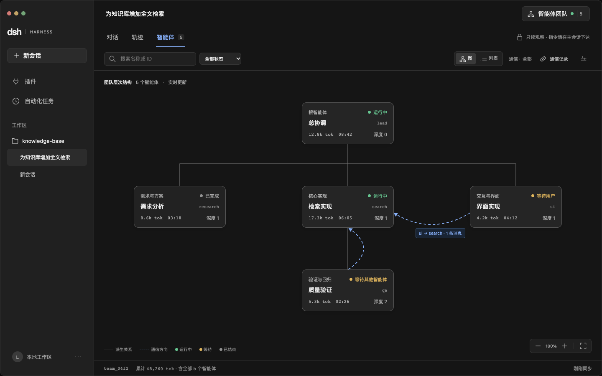

*图 S05 · 智能体拓扑 · 1440 × 900 px。本图显式切换为“通信：全部”以展示两类关系；默认仍为“选中相关”。圆角矩形表达代理，实线表达派生，箭头表达通信。*

### 6.1 内容与工具栏

- 顶部为团队名称、整体状态和运行记录入口；工具栏提供搜索、状态筛选、拓扑 / 列表切换与通信范围。
- 搜索匹配代理名称、会话标题和完整 ID；不默认搜索所有消息正文。
- 状态筛选可组合选择，显示命中数量；“清除筛选”恢复全部。筛选是查看条件，不改变执行。
- 图工具提供放大、缩小、适应视口和定位总协调；缩放显示百分比，范围 25%–250%。
- 拖动空白处平移；节点点击用于选择；鼠标位于画布时，滚轮及触控板缩放改变图的缩放，放大和缩小均以指针位置为中心，无须先聚焦画布；使用非被动事件监听阻止浏览器接管页面缩放。画布以外沿用宿主行为。
- 默认自上而下展示父子关系；总协调为唯一根节点，`qa` 是 `search` 的子节点。
- 节点包含代理标题、状态、职责摘要、累计 Token 和运行时长；详情指标不全部堆入节点。
- 运行时长是会话已持续时长的展示，不能据此推导预算剩余时间。

### 6.2 关系图例

| 视觉 | 语义 | 查看动作 |
|---|---|---|
| 稳定实线，无流动效果 | 父代理派生子代理 | 通过节点查看父子关系 |
| 带方向箭头的虚线 | 智能体之间的通信 | 选择后打开 S08 |
| 蓝色描边与轻背景 | 当前所选代理 | 联动悬浮容器中的对话与信息 |
| 绿色点与“运行中” | 代理执行状态 | 可选轻微脉冲 |
| 黄色点与原因文字 | 等待用户 / 等待代理 / 已暂停 | 查看等待原因 |
| 灰色标记与终态文字 | 已完成 / 已取消 | 查看保留的历史 |
| 红色错误图标与“失败” | 该代理失败 | 查看原因，不代表所有代理失败 |
| “已回收”辅助标签 | 运行资源已释放 | 仍可打开历史记录 |

### 6.3 筛选、折叠与大树

- 隐藏非匹配节点时保留必要的祖先路径；祖先以减弱样式出现并标注“关系节点”，避免误解为命中。
- 无匹配时显示当前筛选条件与“清除筛选”；不得显示为“尚未启动团队”。
- 折叠分支使用子代理计数，不删除层级连接；搜索命中折叠分支时显示命中计数，可定位展开。
- 大树优先保留稳定位置和可读节点；首次适应视口后不随每次事件强制重新缩放。
- 用户平移或缩放后停止自动定位；新代理通过“新增 2 个代理 · 查看”提示访问。
- 列表与图使用相同数据、选择和过滤条件；列表显示层级缩进，并可进入同一检查器。
- 单节点、深层树和宽树都是正常状态；画布不能要求至少存在两个节点。

## 7. S06 联动检查器与 S07 子会话

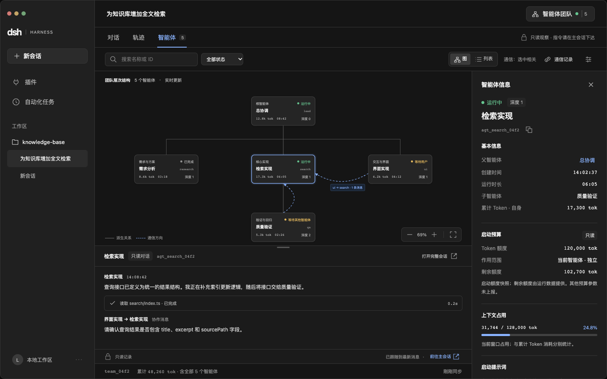

*图 S06 · 联动检查器的原信息结构参考 · 1440 × 900 px。实际布局按 v1.3 修订，将对话和信息置于画布上的悬浮容器。*

### 7.1 S06 选择与面板联动

- 单击节点同时选择代理，打开画布上的悬浮对话和信息容器；画布保持全幅及原视角。可关闭详情后选择被遮挡节点。
- 两面板顶部分别显示当前代理标题与 ID；切换代理时同时切换，不能出现新标题配旧消息。
- 加载中的新选择显示新代理的骨架内容；旧数据不得假装为当前代理数据。
- 右侧信息按“基本信息 / 关系 / 用量与预算 / 上下文 / 会话记录”分组。
- 基本信息包含名称、ID、当前状态、状态原因、启动时间；ID 可复制并显示轻量成功反馈。
- 关系包含父代理、层级与子代理列表；点击关系项选中目标节点并在必要时展开路径。
- 会话记录展示此代理可查看的会话条目与时间；不得用会话数量暗示模型调用次数。
- 面板关闭后保留节点选择；再次选择相同节点重新打开。Esc 优先关闭最近打开的浮层或抽屉。
- 不提供编辑职责、修改预算、直接发消息、暂停、继续或结束按钮。

### 7.2 对话阅读规则

- 消息角色、时间、正文与工具结果沿用宿主对话语义；仅呈现允许用户查看的内容。
- 创建子 Agent 的首条任务显示为普通 user prompt。后续 Agent 通信采用已确认的 A 方式：默认收起为单行摘要与简洁图标，点击原位展开类别、发送方 → 接收方、时间、关联任务与完整正文；保留长主题及结构化证据。类别为任务指令、进度反馈、结果反馈、审查意见、协作请求、阻塞与升级、资源协调、普通讨论；系统自动通知在详情中明确标注“系统”。系统摘要的计数与审核通过状态来自实际记录，不从模型正文推断。
- 流式消息追加在原消息中，不重复生成消息块；工具记录可以折叠，错误保留可读摘要。
- 首次打开遵循“对话自动跟随”设置；用户主动上滚后暂停跟随。
- 暂停跟随期间显示“有新消息 · 回到底部”，点击后滚到底部并恢复跟随。
- 用户本已处于底部时新消息可自然跟随；优先复用官方会话的跟随判定，图稿参考阈值为距底部 48 px，不要求自行实现同一套滚动逻辑。
- 向上加载历史保留当前首个可见消息及偏移，不把页面跳回顶部或底部。
- 切换代理时为每个代理保存本地阅读位置；首次查看无记录时按自动跟随偏好处理。
- 无消息显示“该智能体尚未产生可查看的对话”；不可访问显示原因，不冒充空会话。
- 底部固定提供“打开完整会话”；不出现输入框和发送按钮。

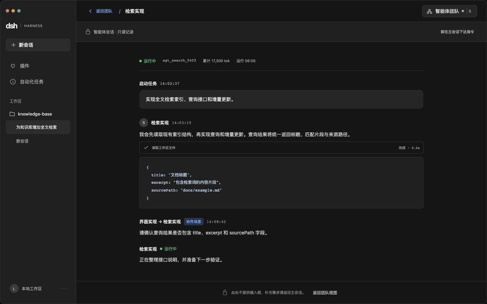

*图 S07 · 子代理完整会话 · 1440 × 900 px。独立阅读空间，明确所属主会话与返回入口。*

### 7.3 S07 完整原生会话

- 进入宿主主区域的代理 Session，复用原生对话、轨迹、历史加载、工具详情和输入框，不在“智能体”标签内另建完整会话渲染器。
- 顶栏展示代理名称、回收状态、所属主会话入口和团队下拉，可切换其他代理或返回团队。
- 未回收且团队未结束时保留原生输入框。通过原生 Session prompt/cancel 接口交给 Flow 执行所有者；冷会话的输入进入持久队列，活动轮次的输入进入其原生收件箱。角色权限、模型、预算和租约保持由团队管理。
- 回收或团队结束后，以历史记录说明替换输入框。服务器同样拒绝新消息；断线重试已接受的请求不会重复投递。
- 打开历史或切换轨迹不恢复普通 Agent、不产生模型请求；资源回收保留完整记录。
- 代理或运行链接失效时提供原因和主会话入口，不自动跳到其他代理。

## 8. S08 通信详情

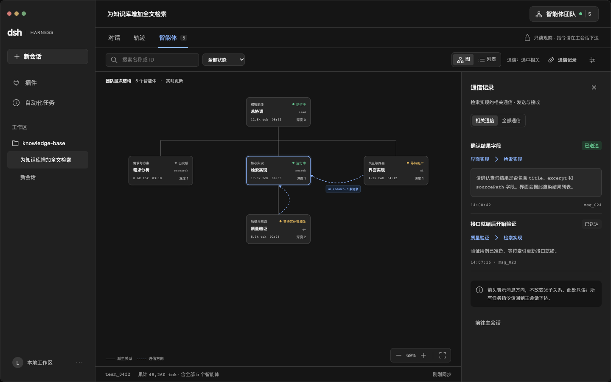

*图 S08 · 通信详情 · 1440 × 900 px。展示发送方、接收方、时间与可查看的消息内容，不能在此回复。*

- 点击通信箭头或通信记录，打开只读通信详情；展示发送方 → 接收方、时间、主题 / 摘要及正文。
- 选中通信时突出对应两端及箭头，其余通信减弱；父子层级线保持稳定。S08 图示处于“检索实现的相关通信”模式，显示 ui → search 与 qa → search 两条消息；点击单条记录后才聚焦该通信。
- 同一对代理短时间内多条通信合并为带计数的连线；详情按时间逐条列出，单条不丢失。
- “选中相关”按当前代理过滤其发送和接收记录；“全部”显示团队范围；“隐藏”只隐藏图上线条。
- 隐藏线条不删除记录，工具栏保留“通信记录”入口，以满足键盘和列表视图访问。
- 箭头只表达发送方向，不自动表达已读、已接受或执行成功；这些状态只有明确数据时才显示。
- 点击端点名称定位代理；详情内无回复、转发、重试发送或广播操作。
- 无通信时显示“暂无可查看的智能体通信”；正文无权限时显示“此通信内容不可查看”。
- 消息发送失败可显示提供方的失败原因，但不把接收代理状态改成失败。
- 多条历史通信浏览使用分页或逐段加载；时间相同的记录保持稳定顺序。

## 9. S09 等待与 S10 结束

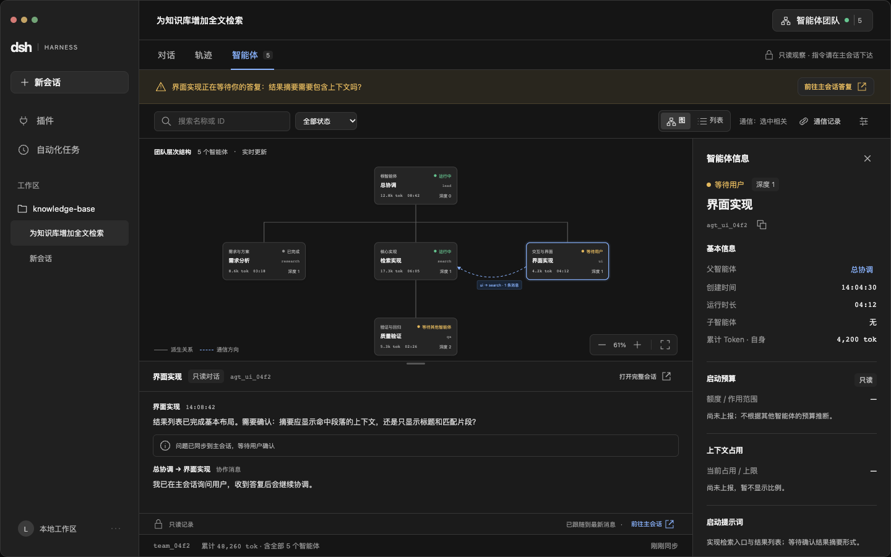

*图 S09 · 等待状态 · 1440 × 900 px。区别“等待用户”和“等待其他智能体”，将答复引导到主会话。*

### 9.1 S09 等待

- “界面实现”显示“等待用户”，详情给出问题“结果摘要需要包含上下文吗？”。
- “质量验证”显示“等待其他智能体”，原因指向“检索实现”，可定位依赖对象。
- 等待时间与运行时长分开标注；等待不等于卡死，不因超过某个前端时长自动转为失败。
- 只有存在明确待用户处理信息时，显示“前往主会话答复”；该动作只导航。
- 主会话中保留代理名称与问题上下文，便于用户知道正在回应哪一个问题。
- 已提交答复但尚未获得状态确认时，不提前把代理绘制为运行中。
- 原因未上报时显示“等待原因尚未提供”；不根据最后一句对话猜测阻塞原因。
- 多个等待用户问题以列表展示来源代理，避免仅突出最近一条而隐藏其他待处理事项。

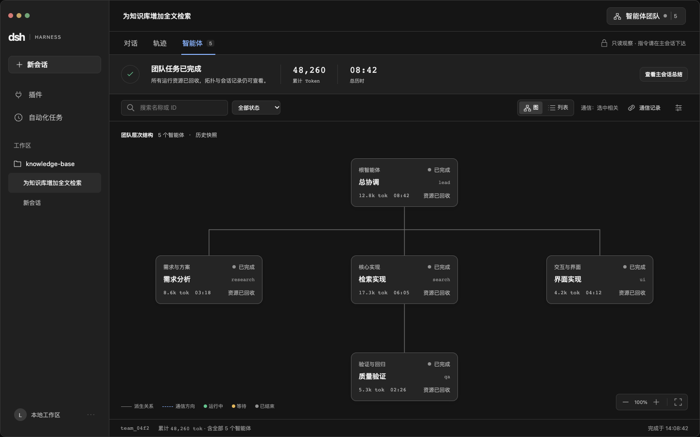

*图 S10 · 团队结束 · 1440 × 900 px。保留结果入口、终态、历史代理与累计用量。*

### 9.2 S10 结束

- 整体结束状态由团队数据明确给出；不能因所有当前可见节点变灰就推断团队完成。
- 页面展示结束结果、起止时间、最终累计用量和结果所在主会话的入口。
- 区分“已完成”“已取消”“失败”；允许团队已完成而历史个别代理曾失败，并保留各自真实终态。
- 结果未提供时显示“结果请在主会话中查看”；不由界面根据工具输出自行生成完成结论。
- 顶栏按钮和“智能体”标签继续存在；拓扑、对话、通信、信息仍可复查。
- 资源回收以“已回收”辅助标签表达；回收动画后保持节点和关系。
- 不显示“重新运行”“恢复团队”等未在本次范围内的执行按钮；新的任务从主会话发起。

## 10. S11 异常、空态与恢复

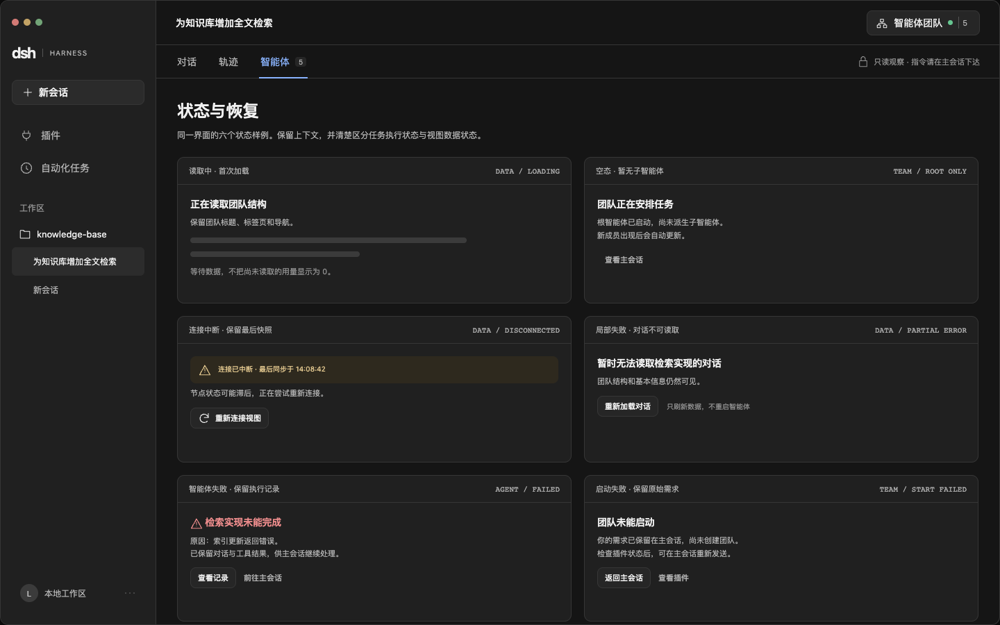

*图 S11 · 状态板 · 1440 × 900 px。集中表达首次加载、仅根节点、断连、局部数据失败、代理失败与启动失败；无匹配等状态见下表。*

| 状态 | 预期展示 | 恢复 / 导航 |
|---|---|---|
| 首次加载 | 结构骨架和“正在加载团队” | 不使用 0 个代理、0 Token 冒充数据 |
| 启动中尚无代理 | 启动状态与原始需求摘要 | 等待结果；启动失败后提供明确重试 |
| 只有根代理 | 正常根节点和“尚未派生子代理” | 可查看根对话 |
| 搜索无匹配 | 条件与“未找到匹配的智能体” | 清除搜索 / 筛选 |
| 实时连接中断 | 保留最后快照，提示“连接中断，显示的是上次数据” | 自动尝试重连；提供“重试连接” |
| 部分数据加载失败 | 失败区域内联错误；其他可用区域继续显示 | 只重试该区域，不重置全部页面 |
| 历史消息失败 | 保留已加载内容，在断点显示错误 | 重试该段历史 |
| 无访问权限 | 显示具体不可查看的对象类别 | 返回主会话，不展示空数据 |
| 对象已不可用 | 说明代理 / 运行不可用，不静默替换对象 | 返回主会话或运行记录 |
| 提供方未上报指标 | `—` 和“尚未上报” | 不显示 0，不自动估算 |

- 错误提示不得覆盖主会话输入区，也不得阻断查看已经成功获取的历史。
- 断连时代理最后状态可保持，但加“数据已暂停更新”和最后更新时间；不伪装成实时运行动画。
- 重连成功后先恢复一致快照，再继续实时变化；保留选中对象、面板与阅读位置。
- 重复重试不重复创建团队、节点、会话消息或通信记录。
- 诊断细节可折叠并复制；默认文案解释用户受到的影响，不暴露内部堆栈作为唯一说明。

## 11. S12 紧凑桌面与 S13 手机布局

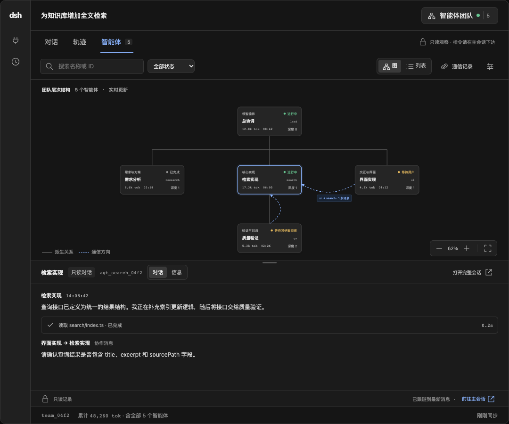

*图 S12 · 紧凑桌面 · 1080 × 900 px。同一代理的“对话 / 信息”在一个抽屉内切换，避免双面板挤压。*

- 图稿参考 768–1279 px；实际根据提供方容器空间进入紧凑模式。宿主侧栏遵循宿主收起规则，插件不改变整个应用的导航方式。
- 选择节点后通过提供方接口打开单个详情容器，默认显示“对话”，可切换“信息”。图稿采用全宽底部抽屉，参考初始高 310 px、可读下限 220 px、高度上限 60%；生产实现沿用提供方可用的停靠方式和尺寸约束。
- 画布保留至少可读的部分；高度不足时切换列表或整页详情，而不是把节点压缩到不可读。
- 关闭抽屉恢复画布；代理选择、视角和阅读位置保留。
- 工具栏低优先级选项进入“更多”，但搜索、图 / 列表切换和返回主会话保持可见。

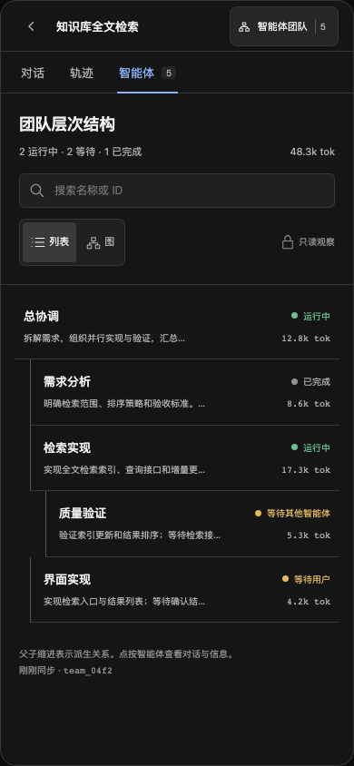

*图 S13 · 手机布局 · 390 × 844 px。默认列表，逐级进入只读详情；图视图作为可选查看方式。*

- 图稿参考 <768 px；实际跟随提供方的窄屏规则。默认层级列表，即使桌面偏好为拓扑；用户可显式切换为拓扑。
- 顶栏保留团队名称、状态和返回入口；长名称截断并可在信息页查看完整名称。
- 搜索和状态筛选占一行或折叠展开；列表每行显示名称、状态与关键用量。
- 选择代理进入整页详情，顶部“返回团队”，内部“对话 / 信息”切换；不同时堆叠多个抽屉。
- 通信详情作为单独只读页进入，返回后恢复原列表位置。
- 手机没有 hover 专属功能；团队按钮、摘要和层级展开均可点击访问。
- 软键盘出现时保持搜索结果可滚动；不为只读对话唤起键盘。

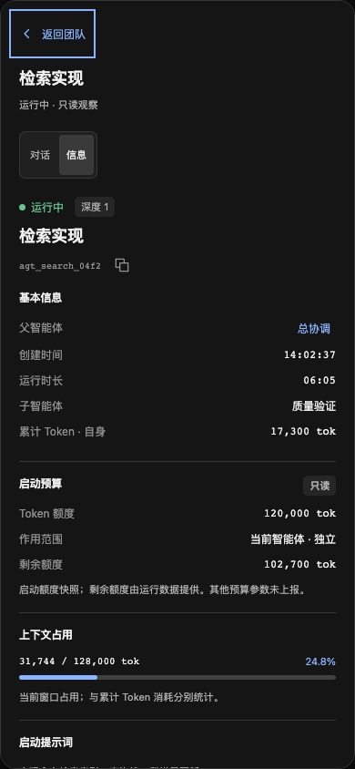

*补图 S13-D · 390 × 844 px。整页详情与明确的“返回团队”；对话 / 信息在同一页切换，内容独立滚动。*

## 12. S14 设置状态与保存契约

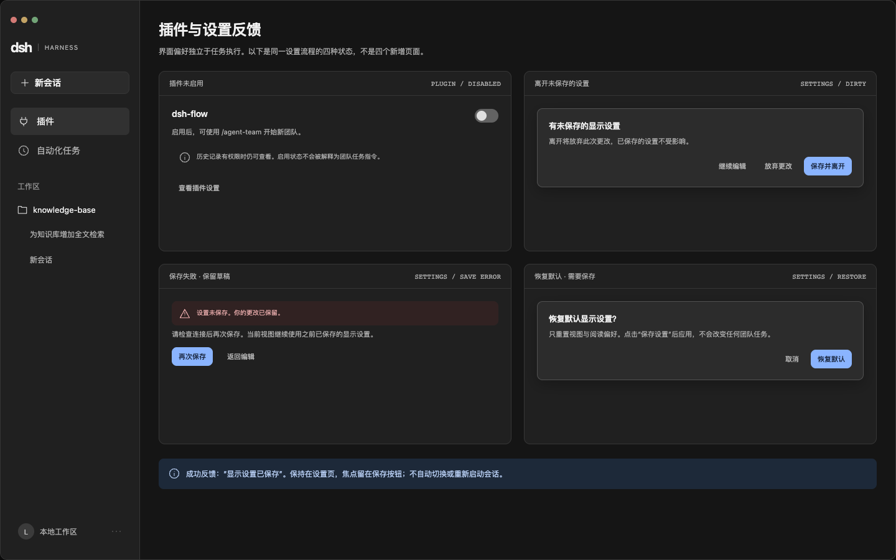

*图 S14 · 设置状态板 · 1440 × 900 px。展示未启用、未保存离开、保存失败与恢复默认确认；保存中和成功反馈使用下列控件规则。*

- 已保存且无改动时，“保存”“取消”禁用；“恢复默认”在当前草稿不等于默认值时可用。
- 修改任意字段后产生本地草稿，显示“有未保存的更改”；相关展示不提前持久化。
- 点击“保存”进入保存中，阻止重复提交；成功后立即应用显示偏好并提示“显示设置已保存”。
- “取消”丢弃当前草稿并恢复最后保存值，留在设置页；不取消或中断任何团队任务。
- “恢复默认”把本节指定默认值写入草稿，提示“已恢复为默认值，保存后生效”；仍可取消。
- 有未保存更改时离开页面，提供“保存并离开 / 放弃更改 / 继续编辑”。
- 保存失败保留全部草稿，显示原因与“重试保存”；不可显示成功后再悄悄回退。
- 保存中请求离开时等待保存结果；失败则保持未保存状态，不丢弃用户更改。
- 保存成功影响当前已打开视图的显示；保留选择和阅读位置，不触发执行操作或重新加载整个会话。
- 设置读取失败时明确提示；可显示标注为“临时默认值”的控件，但不得把其误认成已保存偏好。

## 13. 状态、计量与数据语义

### 13.1 代理执行状态与资源状态

| 执行状态 | 可读名称 | 视觉 | 说明 |
|---|---|---|---|
| `pending` | 待启动 | 中性点 + 文字 | 已创建，尚未开始执行 |
| `ready` | 待命 | 中性点 + 文字 | 已执行过轮次，目前可接受后续调度；明确协作依赖时使用对应等待状态 |
| `running` | 运行中 | 绿色点 + 文字 | 当前执行中 |
| `waiting_user` | 等待用户 | 黄色问询图标 + 文字 | 需要主会话中的用户答复 |
| `waiting_agent` | 等待其他智能体 | 黄色等待图标 + 文字 | 正在等待可标识的协作者或结果 |
| `blocked` | 受阻 | 黄色状态标识 + 文字 | 具体原因说明请求错误或执行停滞 |
| `paused` | 已暂停 | 黄色暂停图标 + 文字 | 上游明确报告暂停；界面无暂停 / 继续操作 |
| `completed` | 已完成 | 灰色完成图标 + 文字 | 本代理工作结束 |
| `cancelled` | 已取消 | 灰色停止图标 + 文字 | 本代理被上游取消 |
| `failed` | 失败 | 红色错误图标 + 文字 | 本代理执行失败 |
| 未识别 / 缺失 | 状态未知 | 中性问号 + 文字 | 保留原始可读说明，不自行映射为运行中 |

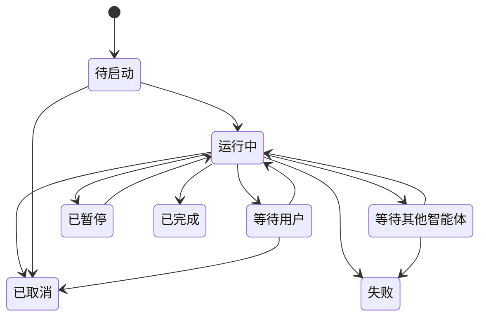
```mermaid
stateDiagram-v2
    [*] --> 待启动
    待启动 --> 运行中
    运行中 --> 等待用户
    运行中 --> 等待其他智能体
    运行中 --> 已暂停
    等待用户 --> 运行中
    等待其他智能体 --> 运行中
    已暂停 --> 运行中
    运行中 --> 已完成
    运行中 --> 失败
    运行中 --> 已取消
    待启动 --> 已取消
    等待用户 --> 已取消
    等待其他智能体 --> 失败
```

图为常见状态转移说明，并非禁止其他由权威数据明确提供的转移；前端不得依此自行推进状态。`已回收` 是独立资源属性，可叠加在终态上，不作为执行状态替代“已完成 / 失败 / 已取消”。

### 13.2 三类计量独立呈现

| 类别 | 定义 | 显示规则 |
|---|---|---|
| 累计 Token | 已发生的累计 Token 用量 | 可分输入 / 输出；上下文压缩不使累计用量减少 |
| 预算 | 提供方报告的额度信息 | 原样表达种类、单位、作用域、共享 / 独立属性；只读 |
| 上下文 | 当前会话已用上下文与可用上限 | 与累计 Token 分开；可因压缩而下降 |

- “累计 Token”必须指明是当前代理自身，还是包含后代；默认节点展示当前代理自身，团队汇总只去重计入一次。
- 如果数据只提供包含后代的统计，明确标注“含子代理”，不得将这些值逐层相加得到团队总量。
- 预算以独立条目展示名称、总额度 / 已用 / 剩余（若提供）、单位、作用域及共享标记；没有提供的字段显示“尚未提供”。
- 共享预算显示“与团队共享”，并指明团队；独立预算显示“当前代理独立额度”。不能仅凭所在面板推断作用域。
- 不同单位预算不相加、不统一转成百分比，也不从 Token 消耗自行推算金钱或时长。
- 不配置预算阈值，不自行预测耗尽时间；提供方明确报告预算相关等待或错误时，按原始原因显示。
- 上下文同时具备已用和上限且单位一致时，才展示占用百分比；仅有一项时显示该项与缺失说明。
- 上下文压缩事件可显示“上下文已压缩”及时间；不据此声称任务结果或历史消息被删除。
- 未知用量显示 `—`；明确的零显示 `0`；估算值加“约”，不得混用三者。
- 简写建议保留一位小数并去除末尾零，如 `12.8k`；精确值使用千位分隔，如 `12,840`。
- 运行时长与等待时长分别由明确起止时间计算；结束后冻结时长，断连时标注时间数据的有效性。

### 13.3 开发所需的概念契约

下表描述界面需要的信息，不指定现成 API、存储格式或生产接口；开发阶段应与数据提供方确认映射和缺失策略。

| 对象 | 必需信息 | 可选信息 / 缺失策略 |
|---|---|---|
| 团队运行 | 稳定运行 ID、主会话 ID、状态、创建时间、数据版本 | 结束时间、结果摘要、累计用量；缺失不伪造 |
| 代理 | 稳定代理 ID、运行 ID、父代理 ID、名称、状态 | 职责、会话 ID、状态原因、回收属性、起止时间 |
| 用量 | 所属对象、数值、单位、统计范围、更新时间 | 输入 / 输出明细、是否估算；范围未知则不参与汇总 |
| 预算条目 | 名称 / 种类、单位、作用域、共享 / 独立属性 | 总额、已用、剩余及提供方说明；不要求每种均存在 |
| 上下文 | 所属会话、已用或上限、单位、更新时间 | 压缩事件；无上限不展示比例 |
| 会话消息 | 稳定消息 ID、代理 / 会话归属、角色、时间、内容、可见性 | 流式阶段、工具记录；缺失显示局部状态 |
| 通信 | 稳定通信 ID、运行 ID、发送方、接收方、时间 | 摘要、正文、传递状态；传递状态不推断执行状态 |
| 实时更新 | 对象标识、可排序版本 / 序号、事件时间 | 快照基准和恢复游标；无法增量恢复时重新获取快照 |

## 14. 实时一致性与稳定布局

- 顶栏树、拓扑、列表、对话、信息面板必须读取同一运行和同一代理标识体系；名称不是主键。
- 同一对象较旧版本的更新不得覆盖新版本；重连或重试后的重复事件按稳定标识去重。
- 状态、通信、用量与资源回收是独立信息：收到一条消息不代表恢复运行，回收不代表成功完成。
- 子代理先于父代理到达时暂存或显示“正在补全关系”；不把它错误挂到根节点。
- 代理标题更新不改变节点身份、选择、消息归属或历史链接。
- 数据更新与视觉动画分离；动画可以跳过，但不能丢失最终节点、状态或通信记录。
- 每批更新后同步完成关联视图刷新，避免同一代理同时显示不同终态；加载中的部分标注更新时间。
- 断连恢复先合并权威快照，再处理其后的更新；不能重新播放全部历史派生和通信动画。
- 已结束对象收到明确的数据修正时可更新，并标注更新时间；不要通过前端计数单调性掩盖真实修正。
- 通用动画优先使用提供方的组件与动效参数。图稿参考新代理出现 180–220 ms、节点状态过渡 150 ms、抽屉打开 / 关闭 200 ms，不要求覆盖官方时序。
- 专属通信高亮参考持续 600–900 ms；同一连线频繁更新合并计数，避免无限动画队列。
- 回收动画使用短暂减弱和标签变化，随后稳定保留历史节点；不做节点消失后无法访问的效果。
- 减少动态效果时取消位移、流动与脉冲，直接更新状态，并保留静态高亮提示。
- 用户查看区域尽量稳定；新增节点优先分配局部空间。必要的大范围重排保留当前选中节点屏幕锚点。
- 搜索、过滤和折叠引起的主动布局变化可以重新组织显示，但保留清晰的当前条件与恢复入口。

## 15. 通用交互、无障碍与文案

### 15.1 键盘与辅助技术

- 所有按钮、标签、展开控件、列表项和详情入口均可由键盘操作；优先使用提供方的可见焦点样式，图稿参考为 2 px 蓝色描边、偏移 2 px。参考尺寸可调整，但焦点可见及可辨识要求不变。
- 标签使用标准标签页语义；方向键切换标签焦点，Enter / Space 激活；内容区具有对应名称。
- 图提供等价列表，读屏用户无需理解空间坐标即可获得层级、状态、用量与导航。
- 树按可见层级顺序进行键盘遍历；左右键折叠 / 展开，上下键移动，Enter 打开或选中。
- 浮层打开后管理焦点；Esc 关闭最上层，关闭后回到触发控件；非模态面板不困住整个应用焦点。
- 状态不得仅用颜色表达；辅助技术名称包含代理名称和状态，通信按钮包含发送方与接收方。
- 实时消息只播报必要变化摘要，避免逐 Token 播报；等待用户、失败和连接中断可使用温和提示。
- 普通文字与背景对比度至少 4.5:1，大字和关键控件边界至少 3:1；低对比分割线不单独承载含义。
- 长中文、200% 缩放和系统大字体下不截断核心操作；详情内容允许换行，ID 可折行或复制。

### 15.2 标准文案

| 场景 | 文案 |
|---|---|
| 观察视图 | 不显示重复只读说明；主对话入口与输入策略表达操作边界。 |
| 等待用户 | 需要你确认：结果摘要需要包含上下文吗？ |
| 等待协作者 | 正在等待“检索实现”的结果。 |
| 数据断连 | 连接中断，显示的是上次数据。最后更新：{时间}。 |
| 指标未知 | 尚未上报 |
| 回收说明 | 运行资源已释放，历史记录仍可查看。 |
| 设置保存成功 | 显示设置已保存。 |
| 设置保存失败 | 未能保存显示设置，你的更改已保留。 |
| 空对话 | 该智能体尚未产生可查看的对话。 |
| 主会话导航 | 返回主会话 / 前往主会话答复 |

文案不使用“已读”代替已送达，不使用“完成”代替已回收，不把所有黄色状态统称为“挂起”。图中的简化文案与本节语义必须一致。

## 16. 验收用例

所有用例使用可控设计数据执行；既验证正常数据，也验证乱序、重复、缺失及断连。以下 Given / When / Then 可直接转为交互或端到端验收。

| ID | Given：前置条件 | When：动作 / 事件 | Then：可观察结果 |
|---|---|---|---|
| A01 | 已启用插件，主会话无团队 | 提交样例命令 | 保留宿主布局，成功后仅出现一个团队按钮与“智能体”标签 |
| A02 | 输入只有 `/agent-team` | 提交 | 提示补充需求，保留输入，不创建空团队 |
| A03 | 同一次启动仍在等待结果 | 重复点击或重试 | 不产生两个未经区分的团队；未知结果先核实状态 |
| A04 | 团队按钮获得键盘焦点 | Enter 打开，Esc 关闭 | 可操作完整树；关闭后焦点返回按钮 |
| A05 | 团队树已打开 | 指针从按钮移入浮层 | 浮层保持展开，能点击深层代理 |
| A06 | 五代理样例已加载 | 进入拓扑 | `qa` 位于 `search` 下；无额外子代理下拉入口 |
| A07 | 当前选中 `research` | 快速选择 `search` 再选择 `ui` | 最终两面板均属于 `ui`；不出现旧消息配新标题 |
| A08 | 图内节点可见 | 单击节点 | 打开只读检查器，不跳离主会话，不出现执行操作 |
| A09 | 悬浮对话已打开 | 打开完整会话再返回 | 保留选择、画布视角和原阅读位置 |
| A10 | `ui` 等待用户 | 点击“前往主会话答复” | 返回并聚焦主输入区；不自动发送，不提前改为运行中 |
| A11 | 用户正在向上阅读 | 新流式消息到达 | 阅读位置不跳动，显示新消息提示；点击可恢复跟随 |
| A12 | 已加载一段历史消息 | 向上加载更多 | 首个可见消息位置稳定，不重复插入消息 |
| A13 | 累计 Token 为 12,840，上下文为 8,000 | 上下文压缩至 4,000 | 上下文下降，累计 Token 不因压缩下降 |
| A14 | 多代理报告同一共享预算 | 打开各代理信息与团队汇总 | 明确显示共享作用域，不重复加总共享额度 |
| A15 | 指标缺失、为零、为估算分别出现 | 查看指标 | 分别显示 `—` / `0` / “约”，不互相混淆 |
| A16 | 代理已完成且有历史消息 | 收到资源回收事件 | 增加已回收标签，节点及消息仍可查看 |
| A17 | 收到通信但未收到状态更新 | 查看发送方和接收方 | 只新增通信，不据此改变执行状态 |
| A18 | 已有最新代理状态 | 收到旧版本或重复事件 | 不回退状态，不重复节点、消息或通信 |
| A19 | 已选中代理并上滚阅读 | 断连后重连 | 提示数据滞后，恢复后一致且保留选择与阅读位置 |
| A20 | 搜索命中折叠深层代理 | 定位结果 | 展开必要路径并选中结果；清除条件可恢复完整树 |
| A21 | 用户已手动平移画布 | 新代理加入 | 不强制重置视角；出现可访问的新代理提示 |
| A22 | 系统减少动态效果已开启 | 出现代理与通信 | 直接更新可见状态，无持续流动或脉冲 |
| A23 | 提供方内容区从宽裕缩至紧凑再至窄屏；1440 / 1080 / 390 仅为参考测试宽度 | 选择代理并查看 | 根据提供方布局切换双面板、单详情容器和窄屏列表 / 详情，保持联动与可读，不按固定像素强制重绘 |
| A24 | 设置有草稿 | 保存成功 | 立即应用显示，任务状态不受影响，清除未保存标记 |
| A25 | 设置有草稿且保存失败 | 重试 / 取消 / 离开 | 草稿不丢失；取消恢复保存值；离开提供三项选择 |
| A26 | 恢复默认但尚未保存 | 点击取消 | 回到原已保存设置，不把默认值自动持久化 |
| A27 | 团队结束 | 重新进入“智能体”页 | 结果、终态、历史拓扑、对话与通信仍可复查 |
| A28 | 只提供部分数据或某段加载失败 | 查看其余区域 | 保持可用数据，仅失败区域提供重试 |
| A29 | 仅使用键盘和读屏 | 完成查找、选择、读对话、查看通信、返回 | 所有只读能力可达，焦点可见且不被困住 |
| A30 | 分别提供 50 / 200 / 1000 个节点，深度 10 层和 80 字标题 | 搜索、定位、切列表并持续收取更新 | 保留关系路径与完整名称访问，不丢选择、不夺焦，图不会缩小到不可读；1000 节点允许折叠与虚拟化 |
| A31 | 同一主会话存在两个历史运行和一个当前运行 | 切换运行再返回 | 只改变所查看的运行，各自选择、消息、用量和阅读位置不串联，不启动新任务 |
| A32 | dsh 或其他 UI 插件负责某个界面区域，提供相应创建 / 扩展接口 | 接入入口、标签、面板或会话展示 | 通过该提供方接口创建并管理生命周期，使用其样式；无平行重绘的宿主外壳、私有 DOM 注入或全局 CSS 覆盖 |
| A33 | 提供方更改主题、字号、密度、侧栏宽度或面板停靠方式 | 继续查看与导航 | 界面适配实际容器及组件规则；保留只读、唯一入口、信息关系和可访问性，不要求匹配图稿固定值 |
| A34 | 官方存在相应 UI/UX 或公开组件能力 | 评审生产接入方案 | 有官方来源 / 适用版本、实际 UI 提供方、采用接口和差异说明；优先复用，缺口明确，不把未经核实的 API 或原型绘制当成正式接入 |
| A35 | 旧实现或旧文档包含 Cluster panel、集群模式 profile 及其他旧入口 | 检查新界面、菜单、模式选择、快捷入口与交互绑定 | 旧元素和旧逻辑均不再生效，无平行兼容入口；团队通过本文规定的 `/agent-team` 启动与新视图查看，历史数据不因界面废止而被删除 |

## 17. 开发拆分与交付边界

### 17.1 建议拆分

| 工作包 | 交付内容 | 主要验收 |
|---|---|---|
| D0 官方参考与 UI 归属核查 | 确认官方来源、适用版本、各区域提供方、公开接口和能力缺口；建立组件及主题映射 | A32–A34 |
| D0a 旧 UI 废止落实 | 清理 Cluster panel、集群模式 profile 及其他旧界面的注册入口和交互绑定，按当前文档建立新流程 | A35 |
| D1 宿主增量入口 | 插件卡片、设置入口、命令、唯一团队按钮、标签页 | A01–A05 |
| D2 团队共享数据 | 稳定标识、状态 / 用量 / 通信语义、快照与更新一致性 | A13–A19、A28 |
| D3 结构查看 | 紧凑树、拓扑、等价列表、搜索筛选、稳定布局 | A06、A20–A22 |
| D4 只读检查器 | 双面板、消息滚动、详情、完整会话、主会话返回 | A07–A12、A16 |
| D5 通信与历史 | 定向通信、详情、等待解释、结束与回收记录 | A10、A17、A27 |
| D6 设置与适配 | 七项显示偏好、保存状态、窄屏、键盘与读屏 | A23–A26、A29 |

### 17.2 P0 范围控制

- 不实现代理控制台、直接通信输入、模型选择、权限编辑、工作区管理或新的任务调度界面。
- 不实现预算编辑、充值、阈值告警规则、消耗预测、费用换算及自动调度建议。
- 不把动画效果、任意自由排布或三维关系图作为 P0 必需；先交付稳定的层次图和等价列表。
- UI 接入先完成 D0，优先复用官方实现和实际提供方的公开接口；数据接入按第 13 节确认映射。未经核实不宣称接口已存在或已经兼容。
- 预览是离线设计场景集，支持关键导航、节点选择、图 / 列表、详情、主题和设置草稿演示；不接后台，不模拟真实流式消息、乱序事件、运行状态转移、千节点性能或全部无障碍行为。上述生产要求按验收表实施，不能由预览通过替代。
- 实际开发交付应包含各屏幕状态、边界数据、无障碍检查及验收记录，不能仅凭静态截图认定完成。

### 17.3 本规格与图稿的使用方式

图稿说明信息层级、相对布局和可见交互意图；正文规定行为、语义与边界。图中所有像素尺寸、比例、色值和样式均为参考，具体呈现服从实际 UI 提供方的公开接口与官方交互惯例。实现与示意图存在尺寸或外观差异，只要保留业务语义、可读性及导航关系，不视为偏离本规格。若图稿出现超出只读或预算展示范围的操作，应修正图稿，不将其解释为隐含的新功能。

所有 UI/UX 冲突按 1.5 处理：当前正文是唯一设计依据，配套图稿和预览必须与正文同步；旧页面、旧模式、旧文档及现有代码不能推翻本规格，也不构成保留旧交互的理由。

离线预览为了独立展示而绘制了宿主外壳，它不是生产 UI 的创建方案。不得将其侧栏、顶栏、标签栏、面板或会话 DOM / CSS 直接搬入插件作为替代宿主接口的实现。生产验收必须在实际 dsh 与相关 UI 插件环境中完成；图稿比对不能替代接口接入和样式适配验证。

设计资源位于 `docs/plans/ux-design/`：`index.html` 是交互预览入口，`app.js` 和 `styles.css` 是设计源，`screens/` 保存 14 张主界面图及浅色、手机详情补图；`render.mjs` 可重新生成全部图片。后续调整应同步更新规格、预览和对应截图，确保三者表达同一设计。

图稿再生成：在仓库根目录执行 `node docs/plans/ux-design/render.mjs`。脚本使用工作区现有 Playwright 与本机 Chrome；不会修改应用源码或连接真实任务。`screens/render-report.json` 记录实际图片尺寸和浏览器错误；交互检查范围见 `verify.mjs`。
